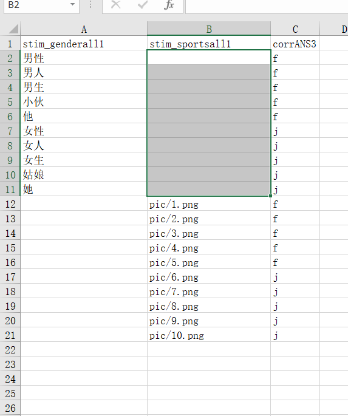

# PsychoPy <!-- {docsify-ignore-all} -->

> 更多请在[Github Issue](https://github.com/psychopy/psychopy/issues)查看

## 线下正常，线上未报错，不过不符合实验逻辑

- 情况1:

在循环中，使用code组件在begin experiment对时间线变量进行重定义。删除重定义即可。比如，xlsx有`cc`列，在循环中将`cc=0`加到组件中，则在调用的时候，无论xlsx给的是什么，程序获取到的都是`0`这个值。

## psychopy 2021.2.3 polygon组件显示圆形出错

用builder的话，就改用regular shape，并且调成999（即正999边形，即圆）

## 被试没有做完实验，但也需要上传数据

如果你想保存部分数据，但前提是参与者完成了最小量的实验（例如100个trials），可以添加`PsychoJS._config.experiment.saveIncompleteResults = true;` 到适当Routine中的 JS 组件【待测试】。

## 语法问题

python语法和js语法不同，以下是在论坛反馈过的语法问题**注意，以下代码均不能在线上运行，需手动修改**：

1. [0, 1] == [0, 1]
2. [1, 2, 3, 3, 3, 3, 3] * 15
3. import os \n os.listdir()
4. divmod()
5. time.clock()

对应方案：

1. [0, 1][0] == [0,1][0] & [0, 1][1] == [0,1][1]
2. [1, 2, 3, 3, 3, 3, 3, 1, 2, 3, 3, 3, 3, 3, 1, 2, 3, 3, 3, 3, 3, 1, 2, 3, 3, 3, 3, 3, ...]
3. 无解，不能使用
4. 取整：Math.floor(7 / 5)  取余：7 % 5
5. new Date().getTime()

## rating marker的起始位置线上不显示

经过测试，在线实验无法支持*slider*的默认位置，需要从代码实现。

也就是添加code组件，然后在`begin routine`添加`slider1.setMarkerPos(50)`即可

## 在线实验可以打Mark吗？例如脑电、皮点等？
这需要询问您的设备供应商是否提供了相应的方法以及具体如何进行操作。

## PsychoPy节点是什么？
PsychoPy是一款老牌的心理学实验编写软件，并支持在线实验功能。脑岛通过兼容PsychoPy相关的导出文件使您能够在线收集数据。

## 上传的实验压缩包是否有大小限制？
是的，请您不要上传超过100M的实验压缩包。您可以通过压缩图片、压缩视频等方式来减少压缩包的大小。

## PsychoPy目前支持哪些版本？
详见[PsychoPy实验](/2-researcher-manual/1-1-2-5-psychopy.md)

您好，目前仅支持2020.1.3与2021.2.3版本，请您务必使用这两个版本编写。我们选择这两个版本的原因在于，这两个版本实验编辑器本身问题较少，同时所对应的线上实验也更稳定。后续如有优化，我们也会继续支持更多版本。

## 如何使不同被试看到的刺激大致一样？
PsychoPy里可以使用Height单位（即屏幕高度为单位1），这样所有刺激在所有被试电脑上他们的比例都是一样的，不会出现变形；而对于屏幕比例的处理（即刺激能不能完整出现在屏幕上），例如有些被试是16：9（e.g 1920*1080）有些被试是16：10（e.g. 2880*1800，常见于mac电脑），通常会设置刺激呈现边界不超过±0.8（即16：10）就能满足绝大部分需求。如果想要兼容性最佳，通常来说±0.5也可。此外，如果需要更为精细的控制，

（1）脑岛提供了被试屏幕像素大小的筛选，可以自动排除一些屏幕分辨率很低的被试；
（2）可以使用卡片矫正（例如银行卡等标准卡片）来估计屏幕的物理大小；利用盲点测试大约偏移13°来估计视角大小等。

## 修改音频的HZ

在线Hz修改不可行，建议使用文件

## PsychoPy code 涉及到import等语法

线上没有numpy等库，不支持import语法（需要使用替代的函数）

## 资源库BART实验 线下运行只有一个试次

PsychoPy资源是线上下线下兼容的，但是有一些例外，这里就是其中一个例子：使用了声音组件。在线上实验中，PsychoJS会根据声音文件的时间长短来决定Routine的时间，因此Audio组件的时间会设置为无限长；而在线下则是根据其时间设置来。

详细[参考这篇文章](https://forum.naodao.com/postingInfo?id=1499255336811630593)

## 复杂按键判断

详见[文章](https://forum.naodao.com/postingInfo?id=1501126060505567233)

## 上传后打不开，显示 unknown resource

* 方案1

> 版本为2021.2.3，请删除导出路径的html。依次点击 `Edit experiment settings` > `Online`，找到`Output Path`，清空文本框的内容即可

* 方案2

> 请检查文件命名和路径是否正确，路径分割以`/`为主，而不是`\`，也就是把反斜杠改成斜杠

## 字体支持

* Arial (sans-serif)
* Verdana (sans-serif)
* Helvetica (sans-serif)
* Tahoma (sans-serif)
* Trebuchet MS (sans-serif)
* Times New Roman (serif)
* Georgia (serif)
* Garamond (serif)
* Courier New (monospace)
* Brush Script MT(cursive)

## 部分图片材料不能正确读取

请手动添加资源文件，方式如下:

依次点击 `Edit experiment settings` > `Online`, 找到`Additional Resources`，这里面进行增减即可。

## 数据乱码

在线实验，采用的是UTF-8，一般采用的是gbk，乱码情况下，用excel导入功能以UTF8导入csv文件即可正常显示

## 定义的变量不能够按照预期执行

请确保变量名称与各个Routine名称、loop名称、循环条件名称均不相等，不然会造成JavaScript重定义问题

[案例1](https://forum.naodao.com/postingInfo?id=1522061951159767041)
[案例2]()

## 条件的变量为空，造成undefined



比如上面的表格，`stim_sportsall1` 在时间线下某些循环中为空值，需要进行填充

详细参考[论坛](https://forum.naodao.com/postingInfo?id=1523567902115237890)

## loop循环出问题，用了thisN函数

`.thisN`这个属性在线是用不了的，你可以用其他的方式

## 在线录音问题

目前暂不支持麦克风的数据存储，后续会考虑加入的~

## new core.Clock()报错

请在js这边改成 new util.Clock()

## 版本语法问题


主要案例为上面图片，将*\$\'right\'*改为 *right* 即可

## 修改背景颜色

如果你的版本是2021.2.3，请参考这篇[帖子](https://forum.naodao.com/postingInfo?id=1541755998795206657)

## 数据并未上传到脑岛

* 方案1

请检查文件夹是否具有`lib`文件夹，这个是本地调试自动生成的，上传请删除。


<!-- ## 线上自动运行

不做解释，内部人员使用

```javascript
function sleep (time) {
    return new Promise((resolve) => setTimeout(resolve, time));
  }

setInterval(() => {
    window.dispatchEvent(new KeyboardEvent("keydown", { key: "3", code: 'Digit3'}));
    window.dispatchEvent(new KeyboardEvent("keyup", { key: "3", code: 'Digit3' }));
    window.dispatchEvent(new KeyboardEvent("keydown", { key: "3", code: 'Digit3'}));
    window.dispatchEvent(new KeyboardEvent("keyup", { key: "3", code: 'Digit3' }));
    sleep(100).then(() => {
        window.dispatchEvent(new KeyboardEvent("keydown", { key: "Enter", code: 'Enter'}));
        window.dispatchEvent(new KeyboardEvent("keyup", { key: "Enter", code: 'Enter' }));
        window.dispatchEvent(new KeyboardEvent("keydown", { key: "s", code: 'KeyS'}));
        window.dispatchEvent(new KeyboardEvent("keyup", { key: "s", code: 'KeyS' }));
    });
}, 1000);
``` -->