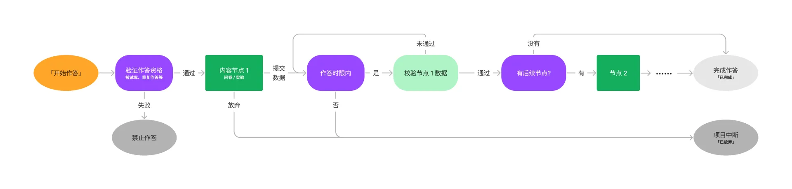

# 项目作答常见问题

## Q：被试作答脑岛项目的流程是怎样的？
  A：不熟悉脑岛的用户经常会将「项目」中的某一部分认为是整个项目。实际上，脑岛的「项目」流程会复杂一些，应该和单个「实验」区分开，实验是项目的一部分，以「节点」形式存在。  
  了解项目流程对于研究者和被试都很重要，研究者首先应该确保自身熟悉流程（发布或预发布后完整作答过），其后应该指导被试按照流程进行操作，以避免作答了却没能拿到报酬的情况出现。下面是项目流程的简单流程图。完成作答后被试才能够拿到报酬  
  

## Q：被试反馈明明完成了实验，但下载数据的记录中显示「进行中」或「已放弃」？  
  A：很有可能是被试未进行最后的提交，参考上文的项目作答流程的说明。 

## Q：当被试作答中遇到问题，我该如何排查原因所在？  
  A：在线实验的实施需要一定的知识与技巧，对此不熟悉的研究者十分容易犯错。因此脑岛的建议首先是，在正式收取数据前，一定要进行预实验或做足测试（有时候仅预览是不够的，因为预览和真实的作答情况仍有差别）。  
  > 在作答过程中遇到任何问题，首先需要考虑的是该问题是否具有普遍性。  
  - 若有部分人能够成功完成，则应该观察能与不能完成的两部分人使用的（浏览器、操作系统等）环境之间的差异，并通过设备限制等功能获得最佳的兼容性。如果只是偶发难以找到规律，则可以考虑网络问题等。  
  - 若所有人都无法完成，则应该是系统性的问题，可能的情况有实验程序的编写错误、画布流程设置错误、平台出现故障等。  
  若您确定是平台存在故障，请及时通过网站客服联系平台工作人员。
