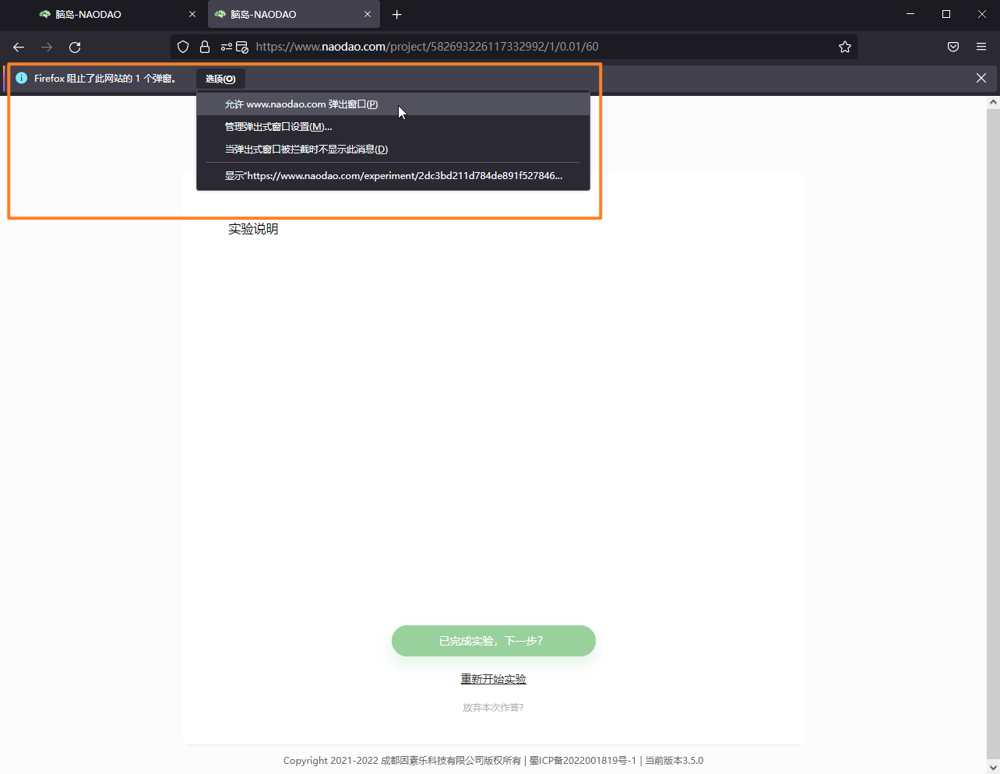

# 在线研究速答

> 我们有一篇关于在线研究[十分详尽的综述](http://chinaxiv.org/abs/202206.00150)，请阅读以了解更多在线研究的注意事项和最佳实践

- Q：什么是在线心理学研究？  
  A：宽泛来说，在线心理学研究指的一些基于互联网的心理学研究。更具体地说，在脑岛上，在线心理学研究指运用**在线问卷**和**在线实验**两种手段，通过互联网被试库招募被试收集数据，进行的心理学或相关科学研究。 

- Q：相比于传统的心理学研究，在线心理学研究有何优势？  
  A：在线心理学研究不仅能够专门研究互联网环境下人们的心理状态，更有助于降低研究的时间、金钱和人力成本，降低主试偏差，提高样本容量和代表性（从而增加统计检验力，更易显著）。 

- Q: 在线研究可以完全取代线下研究吗？  
  A: 需要分情况讨论。线上量表替代线下的纸笔测验已经十分成熟，并被广为接受；而更复杂的在线实验，则需要根据研究目的和实验要求判断是否适合，总体而言，在线实验无法完全代替实验室实验。研究者应该根据实际情况选择合适的研究手段。 

- Q: 什么样的实验不适合线上进行？  
  A: 如果实验需要精准控制、特定设备或非视听刺激（如触觉）、记录大脑数据（如脑电、磁共振）等，抑或是实验的流程 / 刺激涉及保密，这些情况下的实验不应该或无法该在线进行。

- Q: 在线实验有哪些注意事项？  
  A: 在线实验进行中主试通常不在被试身边，因此需要和线下相比需要一些额外的做法，包括并不限于：1) 务必进行测试，确保分发给被试的程序能够正常作答；2) 正式实验前确认被试身份的有效和独立，避免因为欺诈或恶意重复作答导致的损失；3) 在程序上使用更强的控制，包括限制被试作答设备、提供可操作性更强的指导语、准备练习阶段并判断练习阶段正确率等；4) 考虑设备差异，可以使用相对指标和进行刺激矫正等抵消设备差异带来的变异；5) 尽量让被试报告作答时的环境。 

- Q：使用在线实验前，我需要有一定的编程基础吗？  
  A：不一定，脑岛提供了三种实验编写方式：简单云无须编程，PsychoPy需要编程以实现一些高级控制，jsPsych目前仅支持纯编程。通常来说，在线实验与线下实验的编程难度基本相当，您可以根据自己实验的需求来进行相应的选择。 

  # 脑岛平台概述

- Q: 使用了脑岛科研平台，应该如何引用脑岛？  
  A: 我们鼓励脑岛的用户在相关的作品中引用脑岛。脑岛目前可被引用的文献如下 
  > 陈国球，高晓雪，鄢忻媛，杜梦，臧寅垠，汪寅. (2022). *在线心理学研究的历史、现状和展望*. ChinaXiv. http://chinaxiv.org/abs/202206.00150
  >
  > Chen, G., Gao, X., Yan, X., Du, M., Zang, Y., & Wang, Y. (2022). *Online research in psychology: The past, present and future*. ChinaXiv. http://chinaxiv.org/abs/202206.00150

- Q：脑岛平台在在线研究方面有何优势？  
  A：作为研究者，您能够从研究设计、数据收集、质量控制、科研成果的传播与转化、教学与科普等多环节中感受到脑岛资源整合模式所带来的便捷与高效。此外，心理学或相关专业学生还能用于教学任务或科研训练。 

- Q: 在脑岛平台实现在线研究的流程是怎样的？  
  A: 注册成为脑岛用户后，如果想进行研究而非作答，需要在导航栏上进入研究者平台。认证成为研究者后，即可使用研究者最核心的功能——项目推进研究。一般需要经历以下步骤：1) 在项目中编辑好实验、问卷等内容；2) 发布项目；3) 等待被试作答并支付报酬，支付的渠道会根据发布的选择有所不同；4) 完成或主动取消项目。 

- Q: 申请研究者认证需要多长时间通过？  
  A: 平台目前支持 2 种认证方式，1) 使用教育邮箱认证，在填写正确的验证码之后即通过认证；2) 上传资料认证，该通道为人工审核，速度稍慢，通常在 48 h 内出审核结果。请注意上传能够证明研究者身份并**能够识别个人信息的材料**，以免审核不通过造成的重新提交和等待。 

- Q：脑岛平台的项目有哪些发布方式？  
  A：在脑岛，您既可以使用「匿名作答」的方式收集哪些不方便或不愿意注册脑岛的被试数据，并自行支付其被试费；也可以使用「脑岛平台」发布的方式来在脑岛上收集数据、自动支付被试费、进一步追踪被试等。

- Q: 脑岛平台会使用我的数据吗？  
  A: 由您的账户收集到的数据使用权归您所有。我们将遵循相关法律法规对您的数据进行保护，未经许可不会使用您收集到的数据。您的用户数据使用可以查看平台的《用户协议》和《隐私政策》。 

- Q: 被试能用手机作答吗？  
  A: 我们在积极适配移动设备。但需要注意，被试实际上作答的内容（尤其是实验类型）基本上由研究者提供，被试能否在移动端有效作答实验完全取决于实验的编写，而大部分实验不适宜在移动端作答。 

- Q: 脑岛平台的功能可以支持哪些实验设计？  
  A: 目前脑岛可以帮助研究者实现： 
  - [x] 被试内、被试间设计
  - [x] 指定被试群体参与
  - [x] 长程被试追踪
  - [ ] 多人实验（开发中）

- Q：我需要帮助，脑岛提供了哪些支持系统？  
  A：对于实验编写节点和其他使用问题，我们在论坛里专门配置了相关板块，目前每个板块都由该节点的主要创建者或能够熟练使用的科研人员来进行维护；我们极其欢迎您在阅读完相应的发帖格式与规范后发帖提问。我们最为推荐您在论坛上发帖，但我们也提供了其他一对一的渠道，包括「脑岛科研平台」公众号留言、research@naodao.com发邮件等。 

  # 费用和报销

- Q: 如何通过脑岛平台将报酬给被试？  
  A: 研究者需要发布「脑岛平台」渠道的项目，发布时会从研究者账户余额中扣除项目设定的金额。被试在作答完成，并通过项目发布者的审核之后，即会收到报酬。 

- Q: 脑岛平台的收费标准是什么？  
  A: 平台目前不收取任何费用，仅需支付被试费即可。后续我们有可能提供付费服务，收费标准变更时我们会在各个渠道提前通知用户。 

- Q: 发布时扣除的冻结金额是什么，可以退回吗？  
  A: 发布项目时，会按照作答所得（最大）报酬 × 项目人数，从研究者账户余额中扣除金额，余额不足时无法发布项目。扣除的金额处于冻结状态，当有被试完成作答并通过审核，则会将这部分金额发放给被试。当项目完成或研究者手动取消后，剩余的冻结金额会退回账户余额。 

- Q: 充值到个人中心的余额用不完可以退款吗？  
  A: 可以退款，目前脑岛不收取手续费，但研究者需要承担由支付平台收取的 1% 手续费。 

- Q: 如何获取发票或其他报销凭证？  
  A: 脑岛支持提供电子发票、充值协议等材料，详见[充值与报销](https://www.yuque.com/naodao/researcher-manual/transfer)。 

- Q: 如何获得金额花费的明细？  
  A: 脑岛提供了每一笔支出订单的明细，导出方法见[被试费明细](https://www.yuque.com/naodao/researcher-manual/transfer#R3NgM) 

- Q：是否支持国际支付？  
  A：目前暂不支持国际支付方式；如您确实需要，您可以通过mkt@naodao.com联系平台来获取进一步的信息。 

  # 项目、画布和节点

- Q：画布是什么，画布包含哪些内容？  
  A：画布是项目的核心功能。一开始，您需要拖入开始节点，随后就像完成一个流程图一样，通过创建节点和连线就能直观地完成实验设计。双击画布上的节点会进入对应的内容编辑或功能页面。您可以参考使用手册的[画布与节点](https://www.yuque.com/naodao/researcher-manual/wsing0)。 

- Q：如何在画布上实现被试间设计？  
  A：可以利用画布的「分组器节点」实现设定被试作答中的不同走向，在画布上体现为不同的组别（分支）。分组器节点包含「随机分组」和「行为分组」。 

- Q: 通过分组节点产生的多个分支该如何聚拢呢？  
  A: 画布只支持树状结构排列节点，无法聚拢。可以使用节点复制功能快速创建多个相同的结束节点，并安排在不同分组下。这样的好处是双击结束节点预览的必定是对应的分支，不受预览中作答的影响 

- Q: 行为分组该如何使用？  
  A: 行为分组会获取分组器的前一个节点的**得分**，根据设置好的区间决定被试被分在哪一个分支。当被试的得分没有落在任何区间时会被分到默认分支。问卷节点的得分需要在题目中设置，只有个别题型可以设置分值；实验节点需要使用 Python 脚本解析实验数据并返回得分数值。详情参见[行为分组](https://www.yuque.com/naodao/researcher-manual/ih2gp8)。 

- Q: 脑岛目前是否支持同时「行为分组」和「随机分组」？  
  A: 可以同时使用，但行为分组之后的分支无法使用随机分组。这是因为行为分组是根据被试上一个节点被试的得分进行分组，因而每组的人数是不确定的；而随机分组的上游需要固定人数，以便分配为每一组的人数（也即随机分组并非完全随机）。 

- Q: 那么应该如何实现「行为分组」后随机安排实验呢？  
  A: 可以认为此时需求的随机对于每组的比例（或人数）没有硬性要求，也即完全随机可以满足。因此可以尝试在**实验内**实现随机呈现实验 block 以达到对应的需求。 

- Q：PsychoPy / jsPsych 节点上传实验压缩包失败或卡在 95% 处。  
  A：请确保您的压缩包：1) 体积小于 100 MB；2) 没有数量非常多的子目录或和文件；3) 包含且仅包含一个 html 文件（`index.html`） 

  # 项目发布和数据收集

- Q: 发布项目中各个选项的作用是什么？  
- A: 请查阅[发布项目](https://www.yuque.com/naodao/researcher-manual/cd165t)内容，需要重点关注、谨慎填写的内容包括**发布渠道**、**项目人数**、**被试答题时长限制**、**是否允许重复作答**。
 
- Q: 如何取消发布项目？  
  A: 点击「创建项目」按钮旁边的「发布管理」，可以在发布管理页取消和查看发布

- Q: 为什么项目取消之后不能再修改、发布？  
  A: 修改后再发布会带来数据和订单上的混乱，因此我们禁止了这种操作。 

- Q: 为什么实验预览时会下载数据，发布之后，被试作答完成没有下载数据？  
  A: 预览后下载的数据是为了让研究者查看数据结构，以便进行调试、数据分析等操作。发布后被试作答产生的数据均会上传至脑岛服务器，被试无法拿到他们的数据。研究者可以点击项目的「下载数据」按钮查看数据情况。 

- Q: 什么情况下测试记录中被试的作答状态为「进行中」？  
  A: 被试作答状态为「进行中」可能的情况为：1) 被试正在作答中；2) 被试作答中途退出，未进行最后的提交。被试因为意外退出作答的情况可以通过断点续答机制补救。 

- Q: 什么情况下测试记录中被试的作答状态为「放弃」？  
  A: 被试作答状态为「放弃」可能的情况为：1) 被试在作答中主动点击「放弃本次作答」按钮；2) 被试的作答时长超过了设置的时长限制（在发布项目时设置），即作答超时。作答超时不一定是被试真正在作答，被试（未触发断点续答）处于进行中的状态，持续时间超过时长限制，以及被试超过断点续答 24 h 的限制都会导致作答状态为「放弃」。 

- Q: 项目有被试作答后之后为何下载的数据是不完整 / 无法下载 / 为空？  
  A: 最常见的原因在于有些被试可能还未完成作答或脱离了项目作答流程，处于「作答中」或「放弃」状态，因此没有真正收集到他们的数据。 

- Q: 为什么收集到的数据量和人数不一致？  
  A: 首先需要确认人数指的是哪里的人数，项目页面的参与人数中可能包括未产生数据的被试和被拒绝的被试，因此参与人数总是大于有效作答（即审核通过）的人数。下载到的数据均为有效作答的数据。 

- Q: 下载数据的形式是怎样的？  
  A: 平台的数据统一以 CSV 格式储存。项目中的所有问卷类型数据会储存在同一张 CSV 的表中；而实验类型数据会以文件夹的形式储存，文件夹中每个被试的实验数据以独立文件储存，以节点名称作为文件名前缀用于区分。此外 BasicInformation 文件夹下还有储存所有作答被试信息的表。 

- Q: 实验数据似乎和预期的不一样？  
  A: 对于实验类型，平台只会保存接收到的数据文件，数据文件的产生与平台无关，请核实实验程序文件的问题。 

- Q: 问卷数据中出现很多 -888，-999 的字样。  
  A: `-999`表示被试没有作答该题。`-888` 表示一个块的子题没有回答或多选题的可选项没有选择（因此对于矩阵多选会有很多 `-888`）。由于多个问卷节点的数据显示在一起，没有被作答的节点数据也表示为 `-999`。 

- Q: 数据中能不能被试进入的显示分支？  
  A: 这项功能我们正在开发中。 

- Q: 屏幕宽度 400 左右时指手机用户么？  
  A: 屏幕宽度显示的是经过缩放后的逻辑像素值，该值特别小的通常是手机用户。 

- Q: 为什么项目页面有的项目消失了？  
  A: 已完成、已取消的项目将在终止后一个月以后自动加入回收站。回收站的项目可以手动恢复至项目列表中，若 进入回收站一个月未恢复，则会被清除。建议研究者注意数据情况，及时保存数据到本地。 

  # 被试侧常见问题

- Q: 被试点击开始实验后，只能够选择已完成实验和重新开始实验。  
  A: 这通常是由于浏览器禁止了弹窗，使得实验链接无法顺利打开，常见于火狐浏览器的默认设置。这种情况下通常浏览器地址栏附近都会有显著的提示，点击提示可以更改对应的弹窗策略。  
  

- Q: 被试反馈明明完成了实验，但下载数据的记录中显示「进行中」或「放弃」？  
  A: 很有可能是被试未进行最后的提交，参考上文的被试作答状态的说明。 