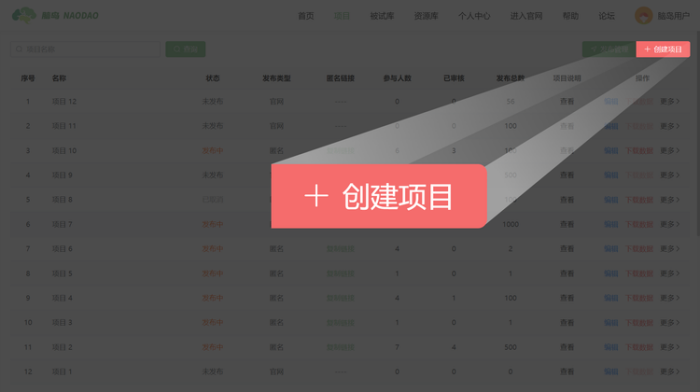
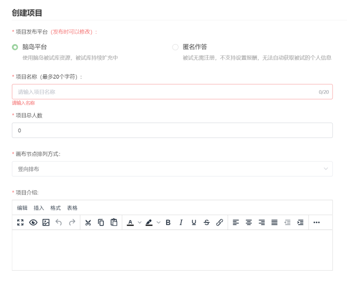
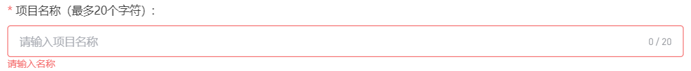
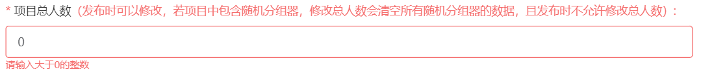
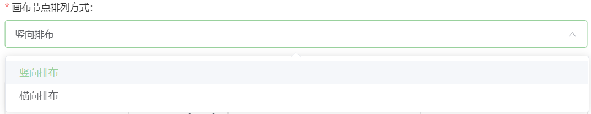
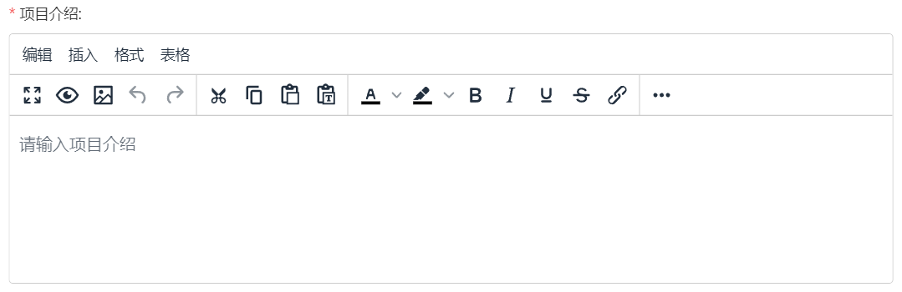
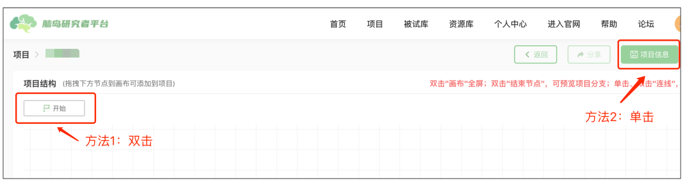

# 新建项目 <!-- {docsify-ignore-all} -->

1. 点击页面右上角「创建项目」按钮新建项目。

2. 新建项目时需要填写一些项目信息，您可以在「创建项目」弹框中填写项目发布渠道、项目名称、项目人数、节点排列方式和项目介绍。其中的项目发布平台（发布渠道）和项目人数在发布项目时通常仍可以更改。

## 项目基本信息设置

### 项目发布渠道

选择发布渠道：`脑岛平台`或`匿名作答`

`脑岛平台`发布会将项目发布在脑岛平台首页 (https://www.naodao.com) 的`答题赚钱`版块中，发布对象为脑岛的注册用户。研究者通过脑岛发放被试费用，并可以利用脑岛提供的`被试库`等功能，对接收人群进行更精确的（人口学信息）选择。需要注意研究者无法参与自己发布的项目

`匿名作答`发布后脑岛仅提供一个匿名链接，研究者需要自行将链接分发给被试，被试无需注册脑岛即可作答。脑岛平台不参与匿名发布项目的分发、信息收集、测试费结算等环节

无论选择哪种发布渠道，被试完成项目产生的数据都会储存在脑岛，但 2 种发布类型可以对被试进行的筛选、对数据的审查等方面也略有不同。

### 项目名称

项目的标识名称，不能与其他已有项目重复。

> 注意项目名称与发布名称略有不同：
>
> - 项目名称作为项目的标识，会在研究者的项目列表中显示；
> - 发布名称是被试作答时在平台首页看到的名称。

如果选择发布到脑岛平台，则发布时需要另外设置发布名称；而匿名发布会将项目名称作为发布名称。

项目名称建议不要超过20个字符（包括中英文字符）

### 项目人数

项目预定收集的人数，必须填入大于 0 的整数。

当收集到指定人数的有效数据后项目会变为`已完成`状态。修改人数会影响项目内的分组器（随机分组）的行为。对于发布到脑岛平台的项目，人数还决定了需要预先支付的报酬。

创建项目时设定的项目人数在发布项目时通常仍可以更改，例外是如果在项目中使用了随机分组节点，则必须在画布上设置好人数，发布时无法再更改人数。

可以双击开始节点，或点击页面右上方的`项目信息`按钮更改人数。

### 节点排列方式

可选`竖向排布`和`横向排布`，设定画布上节点的排布和连接方式。

### 项目介绍（指导语）

项目介绍会呈现在作答界面的信息中，一般会在此处填写项目的指导语。项目介绍支持使用富文本，可根据需求调节字体的格式、插入图片和链接等，非常便捷。

### 修改信息

进入画布后，如果需要重新编辑以上信息，可以双击`开始`节点，或点击页面右上方的`项目信息`按钮进行修改。