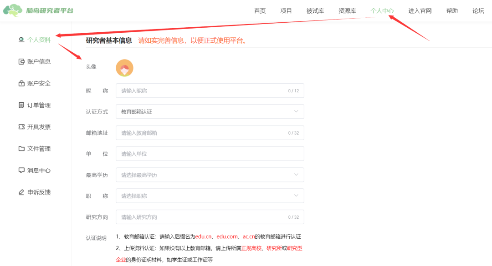
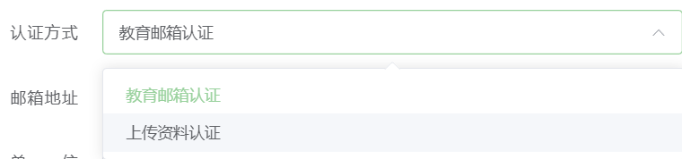
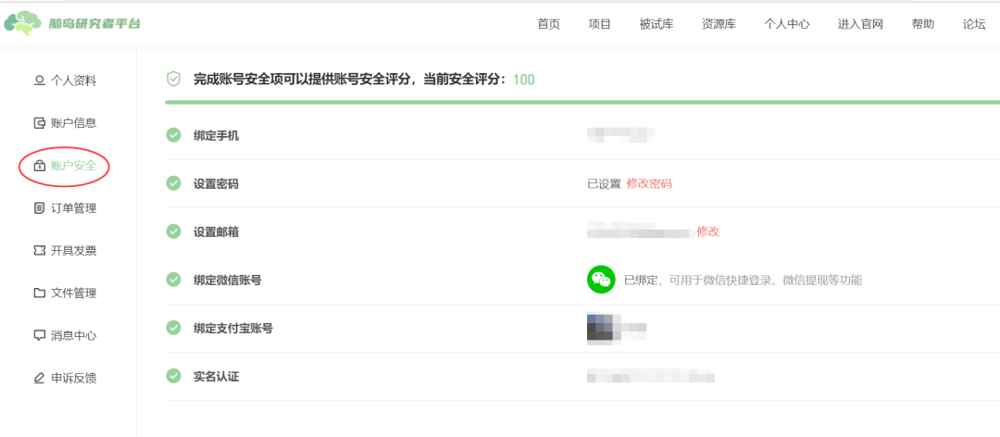

# 认证研究者流程 <!-- {docsify-ignore-all} -->

1. 当用户注册、登录后，即可进入“研究者平台”。

2. 在进入“研究者平台”时脑岛会要求用户进行研究者认证。研究者认证需要在`个人中心` -> `个人资料`完善资料，目前所有基本信息均为必填项。包括昵称、单位和研究方向等。认证可以选择使用教育邮箱或上传材料认证（人工审核稍慢）。

3. 如果用户没有完善（认证）个人资料，则不能使用研究者平台所有功能，之后每一次进入研究者平台，脑岛都会默认先跳转到个人中心页面，提示用户完善个人资料。

4. 认证方式一旦选择**无法**更改。上传材料认证时请上传能够识别身份的认证材料，上传封面或上传其他无关材料一般无法通过审核。

## 个人资料的提交

研究者要正常使用平台必须完善个人资料并通过认证。用于认证研究者。其中最关键的认证，可选`教育邮箱`认证和`上传资料`；

**教育邮箱认证**：请使用后缀名为 edu.cn、edu.com、ac.cn 的教育邮箱进行认证。系统会发送验证码至符合格式的邮箱，需要将验证码填回认证框；

**上传资料认证**：如果没有以上教育邮箱可选上传资料（人工审核）。请上传所属正规高校、研究所或研究型企业的身份证明材料，如学生证或工作证等；

> 注意:
> 1. 认证方式一旦选择无法更改；
> 2. 如果没有收到验证码邮件请检查是否在「垃圾邮件」中，注意验证码的期限；
> 3. 上传材料认证时请上传能够识别身份的认证材料，上传封面或上传其他无关材料一般无法通过审核；

## 账户安全

1. 用户可在账户安全中进行 绑定 手机号、邮箱以及微信账号和支付宝账号等操作，注意一下，目前手机号绑定后就不可以修改了嗷，邮箱可以修改。

2. 除邮箱外，账户安全中的其他项目都和被试者平台保持一致。详见被试者个人中心说明，这里的金额也与被试者平台保持独立。