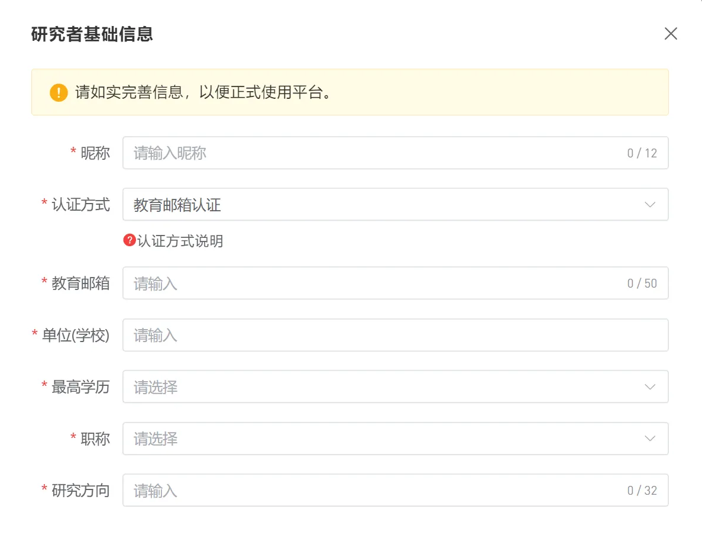
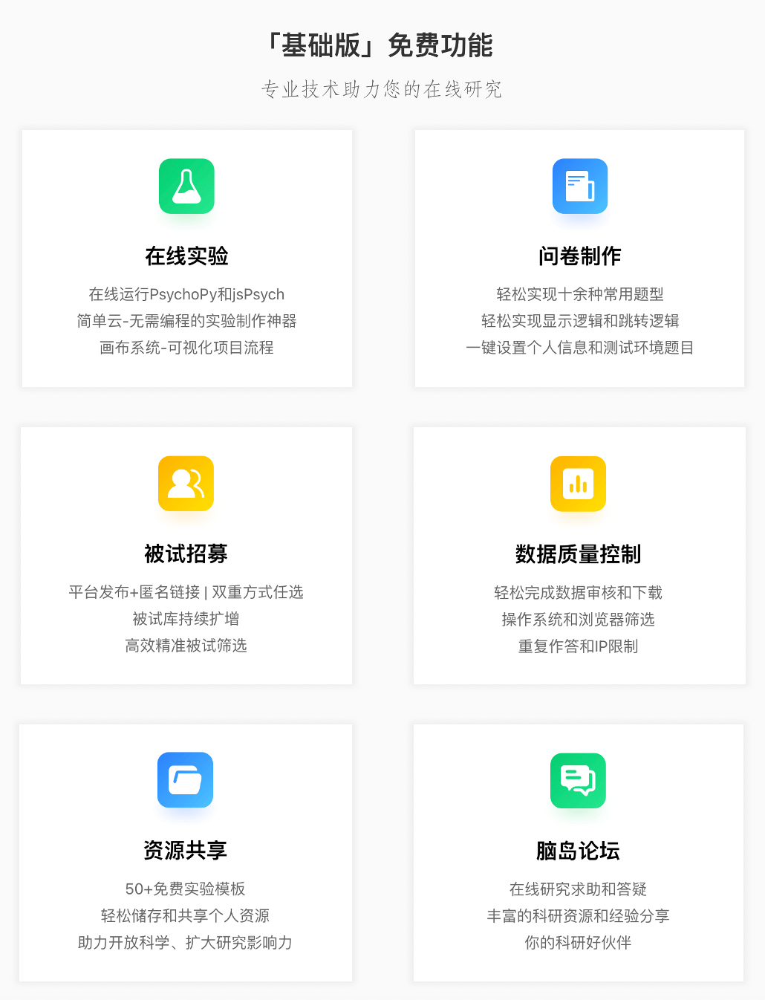
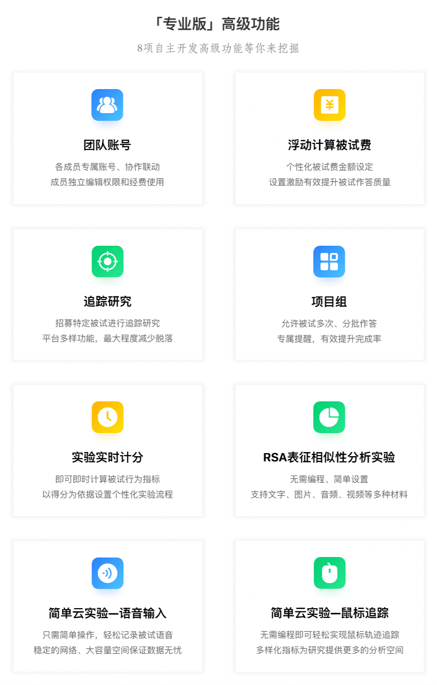
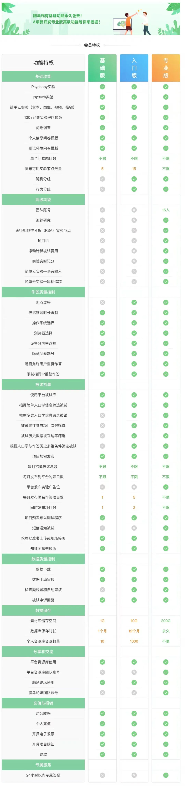

# 认证研究者
研究者注册脑岛并实名后，默认成为脑岛测试者（被试），想要使用研究者功能，需要进行研究者认证。

## 认证方式
在验证邮箱以外，脑岛还需要研究者提供其身份的证明，我们接受 2 种证明研究者身份的方式：

+ **教育邮箱认证**：支持使用域名包含 `edu.cn`, `edu.com`, `ac.cn` 的中国大陆教育邮箱进行认证，其余邮箱需要使用上传资料认证。
+ **上传资料认证**：填写非教育邮箱后，需要另外上传所属正规高校或研究所的身份证明材料，如学生证、工作证、学信网材料等。材料由人工审核，一般在 2 个工作日内审核完毕。

选择认证方式后不可修改，更改邮箱后需要重新进行研究者认证。

如果收件箱中没有验证码邮件，

1. 请检查是否在「垃圾邮件」中。注意验证码的期限。
2. 部分高校自建邮箱、国外邮件服务等可能出现延迟较长或无法收到邮件的情况。若在尝试了等待、重新发送都无效之后，请更换邮箱或选择上传资料认证。

## 其余研究者信息
+ 单位
+ 最高学历
+ 职称
+ 研究方向

# 学术资源
## 引用脑岛
我们鼓励脑岛的用户在相关的作品中引用脑岛。脑岛目前可被引用的文献如下（APA Style 7）

+ **在线心理学综述**

陈国球，高晓雪，鄢忻媛，杜梦，臧寅垠，汪寅. (2023). 在线心理学何以本土化？基于历史、理念与综合性的分析. _心理科学_, _46_(5), 1262–1271. [https://doi.org/10.16719/j.cnki.1671-6981.20230529](https://doi.org/10.16719/j.cnki.1671-6981.20230529)

Chen, G., Gao, X., Yan, X., Du, M., Zang, Y., & Wang, Y. (2023). Online research in psychology and its future in China. _Journal of Psychological Science_, _46_(5), 1262–1271. [https://doi.org/10.16719/j.cnki.1671-6981.20230529](https://doi.org/10.16719/j.cnki.1671-6981.20230529)

## 数据质量
在线实验的数据质量已经得到过众多文献的验证，结果大多认为在线行为实验的数据足够满足研究需要。为了验证托管于脑岛平台的在线实验的可靠性，我们完成了一项包含 3 个实验的数据比对研究。在研究中，我们将同一个实验范式分别在**脑岛平台**、PsychoPy 官方平台 **Pavlovia** 以及**线下** 3 个渠道施测，对比实验的各项指标。结果表明 3 个渠道均表现出良好的效应，并且脑岛平台收集的数据质量与其余 2 个渠道没有明显差异。

实验材料与数据详情请查看 [GitHub](https://github.com/BNU-Wang-MSN-Lab/NaoDao_Data_Reliability) (英文)。

# 脑岛手续费
## 收费规则
手续费的计算可以以下方公式表示：

1. **项目托管费**：指的是使用脑岛项目并发布后，为每份通过审核的作答支付的一定固定费用，与使用的节点有关。例如使用了 `n` 个收费节点、该节点的单价是 `m` 元，则托管部分的费用是每个被试 `m×n` 元。
2. **招募服务费**：指的是在通过脑岛平台招募时，为每份通过审核的作答支付的基于被试报酬一定比例的抽成，通过匿名作答发布则不收取这部分费用。例如为每个被试通过脑岛发放报酬 `F` 元，收取比例为 `a%`，则每个被试的招募服务费是 `F×a%` 元。

也就是说，最终一个项目需要支付的费用与节点数量、招募被试数量、被试报酬（如果在平台招募）相关。

在权衡成本、比较了国内外众多同类型服务并对研究者们的态度进行了调研后，脑岛最终制定了下方的价格方案。

|  | 平台发布 (通过脑岛招募被试) | 匿名发布 (自行招募被试) |
| :--- | :---: | :---: |
| 每个问卷节点 (含个人信息、测试环境节点) | 免费 | 免费 |
| 每个实验节点 (目前有简单云, PsychoPy, jsPsych 节点) | 每份作答 0.5 元 | 每份作答 1.0 元 |
| 每个特殊类型节点 (目前有 RSA 节点) | 每份作答 0.8 元 | 每份作答 1.5 元 |
| 招募服务费用为 | 10% 被试实际报酬 | 无 |

**项目托管**部分的费用存在**每份 10 元**的上限，超过 10 元后节点不再继续收费。上表没有列出的节点均无需收费。具体收取金额以项目发布页面的计算为准。

## 常见问题
Q：何时开始实施新的收费方案？

A：新的收费方案自 2024 年 1 月 15 日开始实施。

Q：这项政策实施前的项目会受到影响吗？

A：1 月 15 日之前已经发布的项目仍然可用，不会受到影响；1 月 15 日前创建但还未发布的项目，在 1 月 15 日后发布将收取费用。

Q：如何支付手续费？

A：一般而言是通过脑岛账户余额支付。以项目为单位，在发布项目时与被试报酬一同预先支付，在项目结束时结算、如有剩余则退回账户余额。

Q：开通会员可以优惠手续费吗？

A：是的，我们将为会员**赠送抵扣券**，可以用券抵扣手续费费用。购买入门版将获赠平均每个月20元抵扣券，专业版将获赠平均每个月200元抵扣券，均接近会员的日常售价。

Q：匿名发布功能有时会用于测试项目，以后都不能免费发布了吗？

A：我们也意识到使用匿名项目进行测试的不便，如需要繁琐地复制项目等。我们推出了更接近真实发布情况的「**预发布**」功能，同时保留原有的预览功能。两者配合应该能够满足研究者测试项目运行情况的需求。

Q：未完成的或未通过审核的数据也需要支付手续费吗？

A：**只需要为有效作答支付手续费**。对于_平台发布_，只有**通过审核的算作有效作答**（也就是被试确实已拿到报酬的情况），未通过与未完成的作答均无需手续费；对于_匿名发布_，因为不存在审核过程，**完成的作答均算作有效作答**，未完成的则无需支付手续费。

Q：采纳被试的申诉需要支付手续费吗？

A：是的，通过申诉支付被试费同样需要收取手续费，与被试申诉的报酬一同结算，直接从账户余额扣除。

Q：复制的节点会重复收费吗？

A：通过复制节点功能产生的相同节点**不会重复收费**，更改了节点后会视作新的节点计算和收费。

Q：我的项目如果包含很多节点，费用会不会变得难以接受？

A：我们为项目托管费用部分设置了上限。单个项目的托管费用上限为**每份作答10元**，此后增加节点不再增加费用。基于被试数量的服务费部分不受此限制。

Q：如果使用了浮动被试费功能，如何抽成招募费用？

A：这种情况按**实际支付的报酬**计算，未使用的服务费将返还到账户余额。

Q：项目没等收集完成就手动结束了，已支付的手续费如何处理？

A：未使用的部分手续费将和被试费一同返还到脑岛账户余额。

Q：不属于平台发布和匿名发布的情况如何收费？

A：我们目前考虑到的有团队账号、项目组的情况。项目组的手续费相当于内部项目之和，每个内部的项目计费均与普通平台发布项目一致；团队账号的子账号发布的项目和主账号一致，抵扣券也可以被子账号使用。

# 脑岛高级会员介绍

购买脑岛会员请从**研究者个人中心**访问，或点击 [https://research.naodao.com/vip](https://research.naodao.com/vip) 查看。以下为脑岛[高级会员](https://uat.naodao.com/view/#/witness)独有功能介绍推文。

+ **RSA 实验节点**

[脑岛使用小妙招21丨带你掌握RSA实验节点——RSA和实验参数介绍](https://mp.weixin.qq.com/s/_vvNCXjKxYWAjxASr84Wbg)

[脑岛使用小妙招22丨带你掌握RSA实验节点——刺激处理、实验预览、操作和结果处理](https://mp.weixin.qq.com/s/8QkyjFeSoRvRKoYdPVpcPQ)

+ **简单云鼠标追踪**

[脑岛高级功能｜实时测量心理过程的前沿技术——鼠标轨迹追踪功能全新升级](https://mp.weixin.qq.com/s/7AOlebv79o2RpU4ktn5l2A)

+ **团队账户**

[脑岛高级功能｜团队账户，助力每一位PI自动化管理团队](https://mp.weixin.qq.com/s/iFmvvV8XkzSLMi-xdRozzA)

