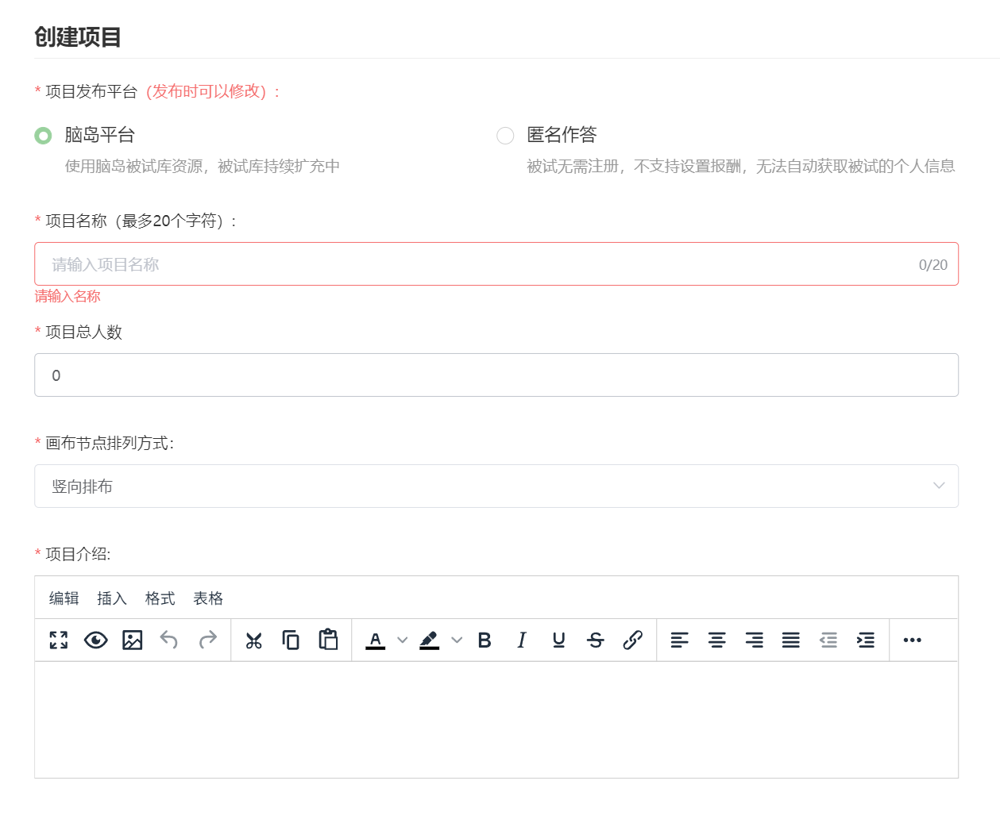
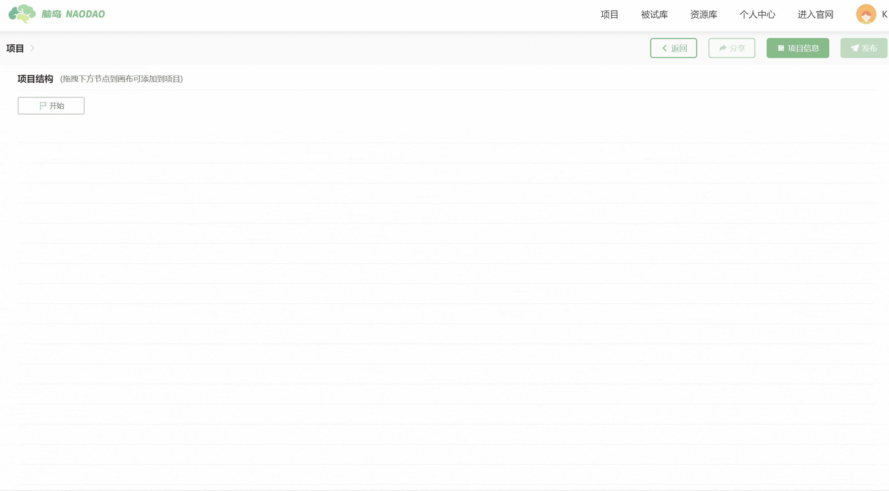

# 新建项目 <!-- {docsify-ignore-all} -->

您可点击页面右上角「创建项目」按钮新建研究项目。

新建项目时需要填写一些项目信息，您可以在「创建项目」弹框中填写项目发布平台、项目名称、项目人数、节点排列方式和项目介绍。其中的项目发布平台（发布渠道）和项目人数在发布项目时通常仍可以更改。

## 项目发布平台

主条目：[发布项目](project1-3.md) - [发布渠道](project1-3.md#发布渠道)

选择项目发布的平台（渠道），可选「脑岛平台」和「匿名作答」。

* 「脑岛平台」发布会将项目发布在脑岛平台首页 (https://www.naodao.com) 的「答题赚钱」版块中，发布对象为脑岛的注册用户。研究者通过脑岛发放被试费用，并可以利用脑岛提供的 被试库 等功能，对接收人群进行更精确的（人口学信息）选择。需要注意研究者无法参与自己发布的项目
* 匿名发布后脑岛仅提供一个匿名链接，研究者需要自行将链接分发给被试，被试无需注册脑岛即可作答。脑岛平台不参与匿名发布项目的分发、信息收集、测试费结算等环节

无论选择哪种发布渠道，被试完成项目产生的数据都会储存在脑岛，但 2 种发布类型可以对被试进行的筛选、对数据的审查等也方面略有不同。

## 项目名称

项目的标识名称，不能与其他已有项目重复。注意项目名称与发布名称略有不同：项目名称作为项目的标识，会在研究者的项目列表中显示，而发布名称是项目作答时、在平台首页时显示的名称。

如果选择发布到脑岛平台，则发布时需要另外设置发布名称；而匿名发布会将项目名称作为发布名称。

> 项目名称建议不要超过20个字符（包括中英文字符）

## 项目人数

项目预定收集的人数，必须填入大于 0 的整数。当收集到指定人数的有效数据后项目会变为「已完成」状态。人数会影响项目内的分组器（随机分组）的行为。对于发布到脑岛平台的项目，人数还决定了需要预先支付的报酬。

创建项目时设定的项目人数在发布项目时通常仍可以更改，例外是如果在项目中使用了随机分组节点，则必须在画布上设置好人数，发布时无法再更改人数。

> 可以双击开始节点，或点击页面右上方的「项目信息」按钮更改人数

## 节点排列方式

可选竖向排布和横向排布和横向排布，影响了画布上节点的连接点位置。

## 项目介绍

项目介绍会呈现在作答界面的信息中，一般会在此处填上项目的指导语。项目介绍支持使用富文本。

## 修改信息

进入画布后，如果需要重新编辑以上信息，可以双击开始节点，或点击页面右上方的「项目信息」按钮进行修改。

