# 问卷节点 <!-- {docsify-ignore-all} -->

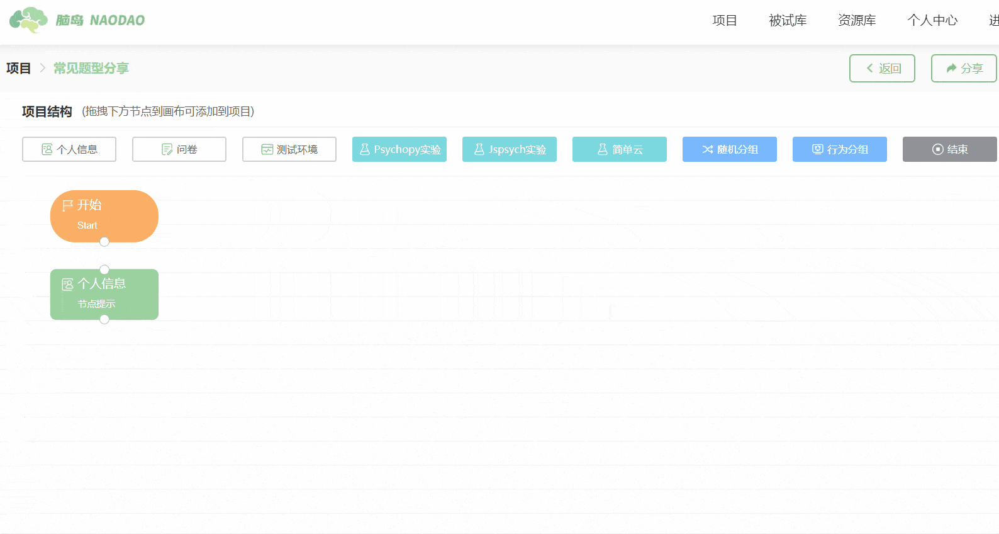

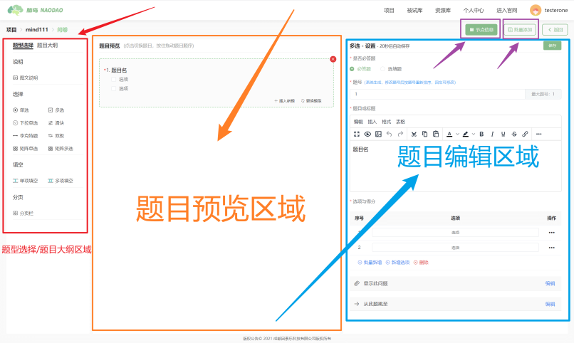

您可以通过【节点信息】按钮修改当前节点的基本信息（节点名称、节点提示）。

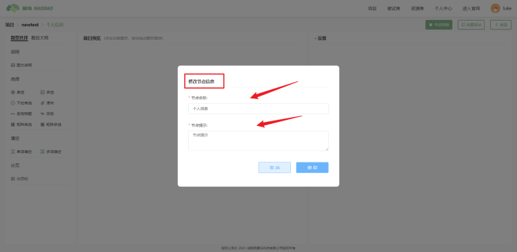

您可以在页面左侧的【题型选择】栏中选择常见的题型。您可以将【题型选择】栏中的题型通过鼠标点击按中并拖动这一动作进入到页面中间的题目预览区域中。

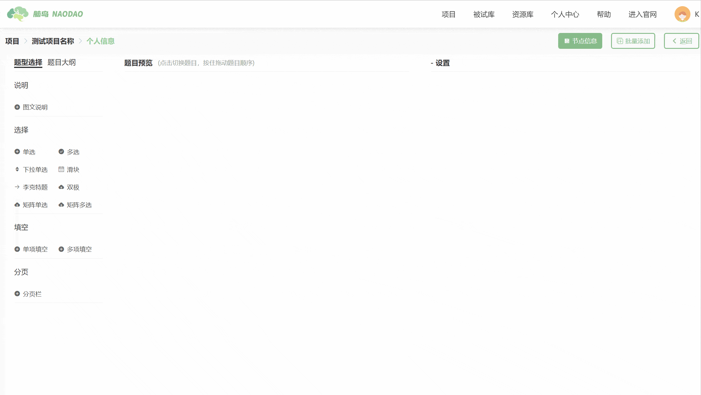

当您在题目预览区域中添加题目后，可以在右侧的【设置】栏中对单个题目进行编辑。

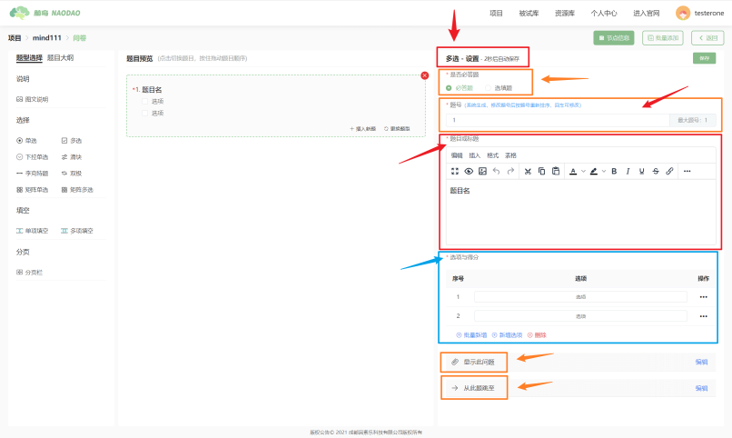

##### 必答题设置

***是否必答题***：您可以通过【*是否必答题】来设置某一道题是否必须被作答。

##### 编辑题号

**题号**：您可以在【*题号】里修改每道题的题号。正常情况下，平台会为题目预览区域中的每道题生成一个默认题号。当您自行修改某一道题的题号后，平台会根据新的题号自动更新所有题目的排序位置。

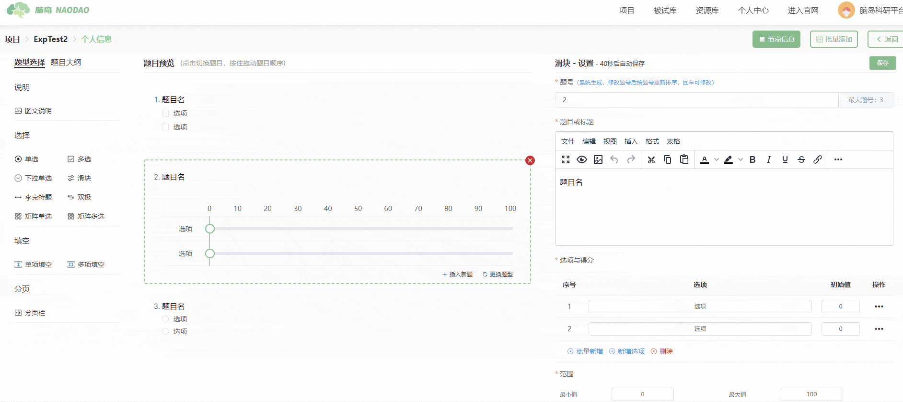

此外，当您在题目预览区域中直接拖动修改题目的排序位置时，平台也会自动修改题号。

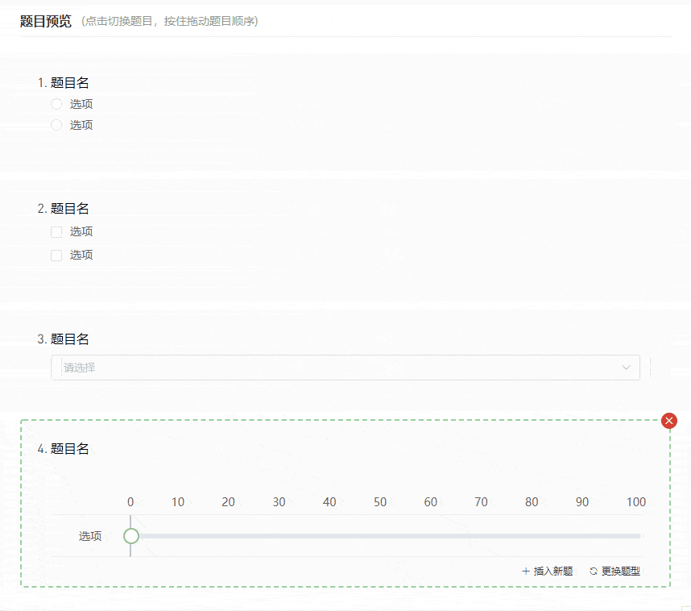

##### 编辑题干

***题目或标题***：您可以在【*题目或标题】里修改每道题的题干，题干的编辑支持富文本格式。

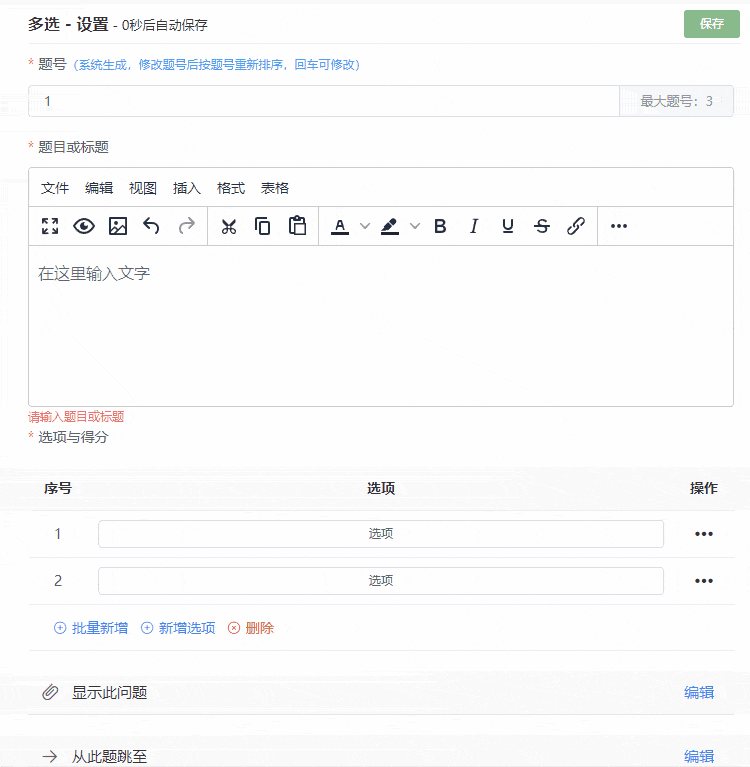

##### 编辑选项

***选项与得分***：您可以在【*选项与得分】里添加题目的选项。

您可通过【批量新增】功能批量增加选项。

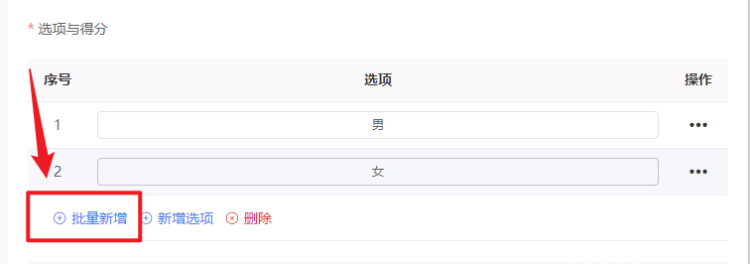

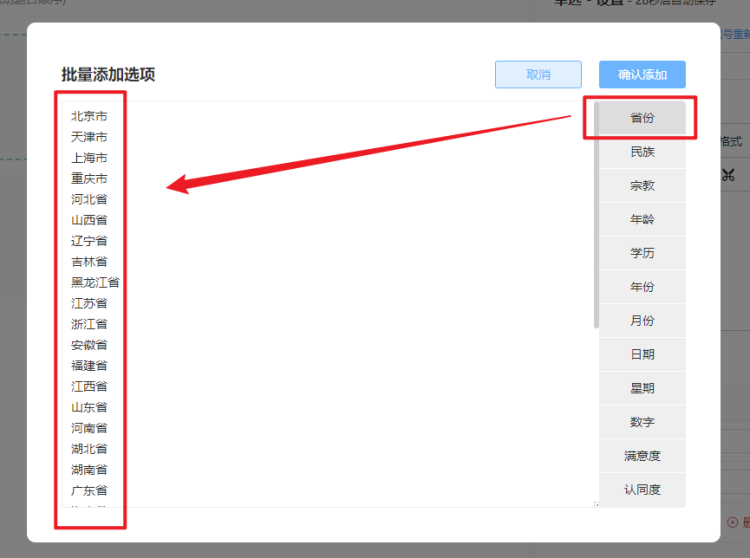

点击【新增选项】添加新的选项。

您也可以通过【操作】功能来编辑选项的具体内容。【操作】功能中提供富文本编辑器，可以对选项内容进行富文本编辑。

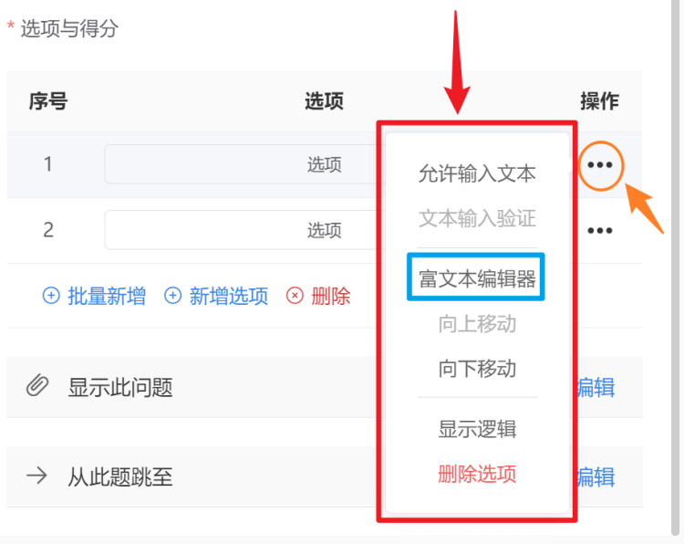

##### 错题验证

您可以为题目设置【错题验证】功能：在题目选项的操作栏中点击【错题验证】，即可将当前选项设置为错题验证选项。

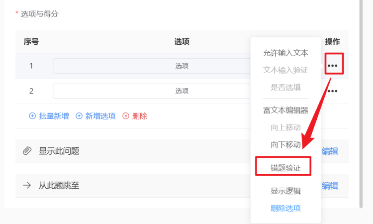

需要说明的是，【错题验证】功能是针对题目选项的操作，也就是说，您只能针对题目的选项(一个或多个选项)进行错题验证设置。以下图为例，我们对选项A进行错题验证设置，这意味着如果被试在作答这道题的时候选择了选项A，那么就代表着被试做错了这道题，此时被试的错题数就会+1。

> 【脑岛Tips】脑岛目前只支持为单选题、下拉单选和矩阵单选题设置错题验证。

##### 显示逻辑

***显示此问题***：您可以通过【*显示此问题】设置题目的显示逻辑。

所谓显示此问题是指在符合某些条件时显示这道题。因此想要为某一道题设置显示逻辑，必须要满足这道题的前面至少有一道题。

如下所示，如果要为第3道题设置显示逻辑，那么可以选择根据第1道题和第2道题进行判断。具体来说，您可以选择根据某一道题的某一个选项进行判断。

> 【脑岛Tips】图文说明题暂不支持设置显示逻辑，该功能正在开发中，敬请期待！

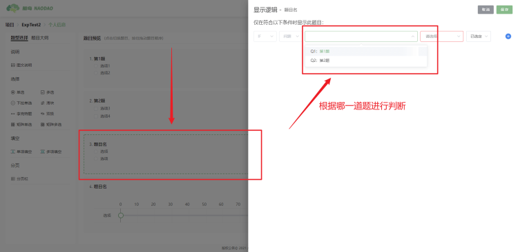

***已选定*** 表示当被试选定特定题目的特定选项*（此例中为选项1）*时才会显示第3题。

***未选定*** 表示当被试没有选定特定题目的特定选项时才会显示第3题*（此例中选定选项1不会显示第3题，选定选项2才会显示第3题）*。

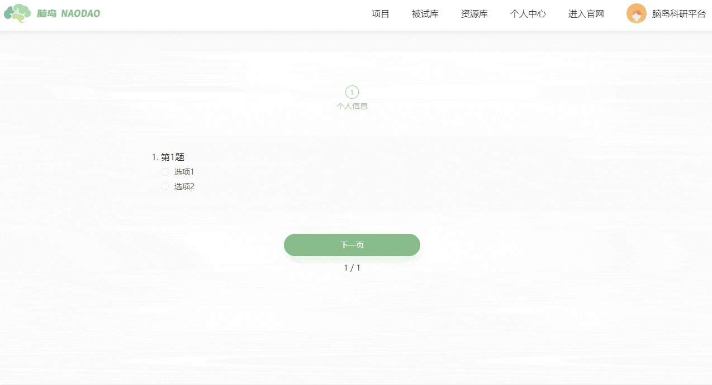

同时，除了上述的单一判断条件外，脑岛也允许您设置多个条件联合判断。您可点击【显示逻辑】弹框中的”+“号新增判断条件。

##### 跳转逻辑

***从此题跳至***：您可以通过【*从此题跳至】设置题目的跳转逻辑。

所谓从此题跳至顾名思义是指在符合某些条件时跳转到特定的题目。目前脑岛只支持向后跳转，也就是说只能从前面的题目跳转到后面的题目，不可以从后面的题目跳转到前面的题目。因此想要为某一道题设置跳转逻辑，必须保证这道题的后面还有其他题目。

此外需要注意的是，只有当目标跳转到的题目和跳转依据题处于不同分页的时候，跳转逻辑才能生效。也就是说，如果您希望被试选择第1题的选项1后，能够直接跳转到第3题，那么必须保证第1题和第3题不在同一页上。

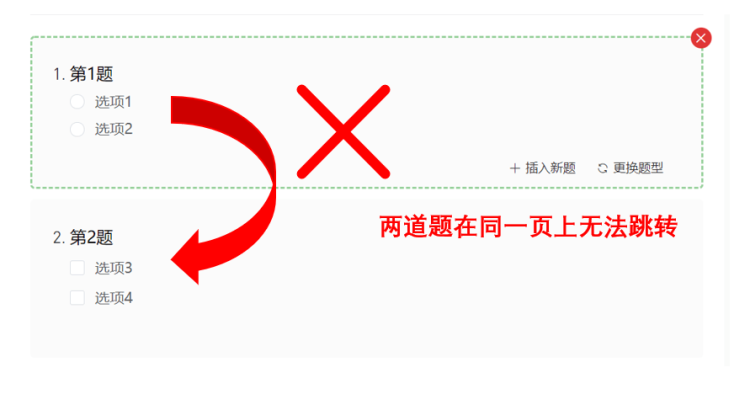

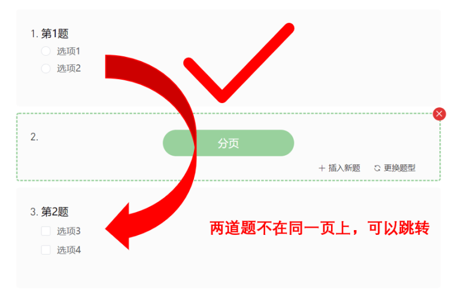

如下所示，第1道题可以跳转到第2、3道题，第2道题可以跳转到第3道题，而第3道题无法设置跳转逻辑，因为第3道题已经是最后一道题了。当您将第1题的跳转逻辑设置为从第1题跳转到第3题时，第2题将被自动跳过。

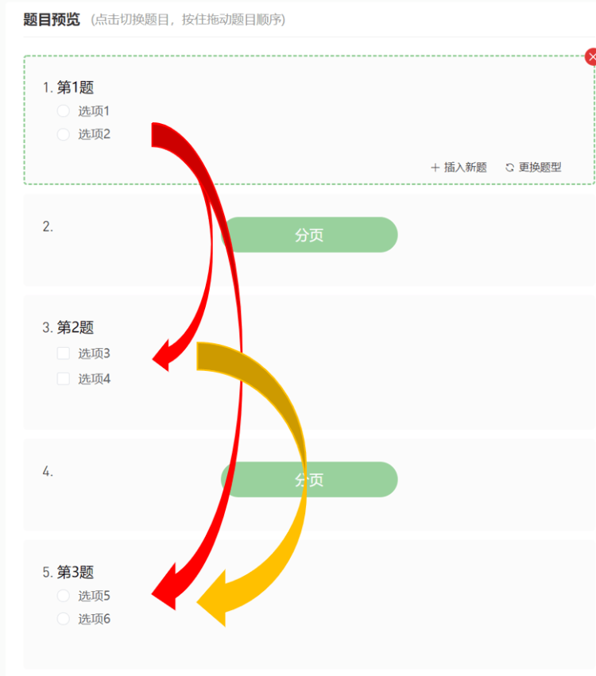

如下所示，例如我们为第1道题设置跳转逻辑，我们可以选择根据第1题的某一个选项进行判断。

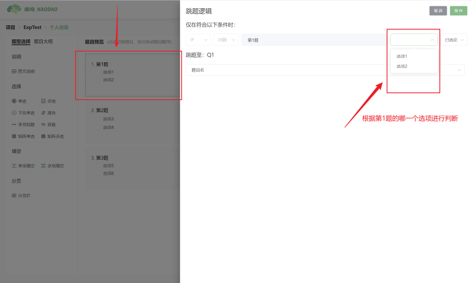

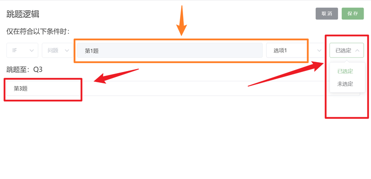

**已选定** 表示当被试选定特定题目的特定选项*（此例中为选项1）*时才会跳转到目标题目*（此例中为第3题）*。

**未选定** 表示当被试没有选定特定题目的特定选项时才会跳转到目标题目*（此例中选定选项1不会跳转到第3题，选定选项2才会跳转到第3题）* 。

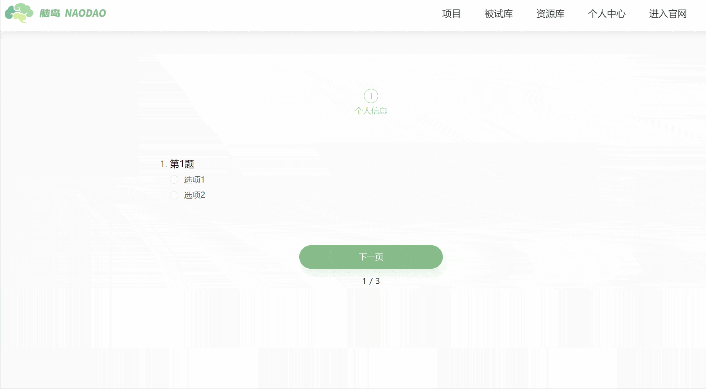

!> 脑岛目前仅支持单一条件跳转判断，尚不支持多条件联合跳转判断。

##### 插入新题

您新增题目的方式，除了从左侧【题型选择】栏中往题目预览区域中拖入题目外，还可以在题目预览区域中通过每一道题右下方的【插入新题】按钮新增题目。画布默认将新题插入到当前题目的下一题。

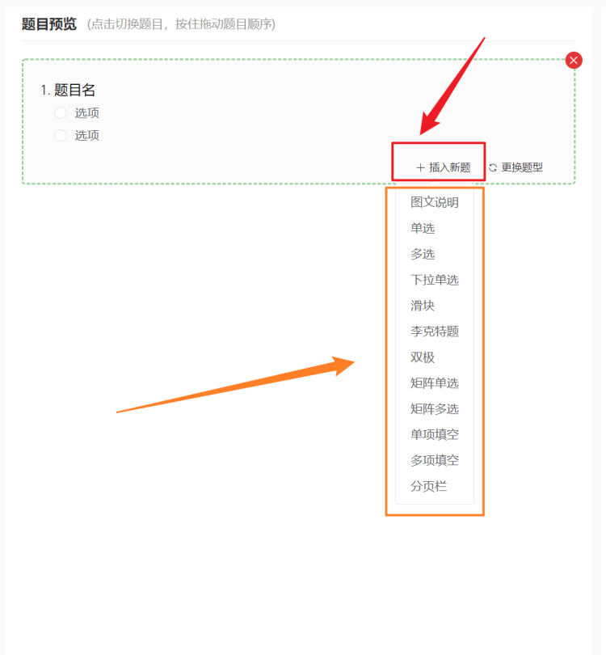

##### 更换题型

您可以通过题目右下方的【更换题型】按钮更改当前题目的类型。

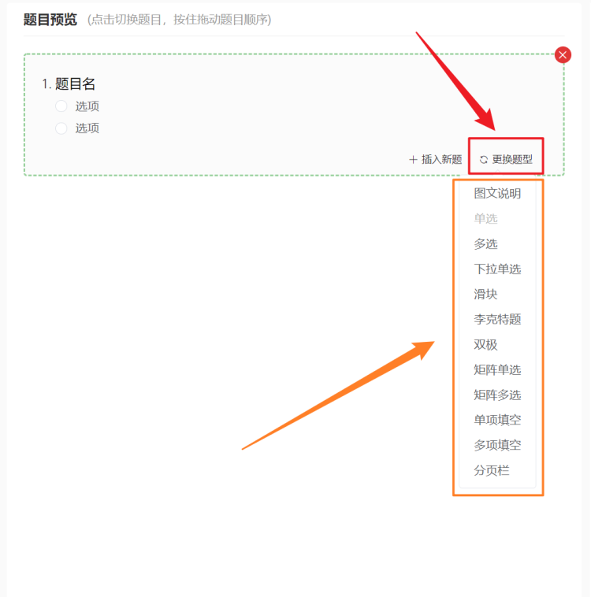

##### 批量添加

如果您希望批量添加题目，可以通过页面右上方的【批量添加】按钮批量导入题目。

脑岛目前仅支持从txt文本文件批量导入题目，您可点击 ? 按钮查看不同类型题目的导入文本排版方式。

您可以将排版后的txt文件复制粘贴到文本内容输入框中，或者通过【从文件上传】按钮导入txt文件。

