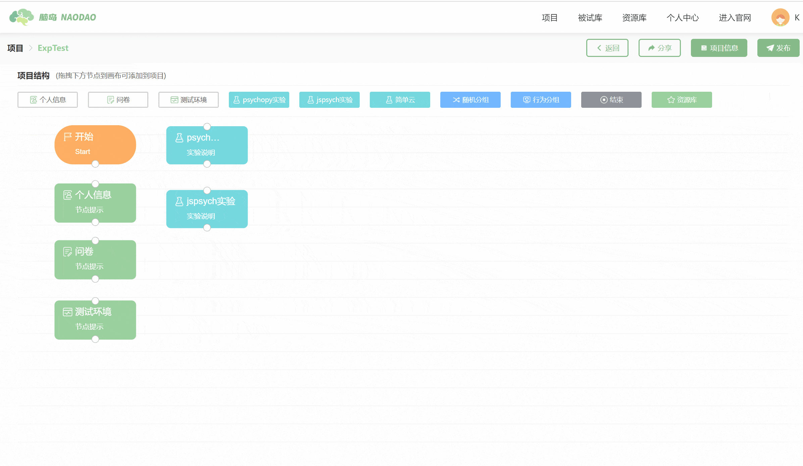
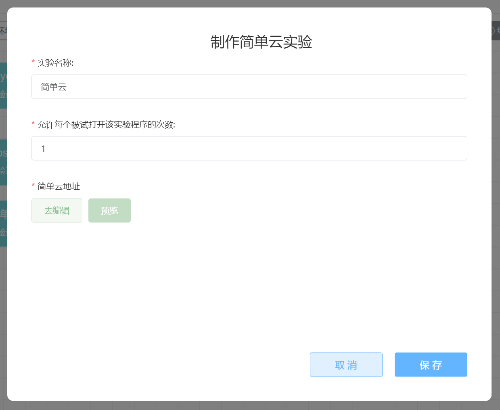

# Simple Cloud <!-- {docsify-ignore-all} -->

For instructions on using [Simple Cloud] experiments, please refer to[ Getting Started with Simple Cloud Guide](https://mp.weixin.qq.com/s/Ly3Sa_9uwE9onAHZbHtLzA) and [Simple Cloud Experimental Platform User Manual](https://www.naodao.com/public/air_cog_sci.pdf).

## Others
[An Online Experiment Creation Tool That Requires No Programming](https://mp.weixin.qq.com/s/Ly3Sa_9uwE9onAHZbHtLzA)

[Simple Cloud_Bilibili_bilibili](https://www.bilibili.com/video/BV1g14y147ZT?p=6)

