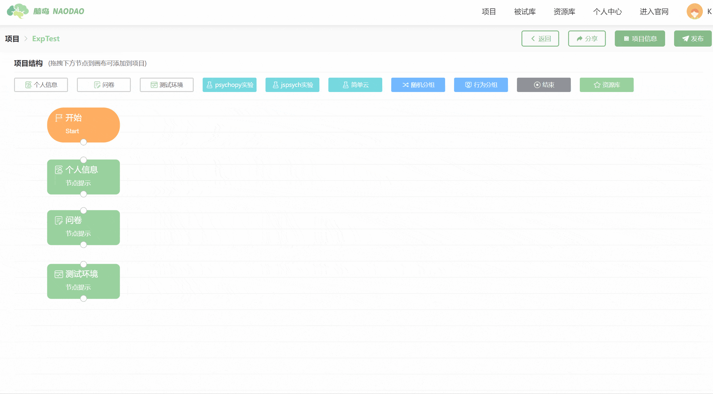
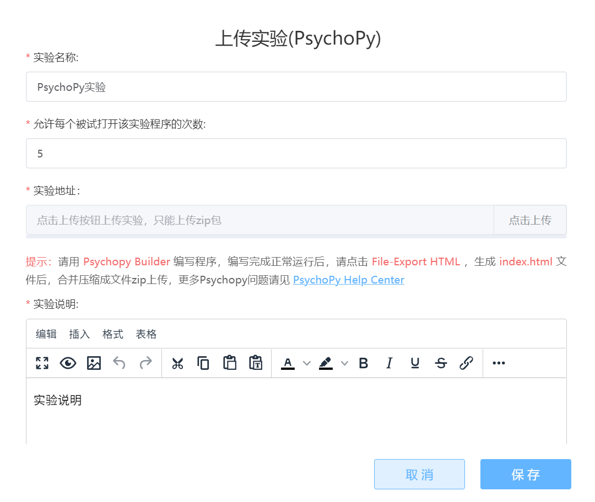
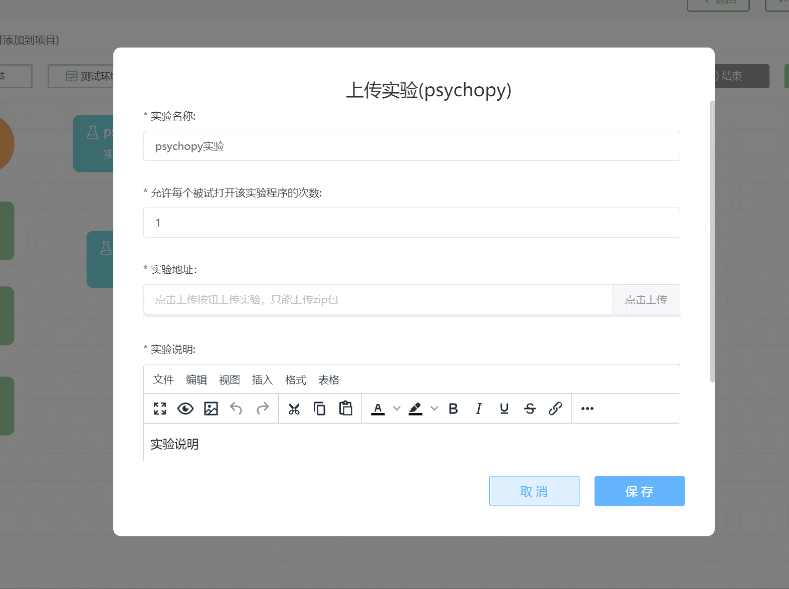
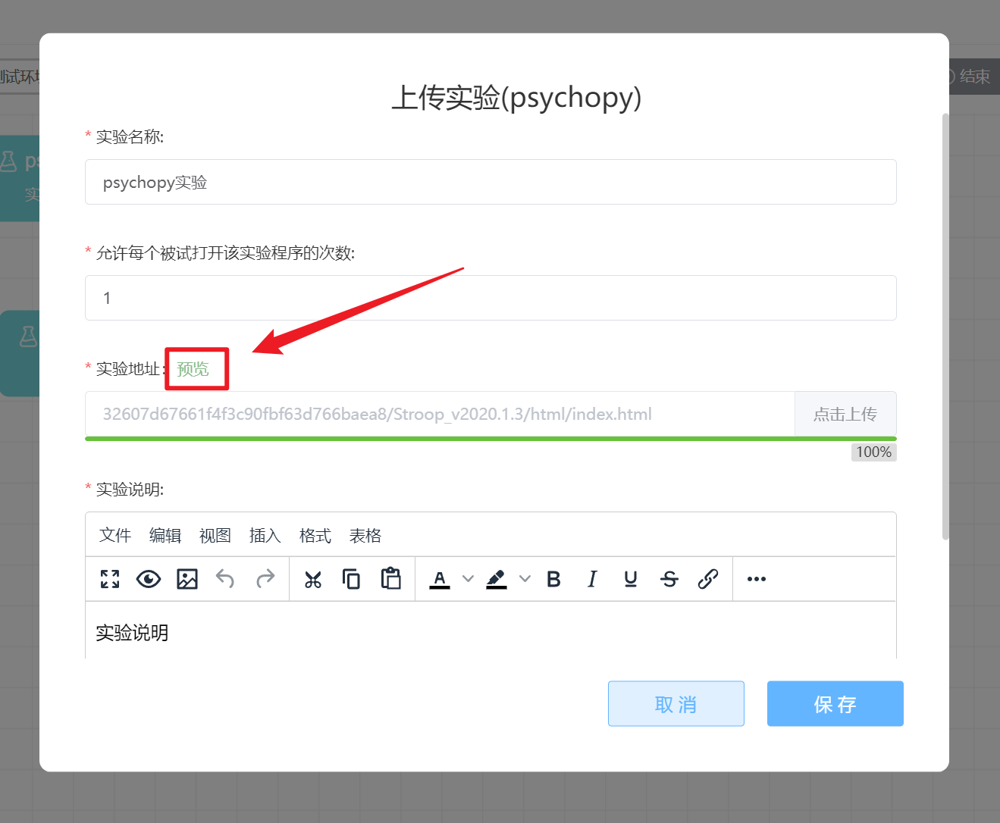
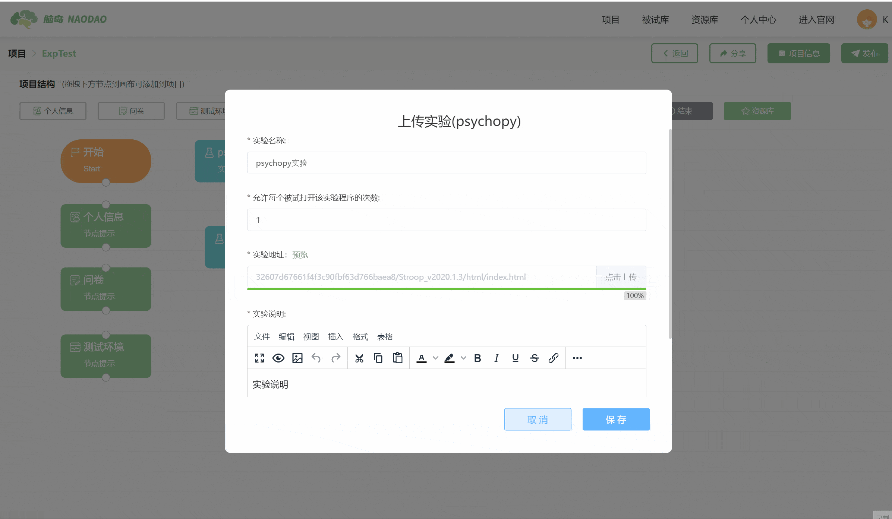
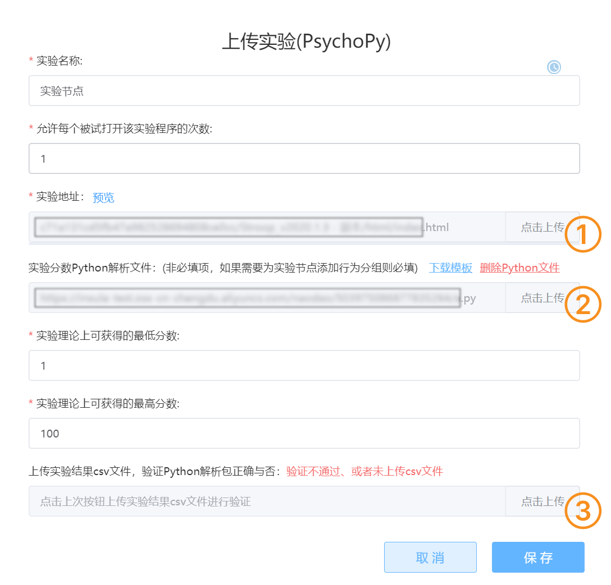

# PsychoPy Experiemnt <!-- {docsify-ignore-all} -->
PsychoPy is a popular tool for creating psychological behavioral experiments. Naodao provides support for online experiments generated by PsychoPy [**2021.2.3**](https://github.com/psychopy/psychopy/releases/tag/2021.2.3) and [**2020.1.3**](https://github.com/psychopy/psychopy/releases/tag/2020.1.3). Important note: Only experiments **written using the Builder** in PsychoPy can be automatically converted to online experiments. Python (local) experiments written using the Coder cannot be converted to online experiments.

New to PsychoPy? We've compiled some learning resources for you:

+ [PsychoPy Official Website](https://www.psychopy.org/)（English）
+ [PsychoPy Help Center](https://psychopyhelp.notion.site/PsychoPy-Help-Center-d517aee9e57749c6b766a005fd34646e) by Xianshi Yu Chenyou

If you need help or want to discuss PsychoPy experiences, welcome to visit the [Naodao Forum PsychoPy Section](https://forum.naodao.com/postingInfo?id=1500138031221575682)

Double-click the PsychoPy node to open the editing interface.

## Number of Times Each Subject Can Open the Experiment Program

You can set the current experiment's name and specify the **number of times each subject is allowed to open the experiment program**. This limit refers to how many times a subject can open the experiment within a single project attempt. **It only functions as a frequency limit within one project response** and is different from the project-level control ["Allow users to repeat responses"](/2-researcher-manual/1-1-6-publish-project.md#作答设置).

For example, if we want subjects to only open the experiment once during one response session, set the number to `1`；However, if you have enabled subjects to repeatedly participate in the current research project in your project publication settings, subjects can still open this experiment after abandoning their response and re-entering the project.

## Uploading Experiment Package

You can click the [Upload] button to upload psychological experiments written using **PsychoPy** software.

> Tips
>
> 1. Please make sure to convert all Python experiments to appropriate online experiments in PsychoPy Builder by selecting `File` - `Export to HTML` to export HTML files before uploading the compressed package
> 2. Files (folders) in the uploaded package with names containing Chinese or other non-ASCII characters may cause execution errors
> 3. Please ensure the uploaded package is less than 100 MB and doesn't contain a very large number of subdirectories or files. Try to avoid including multiple HTML files
>

### Experiment Preview
After the experiment is uploaded, a [Preview] button will appear on the right side of the **Experiment URL**. You can click this button to preview the uploaded experiment.

When the preview ends, the browser will download the data file generated from this preview for inspection.

## Experiment Scoring
Main entry: [Behavior Grouping](/2-researcher-manual/1-1-2-8-behavior-grouping.md)

After uploading the experiment package, users can **optionally** upload code to parse the CSV data files generated by the experiment to obtain a numerical result. This result can be used in subsequent behavior grouping nodes.

## Other Tutorials
[Guide to Easily Using PsychoPy Experiments on Naodao!](https://mp.weixin.qq.com/s/ZYxCI99Ug_wlVvKLkWdEFA)

[PsychoPy Node_Bilibili_bilibili](https://www.bilibili.com/video/BV1g14y147ZT?p=7)

