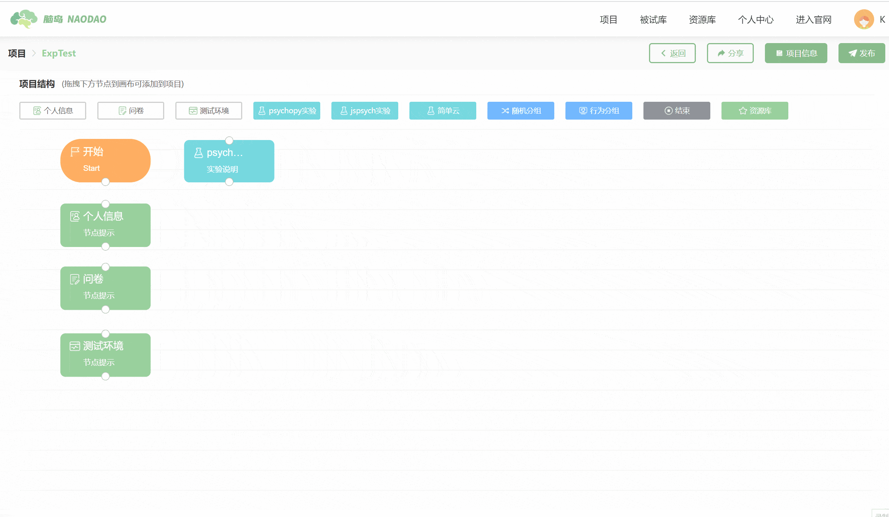
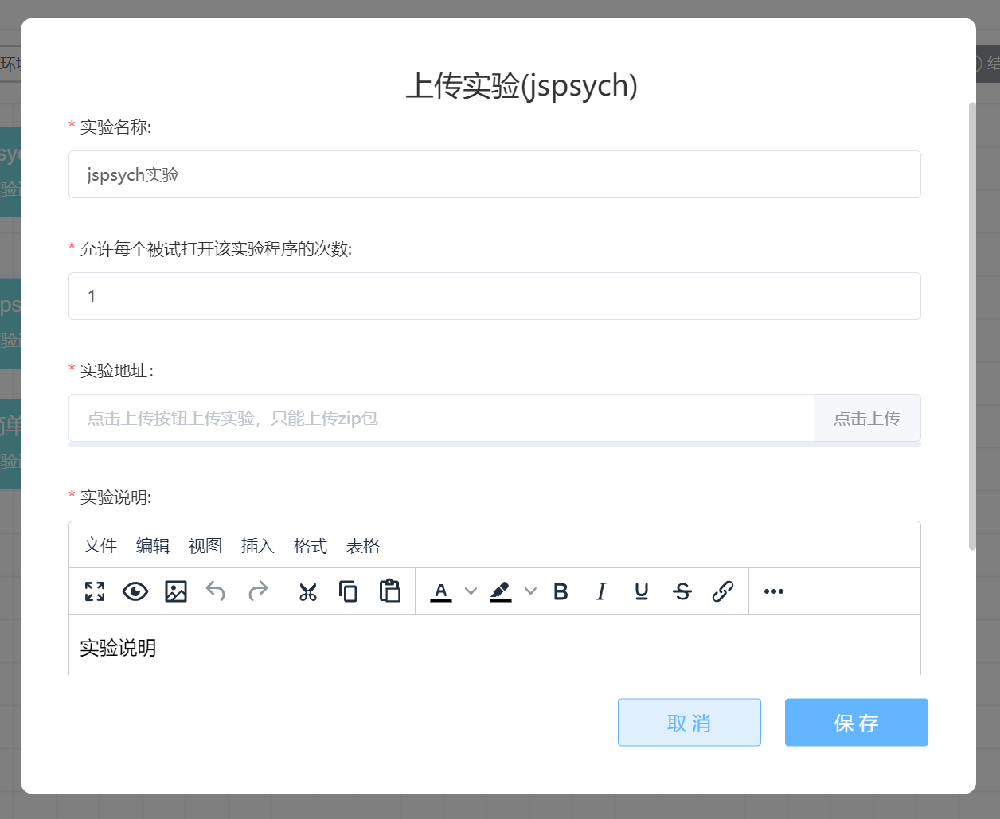
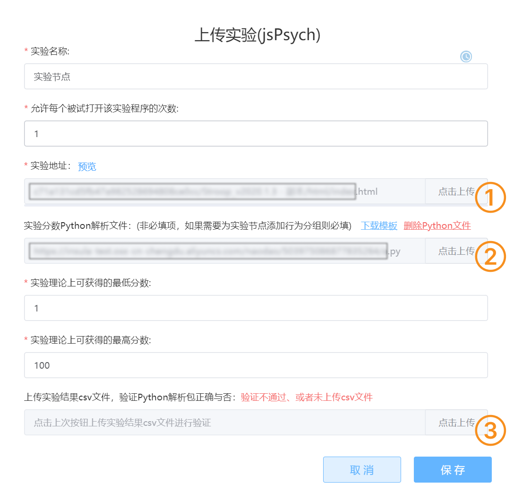

# jsPsych实验 <!-- {docsify-ignore-all} -->
jsPsych 是专门服务于在线实验的工具包。使用 jsPsych 至少需要掌握一定的 JavaScript 语法。脑岛提供了对于 jsPsych 7.1 的支持。

:::color2
在脑岛保存数据需要使用脑岛提供的 jsPsych 扩展，对于第一次在脑岛使用 jsPsych 实验的、不清楚使用了哪个版本，或不知道如何迁移到 jsPsych 7 的，请参阅[这份指南](https://forum.naodao.com/postingInfo?id=1507622372663103489)。

jsPsych 新手？我们也为你准备了一些学习资源

+ [jsPsych 官方文档](https://www.jspsych.org/7.1/tutorials/hello-world/)（英文）
+ [jsPsych 官方文档中文翻译](https://shaobin-jiang.github.io/jsPsych-Chinese-Documentation/7.1/tutorials/hello-world/)
+ [jsPsych 系列教程](https://forum.naodao.com/postingInfo?id=1495710882959986690)

如果研究者想要在脑岛上采用传统的心理物理学范式，我们建议使用 [jspsych-psychophysics](https://jspsychophysics.hes.kyushu-u.ac.jp/) 插件。脑岛提供了该插件配套的[指导语视频](https://www.naodao.com/public/stim_calibrate.mp4)（感谢上海交通大学张洳源老师和华东师范大学游毓琦贡献的视频资料），以演示的方式指导被试如何校准刺激的视角和视距。有意使用可以在实验中嵌入这个链接 `https://www.naodao.com/public/stim_calibrate.mp4`

:::

双击 jsPsych 节点可以进入编辑

## 允许每个被试打开该实验程序的次数

您可以设置当前实验的名称以及规定**允许每个被试打开该实验程序的次数**。此处的次数限制是指在一个项目中允许被试打开实验的次数，**只能在一次项目项目作答中起到次数限制的作用**，与项目级别的控制「[允许用户重复作答](https://www.yuque.com/naodao/researcher-manual/cd165t#iAm3a)」不同。

例如我们希望被试在一次作答中只能打开一次实验，那么将次数设为`1`；但如果您项目发布设置中允许了被试重复参与当前的研究项目，那么被试放弃作答后重新进入这个项目，仍然可以打开这个实验。

## 上传文件

您需要将 `index.html`、js 文件、实验材料和其余附加文件打包为 zip 压缩包，并在 jsPsych 节点内上传。

> 脑岛Tips
>
> 1. HTML 文件命名必须为`index.html`
> 2. 注意 jsPsych 的版本及必要的扩展是否添加，太多数情况下引入扩展后不再需要使用`localSave()`保存数据
> 3. 除非脑岛没有提供支持，否则不建议采用将 jsPsych 脚本文件随实验一起上传的方式。如果必须上传，请仅上传必要文件，尤其是不要将官方包中`examples`内的大堆示例一并上传
> 4. 上传的压缩包中的文件（夹）命名中带有中文或其他非 ASCII 字符可能导致执行出错
> 5. 请确保上传的压缩包体积小于 100 MB，并且没有数量非常多的子目录或和文件。尽量不要包含多个 html 文件
>

### 预览实验

当实验上传完成后，在**实验地址**右侧会出现一个【预览】的功能按钮，您可点击此按钮预览刚才上传的实验。预览结束后，浏览器会下载本次预览生成的数据文件以供检查。

## 实验计分
主条目：[行为分组](https://www.yuque.com/naodao/researcher-manual/ih2gp8#YIS9r)  
  
在上传实验包之后，用户**可选**上传代码解析实验生成的 CSV 数据文件，从而得到一个数值结果。这个结果能在后续的行为分组节点中使用。

## 其他教程
[脑岛使用小妙招07丨带你在脑岛轻松使用jspsych实验程序！](https://mp.weixin.qq.com/s/vik0H8ewEIwXeJ4bpyUHOw)

[jsPsych节点_哔哩哔哩_bilibili](https://www.bilibili.com/video/BV1g14y147ZT?p=8)

