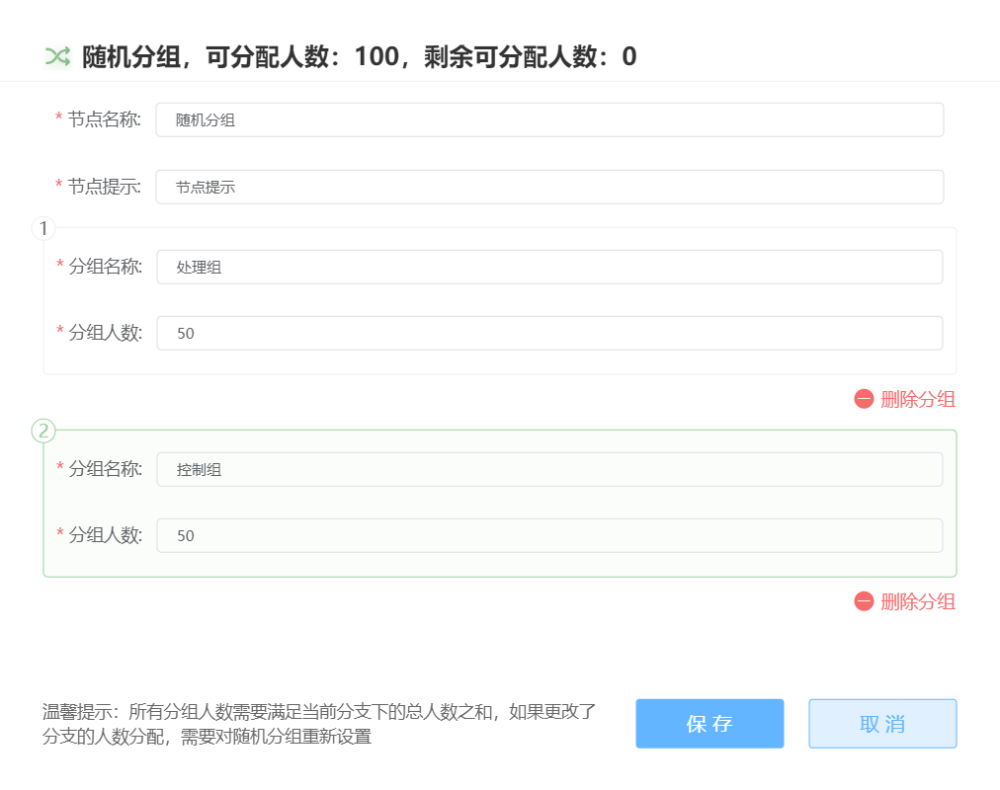
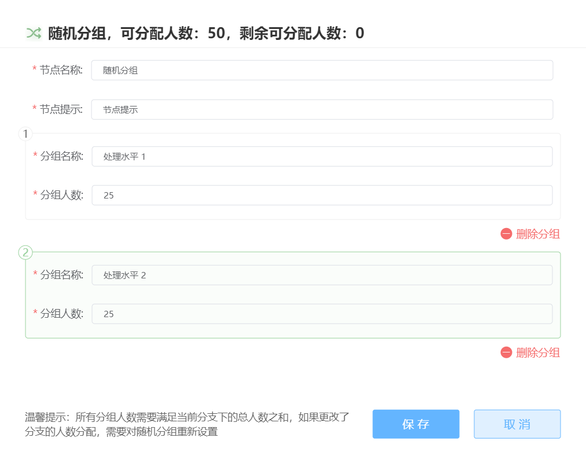
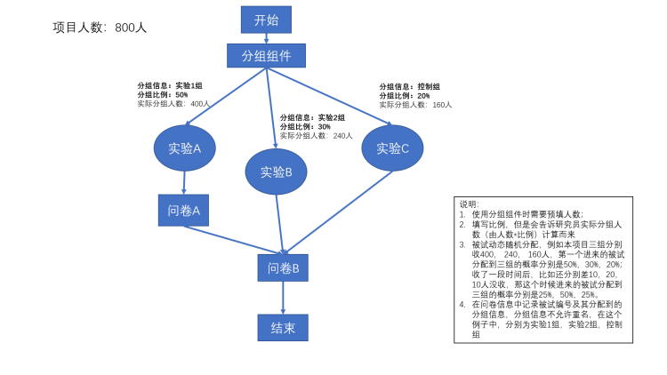

# 随机分组 <!-- {docsify-ignore-all} -->

随机分组节点可以获取项目参与人数，并依据人数设置分组，为项目的流程建立多个分支。随机分组会将参与项目的被试随机分配至某个分支上，适用于随机分配被试间因素等情况。

如下图的示例，最开始的随机分组节点会获取设置的项目的参与人数，并作为分组依据。此后的分支上设置的随机节点会获取该分支的人数。

> 分组后产生的分支无法再合并，即整个项目必须是树状结构

前后两个随机分组节点的设置界面如下（双击进入）

> 随机分组建立在设置人数的基础上，因此存在一些限制
>
> * 随机分组的上游节点必须确定人数，因此随机分组无法出现在行为分组的下游
> * 一旦更改人数，则画布上所有的随机分组设置全部失效，需要重新分组、连线
> * 画布上存在随机分组，则发布页面的人数无法再更改，若需要更改人数需要返回画布编辑

随机分组节点能够实现动态随机分组，而不是传统的固定概率随机分配。

与传统的随机分组不同的是：

* 每组都能收集到指定的人数，避免一组30人，一组60人的尴尬情况；
* 在实际数据收集过程中，被试能够更为均匀地收集；
* 与传统的随机分组方式相比，动态随机分组不太可能出现一直都是同一组随后一直都是另一组的情况；

**随机分组示例**：

