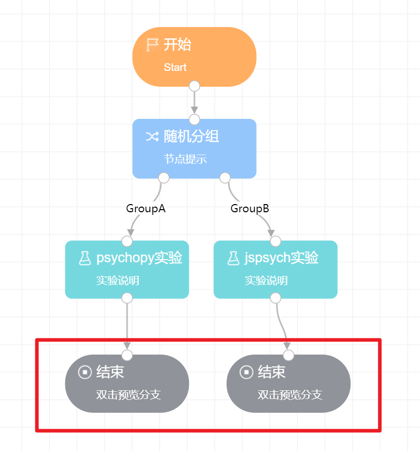

# 结束 <!-- {docsify-ignore-all} -->

**结束**节点本身无需进行任何设置，但它是一个完整实验分支结束的标志。

对于**画布**上的任何一个分支而言，都必须拥有**开始**和**结束**两个节点。如果一个项目分支没有**结束**节点，那么画布会判定项目中存在不完整的分支，从而无法**发布**。

对于存在**多分支**的项目结构来说（所谓多分支是指在项目结构中使用了**随机分组或行为分组节点**，使得一个项目存在多个可能的分支走向），每一个分支都需要设置一个**结束**节点。如下图所示，项目中存在两个分支，因此需要设置两个**结束**节点。

