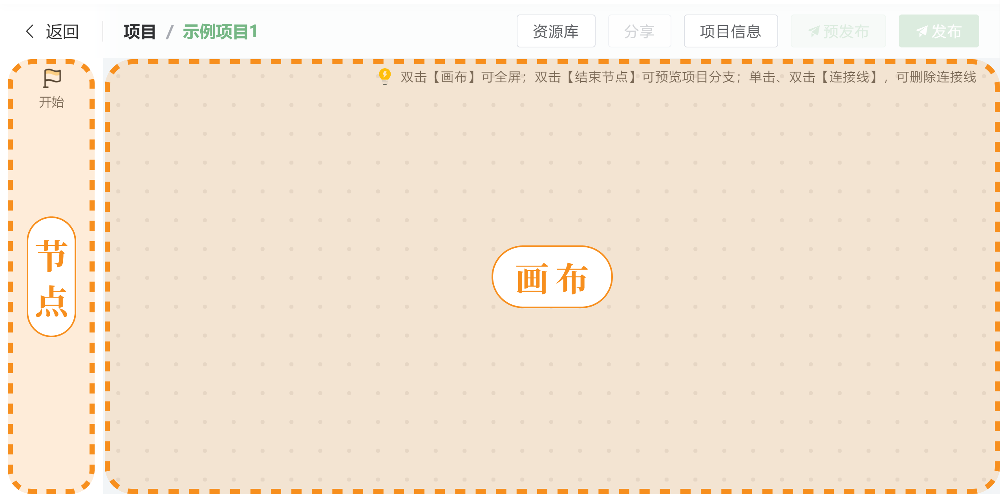
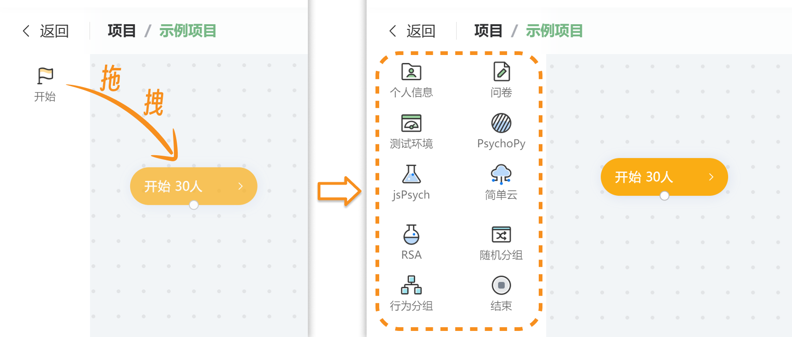
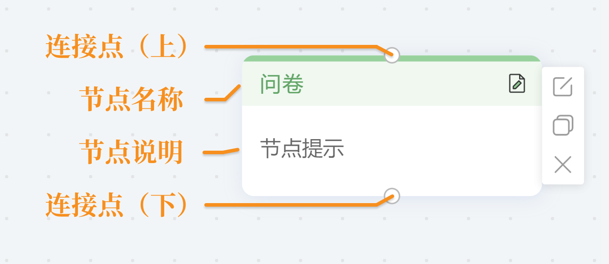
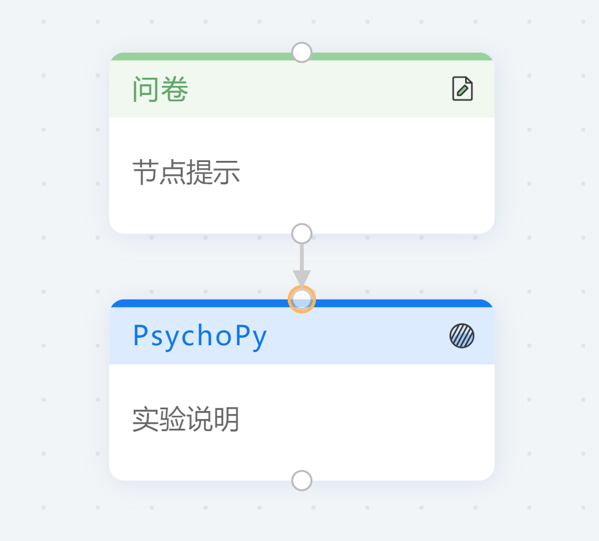
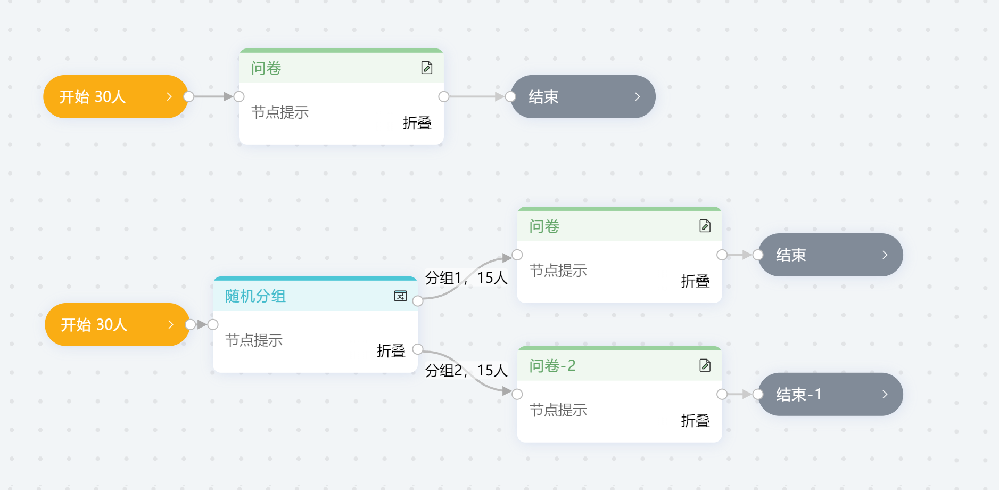

# 画布和节点 <!-- {docsify-ignore-all} -->

脑岛研究者平台希望您在脑岛中所做的一切都可以通过一个清晰且直观的界面来展现，因此脑岛提供了一套简单易用但又功能强大的**画布工具**，您可通过**画布工具**轻松快速地编辑自己的项目和实验，并且只需通过鼠标拖动即可设计复杂的项目流程。

在初始**未激活状态**下，【画布】的菜单栏中仅有一个【开始】节点。您需要将【开始】节点拖入【画布】才能激活画布的**编辑状态**。

在编辑状态下，画布的菜单栏会显示若干功能节点，您可通过将这些**功能节点**拖动到画布中以实现复杂的项目结构。画布中所有的功能节点均通过**鼠标点击按中并拖动**这一动作进入画布。

画布上的节点结构一般如下图所示，在连接点上拖拽可以进行连线，节点之间通过**连线箭头**进行相连。

**双击**大部分节点都会触发相应的功能，鼠标悬浮在节点上可以触发额外的菜单

+  图标可以修改节点元数据（标题、描述）
+  图标可以快速复制节点
+  图标可以删除节点

## 作答流程

画布中**箭头的流向**指示着**作答时的流程**。作答中测试者**以开始节点作为入口，每完成一个节点才能进入下一个节点，到结束节点结束**。因此画布上的所有节点必须包含在**开始 -> [各类节点] -> 结束**的结构中。

## 目前可使用的节点一览

+ 功能控制节点
    - 开始节点
    - [结束节点](/2-researcher-manual/1-1-2-9-end.md)

+ 问卷类型节点
    - [问卷节点](/2-researcher-manual/1-1-2-1-questionnaire.md)
    - [个人信息](/2-researcher-manual/1-1-2-2-personal-info.md)（预设的一套用于收集个人信息的问卷）
    - [测试环境](/2-researcher-manual/1-1-2-3-env.md)（预设的一套用于收集被试作答环境的问卷）

+ 实验类型节点
    - [简单云节点](/2-researcher-manual/1-1-2-4-simple-cloud.md)
    - [PsychoPy 节点](/2-researcher-manual/1-1-2-5-psychopy.md)
    - [jsPsych 节点](/2-researcher-manual/1-1-2-6-jspsych.md)

+ 分组器节点
    - [随机分组节点](/2-researcher-manual/1-1-2-7-Random-grouping.md)
    - [行为分组节点](/2-researcher-manual/1-1-2-8-behavior-grouping.md)

+ [由资源库导入节点](/2-researcher-manual/1-1-2-10-resource.md)

## 其他教程
[脑岛使用小妙招03丨如何使用画布系统实现各种“高大上”的实验流程？](https://mp.weixin.qq.com/s/a5wEEZ9g_sUXIecfxzs0iQ)

[画布系统_哔哩哔哩_bilibili](https://www.bilibili.com/video/BV1g14y147ZT?p=4)

