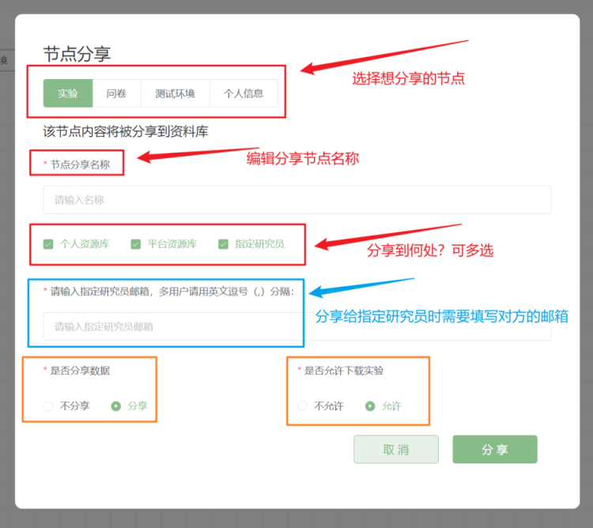

# 分享项目 <!-- {docsify-ignore-all} -->

当画布上存在可被分享的功能节点时，您可以点击画布右上方的分享按钮进行节点分享。需要说明的是，脑岛目前只支持您分享单个节点，不支持分享整个项目。

可被分享的功能节点包括：【个人信息】、【问卷】、【测试环境】、【PsychoPy实验】、【jsPsych实验】、【简单云】。

需要说明的是，当您选择将节点分享到平台资源库时，这就意味着您同意将当前节点转让给脑岛，即脑岛拥有该节点的所有权。详情见脑岛平台研究者服务协议。

您可以选择是否分享数据，若选择分享，则其他用户可以使用基于当前节点所收集到的数据；您也可以选择是否允许下载实验/问卷，若允许，则其他用户可以将该节点中的实验/问卷下载到本地。

