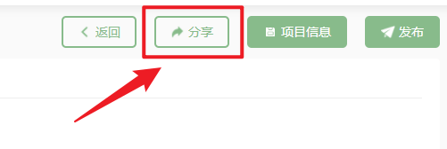

# Share Project <!-- {docsify-ignore-all} -->

When there are **shareable function nodes** on the canvas, you can click the share button in the upper right corner of the canvas to share nodes. It's important to note that Naodao currently only supports sharing **individual nodes**, not entire projects.

**Shareable function nodes** include: [Personal Information], [Questionnaire], [Test Environment], [PsychoPy Experiment], [jsPsych Experiment], and [Simple Cloud].

It's important to note that when you choose to share a node to the **platform resource library**, this means you agree to transfer the node to Naodao, i.e., Naodao owns the rights to that node. For details, see the Naodao Platform Researcher Service Agreement.

You can choose whether to **share data** - if you choose to share, other users can use the data collected based on the current node. You can also choose whether to **allow downloading of experiments/questionnaires** - if allowed, other users can download the experiments/questionnaires from that node to their local device.

