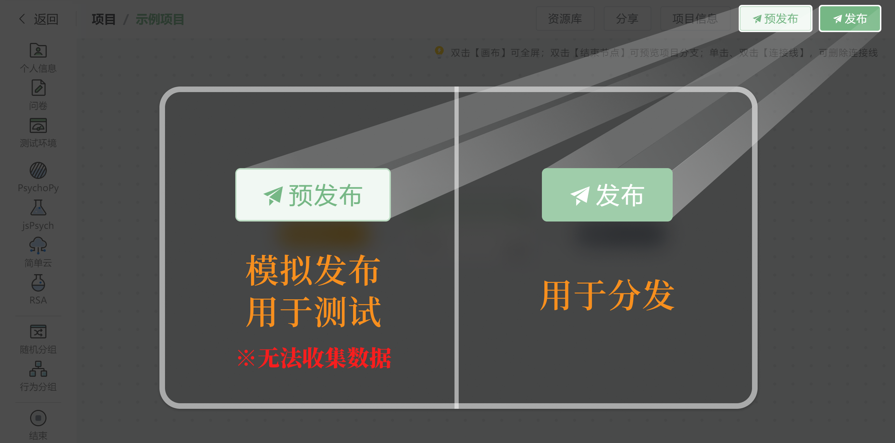

# Test and Publish Project<!-- {docsify-ignore-all} -->

After completing project editing, you can choose to enter either the testing "pre-release" phase or the distribution "publish" phase. For projects that haven't been validated through pre-release, **we strongly recommend testing through pre-release first**. This helps understand how Naodao works and experience the participant response process, making it clearer when guiding participants and handling errors. Click the buttons in the upper right to pre-release or publish.

**Publishing** a project means entering the distribution phase, which starts online testing with participants. Once a project is published, it begins collecting data and undergoes the following changes:

+ Published projects cannot be edited further; they can only undergo [publishing management](/2-researcher-manual/1-2-release-manage-projects.md) operations. After canceling publication, the project cycle ends and cannot be edited or published again
+ Based on different publishing channels, published projects can be distributed to participants in various ways
+ Unlike preview mode, after publication, **data files generated by participants' responses will be uploaded to Naodao** rather than downloaded to participants' devices

**Pre-release** is a feature designed to address the limitations of preview mode. While preview is for unit testing and differs significantly from actual publication, pre-release aims to simulate publication (also called **formal publication**). The response process is basically the same as formal publication but has these characteristics:

+ Compared to formal publication, pre-release only requires necessary [publication settings](/2-researcher-manual/1-1-6-publish-project.md)
+ Pre-release **cannot download data**; data is only used to confirm response status
+ Pre-release can be canceled multiple times; after cancellation, the project can be edited, pre-released, or formally published again. **All data is cleared after canceling pre-release**
+ Pre-release is not available after formal publication

Pre-release is not an independent feature. Due to its inability to obtain data, it needs to be used in conjunction with preview mode (which can download data) for more comprehensive testing. [Learn more about pre-release comparison with other features](https://mp.weixin.qq.com/s/EzhkBkEAsEBv79qsmPAMsg)

Publishing a project requires [publication settings](/2-researcher-manual/1-1-6-publish-project.md).

## Other Tutorials
[New "Preview" for Full Process: Pre-release Feature Launch](https://mp.weixin.qq.com/s/EzhkBkEAsEBv79qsmPAMsg)

[Easy Guide to Publishing Experimental Projects on Naodao Platform!](https://mp.weixin.qq.com/s/ZxrB7PL_eew5EqZqOf1Glw)

[Master Anonymous Publishing for Experimental Projects!](https://mp.weixin.qq.com/s/SChqlMSQTCZMbEqob8p0uA)

[Publishing Projects to Naodao_Bilibili_bilibili](https://www.bilibili.com/video/BV1g14y147ZT?p=15)

[Anonymous Project Publishing_Bilibili_bilibili](https://www.bilibili.com/video/BV1g14y147ZT/?p=16)

