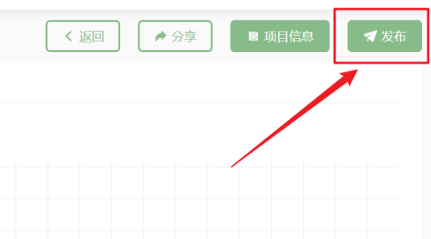
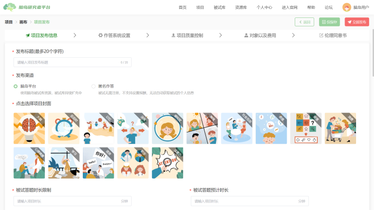
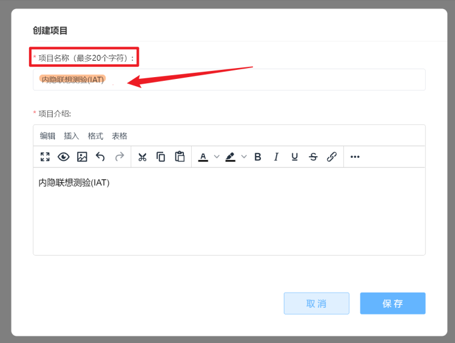
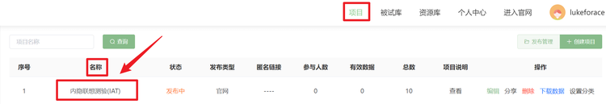
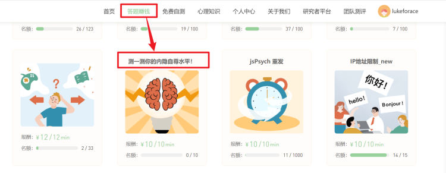
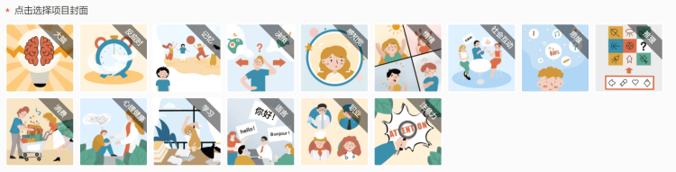
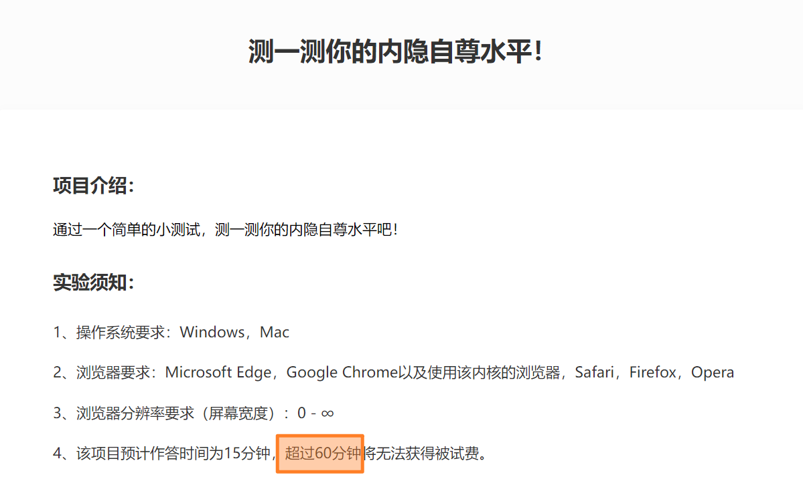
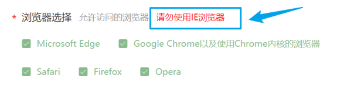
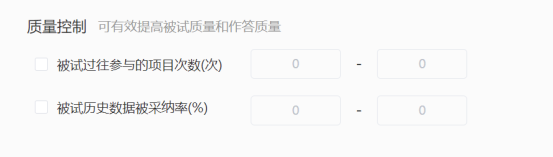

# 发布项目 <!-- {docsify-ignore-all} -->

当项目编辑完成后，可点击【画布】右上方的【发布】按钮进行项目发布。

> 所谓发布项目，就是完成项目的编辑、进入分发项目阶段的操作。项目进入发布状态后会产生如下变化
>
> * 项目发布后无法再编辑，此后只能对项目进行发布管理操作
> * 根据发布渠道的不同，发布后的项目能够以不同的方式分发给被试
> * 和预览时不同，发布后被试在作答后产生的数据文件会上传至脑岛，不会下载到被试的设备上

项目发布需要设置的内容相对繁多，基本可以分为**项目发布信息、作答系统设置、项目质量控制、对象以及费用、伦理相关事项** 5 个部分。

## 项目发布信息

### 发布渠道

脑岛平台目前提供两种发布渠道：【脑岛平台】和【匿名作答】。每次发布只能选择发布到一种渠道。根据发布渠道的不同，需要设置的发布选项也有所差异。

* 如果您将项目发布至【脑岛平台】，那么该项目会展现在脑岛官网首页的【答题赚钱】版块中，仅有脑岛的注册用户才有机会作答该类项目。所有发布到【脑岛平台】的项目必须提供测试报酬，也就是被试费，被试作答完成（并通过审核后）将直接拿到对应报酬。不提供测试报酬的研究项目将无法发布到【脑岛平台】。
* 如果您将项目发布至【匿名作答】，那么该项目将发布绕开脑岛的用户和报酬体系。匿名意味着这个项目不会出现在脑岛官网上，同时脑岛也不会记录参与这个项目的被试身份信息。【匿名作答】的项目发布成功后，会生成一个作答项目的链接，拿到链接的被试均可以参与作答，并无需注册脑岛。发布到【匿名作答】的项目无法设置测试报酬。

> 【脑岛tips】
>
> * 【匿名作答】形式发布的项目，其测试报酬的发布并不依赖脑岛平台，因此在发布时不需要设置测试报酬。但这并不意味着该项目不需要被试费，主试和被试应该另行商定进行发放报酬的方式
> * 【匿名作答】将无法利用脑岛针对被试身份提供的筛选、追踪等功能（例如下方）

### 发布标题

:::tip
此选项仅可在发布渠道为「脑岛平台」时设置
:::

发布研究项目的第一步是为您的项目设置一个发布标题。

项目发布标题并不是您在创建项目时设置的项目名称，前者是显示脑岛官网上展现给所有用户看的名称，而后者是在研究者平台的项目版块中展现给您看的名称。

例如下面的项目，在创建项目时将项目名称设置为`内隐联想测验(IAT)`，

而在项目发布时将项目发布标题设置为`测一测你的内隐自尊水平`！

这样当项目发布后，该项目在研究者平台的项目版块中显示的名称是`内隐联想测验(IAT)`，即项目名称，

而在脑岛官网的答题赚钱版块中显示的名称则是`测一测你的内隐自尊水平！`，即项目发布标题。

> 【脑岛Tips】关于项目名称和项目发布标题有一些需要注意的事项：
> * 项目发布标题允许重复，也就是说答题赚钱版块中可以出现两个测一测你的内隐自尊水平！
> * 项目名称不允许重复，也就是说研究者平台的项目版块中不可以出现两个内隐联想测验(IAT)，这主要是为了方便研究者区分自己发布的项目。

### 点击选择项目封面

:::tip
此选项仅可在发布渠道为「脑岛平台」时设置
:::

目前，脑岛为您提供了15张涉及不同研究领域的封面图，`暂不支持您自行上传封面`。

### 被试答题时长限制

作答时长限制用于避免被试在作答过程中出现意外情况而一直处于「作答中」。您需要规定项目作答时间的上限。如果被试的项目作答时间超过该上限，脑岛会自动判定该被试本次作答无效，本次作答的数据无法提交。

> 【脑岛Tips】请您谨慎设置答题时长限制，时间不宜过短，可适当放宽，以免增大被试超时作答的概率从而导致项目被投诉。

### 被试答题预计时长

:::tip
此选项仅可在发布渠道为「脑岛平台」时设置
:::

对于发布到【脑岛平台】的研究项目，您需要设置被试完成项目的预计时长。所谓预计时长并不是指实际完成项目需要的时间，也不是指被试参与项目的作答时间上限，而是指您（即主试）预估一个被试在正常情况下完成当前项目需要花费的时间。项目的预计时长将显示在脑岛官网的【答题赚钱】版块中，更多的是起到吸引被试参与的功能。

## 作答系统设置

### 操作系统选择

您可以设置允许使用哪些电脑操作系统的您参与项目。默认全选。

### 浏览器选择

您可以设置允许使用哪些浏览器的您参与项目。脑岛不支持使用IE浏览器作答。默认全选。

### 分辨率控制

您可以通过【分辨率控制】功能限制被试电脑屏幕的分辨率，也就是只允许电脑屏幕分辨率在指定范围内的被试才能参与项目。

脑岛默认不对被试电脑屏幕的屏幕分辨率进行限制。

> **分辨率控制的注意事项**
>
> 目前脑岛的【分辨率控制】功能只能限制电脑屏幕分辨率的宽度，并且只能对实际显示宽度进行限制。
>
> 以最为常见的1920×1080分辨率为例，1080即为电脑屏幕的宽度。但在绝大多数情况下这都不是电脑屏幕的实际显示宽度，这是因为电脑的操作系统往往会存在一个缩放布局的设置。对于上面提到的1920×1080分辨率，假设系统设置为150%的缩放，屏幕的实际分辨率会在物理分辨率的基础上除以1.5，即为1280×720，因此电脑屏幕的实际显示宽度为720。对于移动设备，实际宽度往往特别小，通常在480左右。

## 项目质量控制

### 质量控制

:::tip
此选项仅可在发布渠道为「脑岛平台」时设置
:::

您可以通过【质量控制】功能有效提升被试质量和作答质量。

被试过往参与的项目次数(次)是指一个被试在参与当前项目之前参加过脑岛官网的【答题赚钱】版块中的项目总数。

被试历史数据被采纳率(%)是指一个被试在参与当前项目之前参加过的所有项目中测试数据被采纳的情况（仅限于统计被试参与脑岛官网的【答题赚钱】版块中的项目）。采纳率越高表示被试的历史作答质量越高。

### 验证错题数

:::tip
此选项仅可在发布渠道为「脑岛平台」时设置
:::

【验证错题数】是指研究者允许被试在作答当前项目时做错的题目数，大于等于这个数量(也包括这个数量)即认为被试没有认真作答。

也就是说，如果我们将【验证错题数】设置为1，那么就意味着不允许被试错一道题。没有认真作答的实验记录会在完成实验的72小时后被系统自动拒绝。

### 作答设置

**本次发布允许您重复作答**：勾选后被试可以重复参与当前项目。

**IP地址限制**：勾选后每个IP地址只能参与一次项目。

> 【脑岛Tips】
>
> 当项目匿名发布时，没有【本次发布允许用户重复作答】选项
>
> 作答设置里的两个选项允许同时勾选，即“允许一个被试重复作答某个项目”且“每个IP地址只能参与一次项目”，也就是说脑岛目前允许一个被试可以在不同的IP地址参与某一个项目

## 对象以及费用

### 选择测试对象

主条目：[被试库](2-participants.md)

:::tip
此选项仅可在发布渠道为「脑岛平台」时设置
:::

可以选择发布对象为脑岛平台的所有注册用户或限定一个被试库用户。未被选择的用户首页无法看见该项目，同时也无法作答（即使拿到链接）。

### 项目人数

无论是发布到【脑岛平台】还是【匿名作答】的研究项目，都需要设置项目人数，即一个项目最多能够收到多少份有效数据。

人数与许多项目设置有着密切的关系，请慎重设置。参看 人数与随机分组、人数与被试库

> 【脑岛Tips】项目一旦发布，则人数不可修改，因此请务必谨慎设置。

### 测试报酬

:::tip
此选项仅可在发布渠道为「脑岛平台」时设置
:::

测试报酬是指完成一次项目需要支付给被试的报酬。测试报酬不能为0（您可以设置的最低测试报酬为0.01元），否则项目无法发布。

> **目前脑岛平台不收取平台服务费**，因此您支付的所有费用均为支付给被试的测试报酬。

### 项目加密

:::tip
此选项仅可在发布渠道为「脑岛平台」时设置
:::

研究者可以为【脑岛平台】发布的项目设置密码，并将密码分发给指定被试群体。

> 建议使用被试库的方式实现更有效和可追踪的被试控制

## 伦理相关事项

### 伦理批准文件

无论是将研究项目发布到【脑岛平台】还是发布到【匿名作答】，您都需要上传所在单位对于当前研究项目的伦理批准文件。

> 【脑岛Tips】脑岛平台并不会主动去检查您上传的伦理批准文件是否符合规范，请您对自己上传的文件负责！您上传伦理批准文件后，`一旦发生任何违反科研伦理的不良后果，一切责任将由您自行承担`。

#### 伦理免责声明

考虑到一些您所在的单位无法出具伦理批准文件，脑岛平台提供了一份伦理免责声明文件，无法上传伦理文件的您可通过签署此文件来发布项目。

### 知情同意书

无论是将研究项目发布到【脑岛平台】还是发布到【匿名作答】，您都需要上传知情同意书。被试在参与项目时可以看到这份知情同意书。

> 如果您不清楚知情同意书如何撰写，可以参考这份[知情同意书](/assets/知情同意书_模板1.docx){target="_self"}

