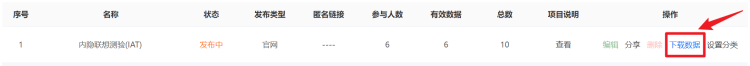
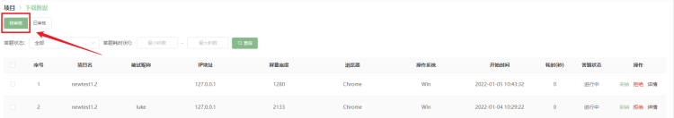
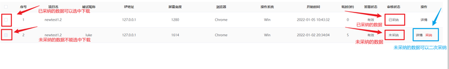
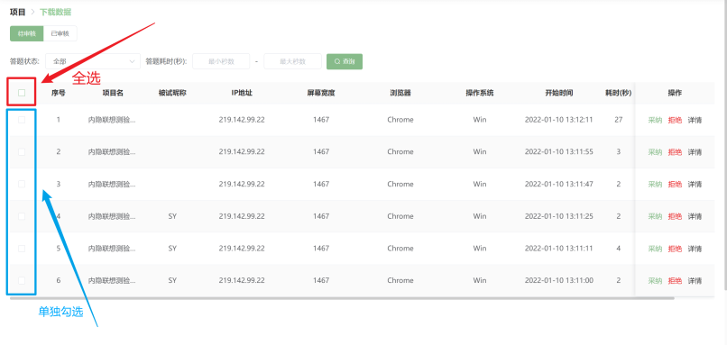
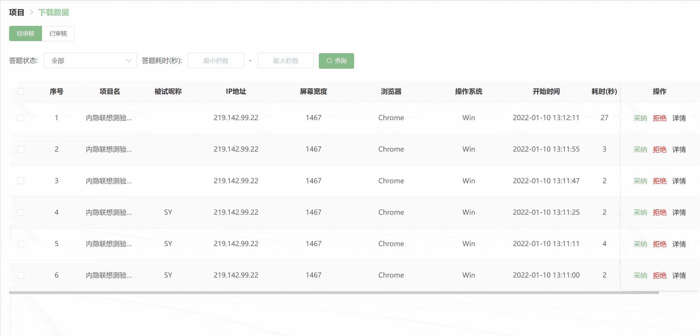
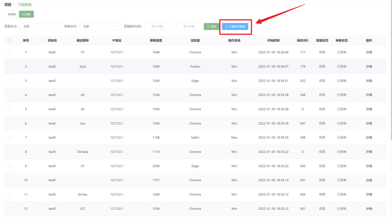
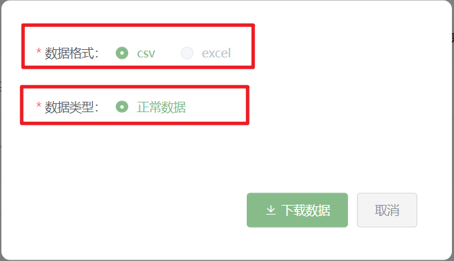
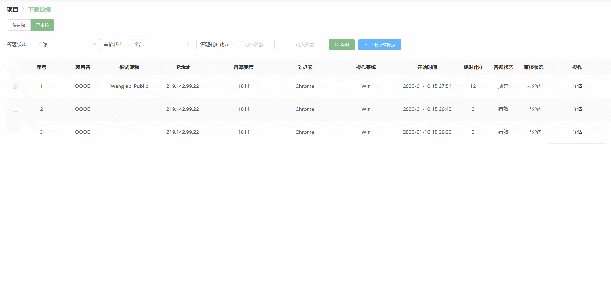
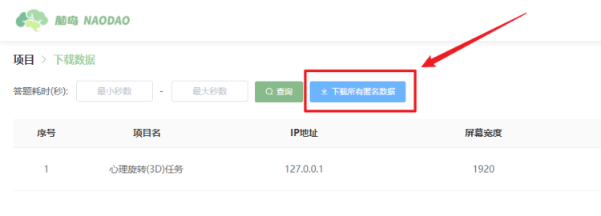

## 项目数据管理 <!-- {docsify-ignore-all} -->

您可以点击【下载数据】按钮进入项目数据下载页面。

### 脑岛平台（答题赚钱）类型发布

#### 待审核版块

##### 答题状态

每一条数据记录的答题状态分为三种：有效、进行中和放弃 。

* 有效状态是指被试已经正常完成了项目并提交了数据。
* 进行中状态是指被试当前正在进行项目。
* 放弃状态是指被试在参与项目的过程中主动放弃了项目。

>【脑岛Tips】
> 有效的答题状态并不代表着数据质量的高低。
>
> 需要说明的是，一旦被试在测试过程中放弃测试，那么脑岛会默认拒绝该被试的数据记录。也就是说，脑岛会自动审核这些中途放弃的数据记录，因此这些中途放弃的数据记录不会出现在待审核版块，而是会自动出现在已审核版块。

##### 数据采纳

当被试完成某个项目后，【下载数据】页面的待审核版块中就会出现该被试的测试记录。待审核版块中所有的测试数据都还未经过项目发布者的审核。

您可根据被试完成检查题的情况(可依据正确率或作答时间等指标)对被试的数据进行采纳。需要注意的是，答题状态为进行中的数据不能够进行采纳或拒绝！

> 【脑岛Tips】检查题功能正在开发中，敬请期待！

被采纳的数据会出现在已审核版块中，其审核状态为已采纳。您可以下载已采纳的数据，也可以点击【操作】栏中的详情按钮查看被试的作答情况。

> 【脑岛Tips】点击已审核版块中的【详情】按钮只能查看问卷类题目(个人信息、问卷、测试环境)的作答信息，无法查看实验的作答信息(需手动下载数据文件)。

需要注意的是，您无法查看未采纳的被试数据，一旦您在待审核版块采纳了被试的数据，系统会默认您已经获取了被试的数据，也就意味着您不能再将被试数据的审核状态由采纳改为未采纳。

##### 数据拒绝

如果您认为被试在测试过程中没有认真填写或存在恶意作答等情况，可以通过【拒绝】按钮不采纳被试的数据。

> 【脑岛Tips】请不要随意拒绝被试的数据！如果您随意拒绝被试的数据，可能会导致被试对您所发布项目的投诉。一般来说，面对项目投诉，脑岛会先让被试和您通过站内信的方式进行私下沟通，如果沟通未果，那么脑岛平台才会介入，此时脑岛平台会根据双方提供的证据来判定被试投诉的合理性。请注意的是，如果您发布的项目收到一定数量的投诉，脑岛平台会暂时下架您的项目。

被拒绝的数据也会出现在已审核版块，其审核状态为未采纳。未采纳的数据无法选中下载。

被拒绝的数据允许二次采纳，但这种情况一般出现在您与被试进行私下沟通有效之后。也就是说系统允许您重新采纳一开始拒绝的被试数据。注意，二次采纳后将无法拒绝该被试的数据。

##### 批量采纳/拒绝

当下载数据版块中存在不止一条作答记录时，您可以通过批量的方式进行数据的采纳和拒绝。

您可以点击全选按钮全部选中所有的作答记录，也可以通过单独勾选的方式选中您想要的作答记录。以上两种方式都会激活【批量采纳】和【批量拒绝】按钮。

#### 已审核版块

所有被审核过的数据记录都在出现在已审核版块。

##### 审核状态

每一条数据记录的审核状态分为两种：已采纳 和未采纳。顾名思义，已采纳是指被项目发布者采纳的数据，未采纳是指被项目发布者拒绝的数据。

##### 下载所有/选中数据

您可以在已审核页面中下载所有审核状态为已采纳的数据。

> 未采纳的数据不能下载。

您有两种下载数据的方式可以选择：

* 下载所有数据

您可以直接点击【下载所有数据】按钮自动下载所有已采纳的数据记录。

**数据格式**：您可以选择下载`csv`文件还是`excel`文件

> 目前仅支持下载`csv`文件

* 下载选中数据

您可以通过单独勾选的方式选中您想要的数据记录。这种方式会激活【下载选中数据】按钮。

### 匿名发布

脑岛默认采纳所有的匿名数据，不需要您自行采纳。因此匿名数据的【下载数据】页面李没有待审核和已审核版块。

对于一个匿名项目，脑岛默认每次下载所有的匿名数据，暂不支持下载选中数据。

