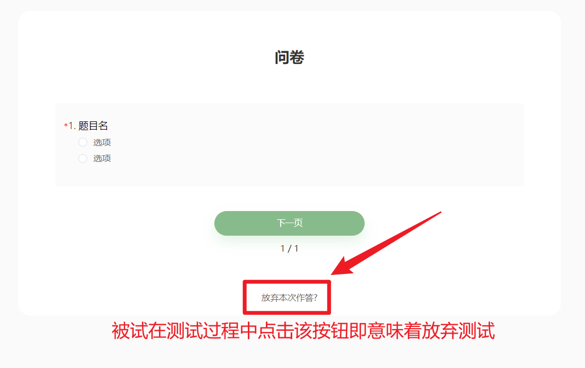
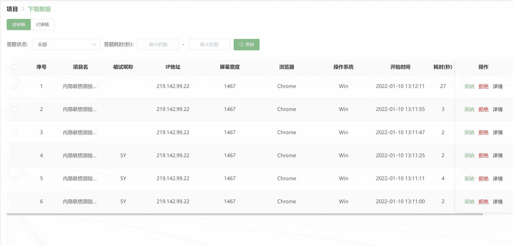
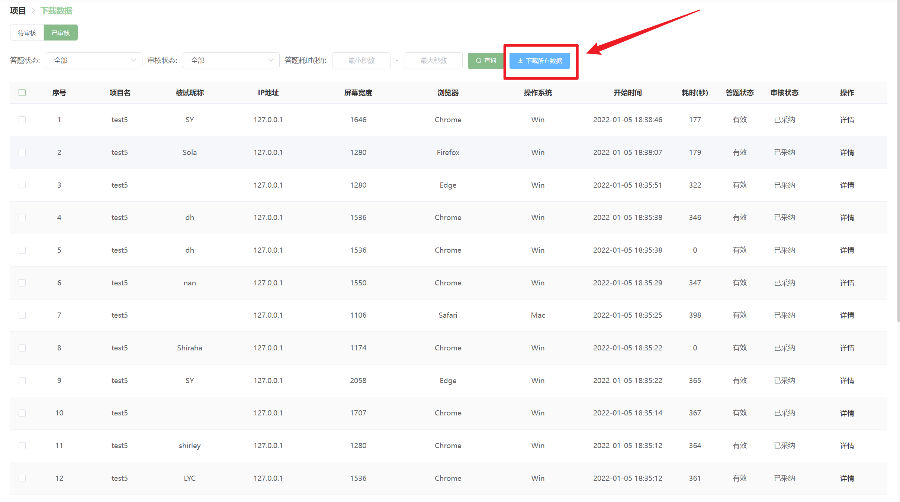
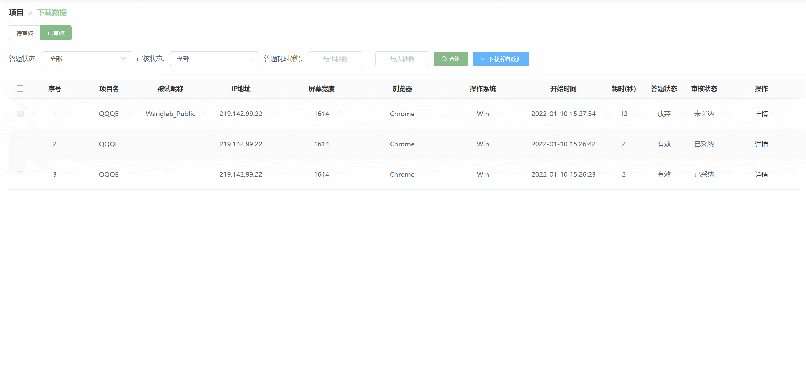

## 项目数据管理 <!-- {docsify-ignore-all} -->
在项目列表中点击「**下载数据」**按钮进入项目数据下载页面。

如果无法直接看**画布**、**下载数据**等按钮，可能是由于设备的屏幕过窄而无法显示完全，向右拖动滚动条即可找到。

## 脑岛平台（答题赚钱）类型发布
### 待审核版块
#### 答题状态
每一条数据记录的**答题状态**分为三种：有效、进行中和放弃 。

+ **有效**状态是指被试已经正常完成了项目并提交了数据。
+ **进行中**状态是指被试当前正在进行项目。
+ **放弃**状态是指被试在参与项目的过程中主动放弃了项目。

> 【脑岛Tips】
>
> **有效**的答题状态并不代表着数据质量的高低。
>
> 
>
> 需要说明的是，一旦被试在测试过程中放弃测试，那么脑岛会默认**拒绝**该被试的数据记录。也就是说，脑岛会自动审核这些中途放弃的数据记录，因此这些中途放弃的数据记录不会出现在**待审核**版块，而是会自动出现在**已审核**版块。
>

#### 数据采纳
当被试完成某个项目后，【下载数据】页面的**待审核**版块中就会出现该被试的测试记录。**待审核**版块中所有的测试数据都还未经过项目发布者的审核。

您可根据被试完成**检查题**的情况(可依据正确率或作答时间等指标)对被试的数据进行**采纳**。需要注意的是，答题状态为**进行中**的数据不能够进行采纳或拒绝！

被采纳的数据会出现在**已审核**版块中，其**审核状态**为_已采纳_。您可以下载已采纳的数据，也可以点击【操作】栏中的**详情**按钮查看被试的作答情况。

> 【脑岛Tips】点击**已审核**版块中的【详情】按钮只能查看问卷类题目(个人信息、问卷、测试环境)的作答信息，无法查看实验的作答信息(需手动下载数据文件)。
>

需要注意的是，您无法查看**未采纳**的被试数据，一旦您在**待审核**版块采纳了被试的数据，系统会默认您已经获取了被试的数据，也就意味着您不能再将被试数据的审核状态由**采纳**改为**未采纳**。

#### 数据拒绝
如果您认为被试在测试过程中没有认真填写或存在恶意作答等情况，可以通过【拒绝】按钮不采纳被试的数据。

> 【脑岛Tips】请不要随意拒绝被试的数据！如果您随意拒绝被试的数据，可能会导致被试对您所发布项目的投诉。一般来说，面对项目投诉，脑岛会先让被试和您通过**站内信**的方式进行私下沟通，如果沟通未果，那么脑岛平台才会介入，此时脑岛平台会根据双方提供的证据来判定被试投诉的合理性。请注意的是，如果您发布的项目收到一定数量的投诉，脑岛平台会暂时下架您的项目。
>

被拒绝的数据也会出现在**已审核**版块，其**审核状态**为_未采纳_。未采纳的数据无法选中下载。

被拒绝的数据允许**二次采纳**，但这种情况一般出现在您与被试进行私下沟通有效之后。也就是说系统允许您重新采纳一开始拒绝的被试数据。注意，二次采纳后将无法拒绝该被试的数据。

#### 系统自动审核
:::danger
⚠️ 为避免接受不必要的数据，请及时进行审核。

:::

上文所述采纳与拒绝通常需要研究者手动操作。但为保证被试权益，研究者人工手动审核的期限在作答完成的 **72 小时内**。

如果该期限没有人工审核，将触发**系统自动审核**，系统将根据问卷发布中设置的[检查题数量阈值](https://www.yuque.com/naodao/researcher-manual/cvixs4hqh82v2cnt#BYzK1)来判断是否给予通过：当检查题错误数量**小于**该阈值，则系统将审核通过；相反若**大于等于**该阈值则会系统拒绝。若没有设置检查题则**默认系统通过**。

#### 批量采纳/拒绝
当**下载数据**版块中存在不止一条作答记录时，您可以通过**批量**的方式进行数据的采纳和拒绝。

您可以点击**全选**按钮全部选中所有的作答记录，也可以通过**单独勾选**的方式选中您想要的作答记录。以上两种方式都会激活【批量采纳】和【批量拒绝】按钮。

### 已审核版块

所有被审核过的数据记录都在出现在**已审核**版块。

#### 审核状态
每一条数据记录的**审核状态**分为两种：_**已采纳**_ 和_**未采纳**_。顾名思义，**已采纳**是指被项目发布者采纳的数据，**未采纳**是指被项目发布者拒绝的数据。

#### 下载所有/选中数据
您可以在**已审核**页面中下载所有审核状态为**已采纳**的数据。

> 未采纳的数据不能下载。
>

您有两种下载数据的方式可以选择：

+ 下载所有数据

您可以直接点击【下载所有数据】按钮自动下载所有已采纳的数据记录。

**数据格式**：您可以选择下载`csv文件`还是`excel文件`

> 目前仅支持下载`csv文件`
>

+ 下载选中数据

您可以通过**单独勾选**的方式选中您想要的数据记录。这种方式会激活【下载选中数据】按钮。

## 匿名发布

脑岛默认采纳所有的匿名数据，不需要您自行采纳。因此匿名数据的【下载数据】页面李没有**待审核**和**已审核**版块。

对于一个匿名项目，脑岛默认每次下载所有的匿名数据，暂不支持下载**选中数据**。

## 其他教程
[脑岛使用小妙招17丨教你轻松掌握项目发布管理和数据管理](https://mp.weixin.qq.com/s/RVgvSqqBYg0JVzjPYyc7BA)

