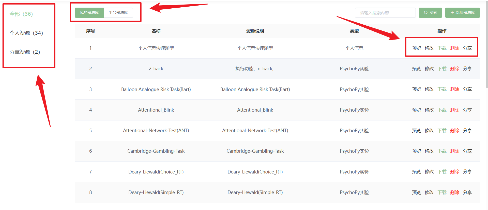

# 资源库 <!-- {docsify-ignore-all} -->

用户可点击**资源库**按钮进入脑岛的资源库页面。

脑岛**资源库**分为_【我的资源库】_和_【平台资源库】_，同时在每个资源库中还分为_个人资源_和_分享资源_两个版块。

在画布中被分享到【个人资源库】的节点将保存在`【我的资源库】-【分享资源】`版块中，被分享给【指定研究员】的节点将保存在指定研究员的`【我的资源库】-【分享资源】`中。

在【我的资源库】中点击【新增资源库】按钮直接添加的资源会保存在`【我的资源库】-【个人资源】`中。

在画布中被分享到【平台资源库】的节点将保存在`【平台资源库】-【个人资源】`版块中。同样，在【平台资源库】中点击【新增资源库】按钮直接添加的资源也会保存在`【平台资源库】-【个人资源】`中。而`【平台资源库】-【分享资源】`则保存的是其他研究者分享到【平台资源库】的资源。

## 资源预览

用户可以点击操作栏中的**预览**按钮对**资源库**中分享的节点进行预览。

### 预览**个人信息**、**问卷**、**测试环境**节点

### 预览**PsychoPy实验节点**和**jsPsych实验节点**

## 资源修改

用户可以点击【修改】按钮对**自己上传或分享**的节点进行修改。

## 资源下载

**资源库**中分享的节点均支持下载，用户可以点击操作栏中的**下载**按钮进行下载。

需要说明的是，**个人信息**、**问卷**、**测试环境**节点目前仅支持以txt文件格式下载。对于**PsychoPy**实验节点和**jsPsych**实验节点，将下载相应的实验压缩包(ZIP格式)。**简单云**实验节点目前暂不支持下载。

## 资源删除

用户可以点击【删除】按钮对**自己上传或分享**的节点进行删除。

## 资源分享

用户可以点击【分享】按钮将【我的资源库】中的资源分享到【平台资源库】或指定用户。

## 其他教程
[脑岛使用小妙招10丨脑岛资源库（上）—设计理念及个人资源库使用](https://mp.weixin.qq.com/s/c4tZQcEcTfOmCYbsWpapLg)

[脑岛使用小妙招11丨脑岛资源库（下）—平台资源库的使用和现有公开资源介绍](https://mp.weixin.qq.com/s/ngTk8lEU-toWX4kG3m1G_w)

[脑岛使用小妙招12丨如何快速使用脑岛资源库的资源](https://mp.weixin.qq.com/s/gnHvffTGZbbh-OUKM0e52g)

[资源库-上_哔哩哔哩_bilibili](https://www.bilibili.com/video/BV1g14y147ZT?p=11)

[资源库-下_哔哩哔哩_bilibili](https://www.bilibili.com/video/BV1g14y147ZT?p=12)

[资源库节点_哔哩哔哩_bilibili](https://www.bilibili.com/video/BV1g14y147ZT?p=13)

