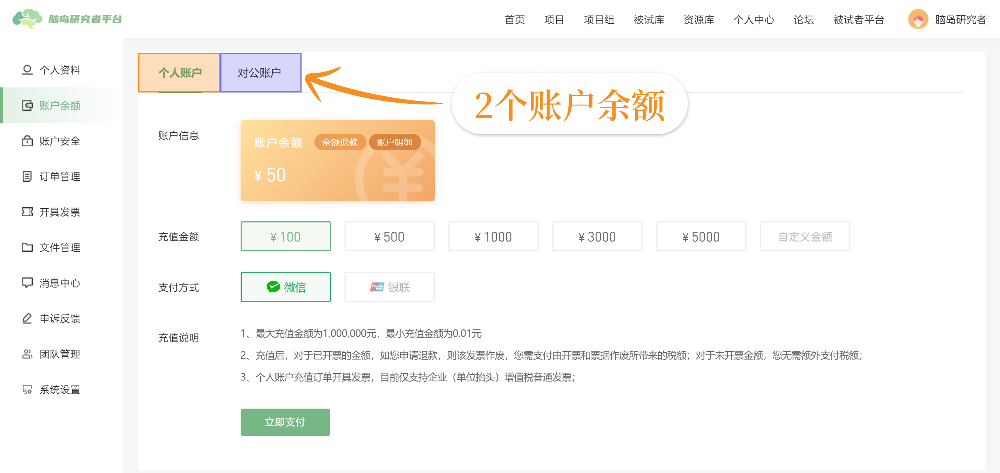
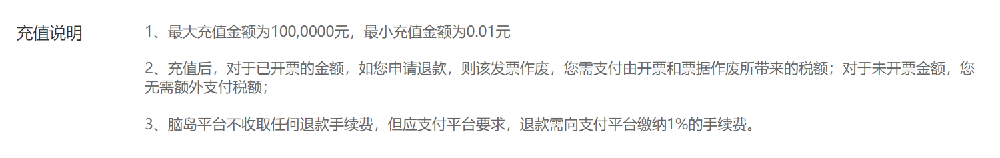
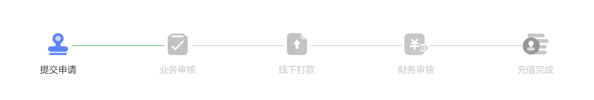
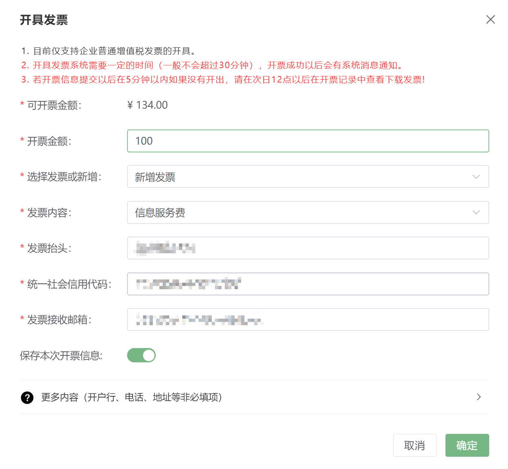
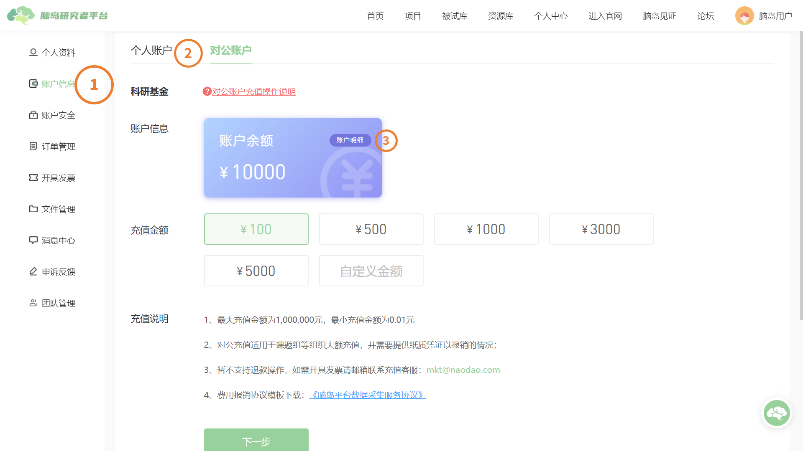
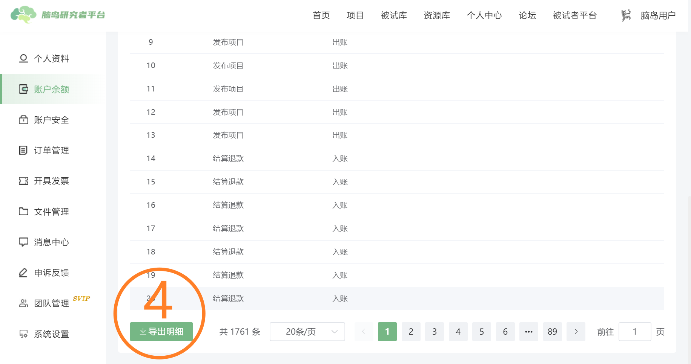
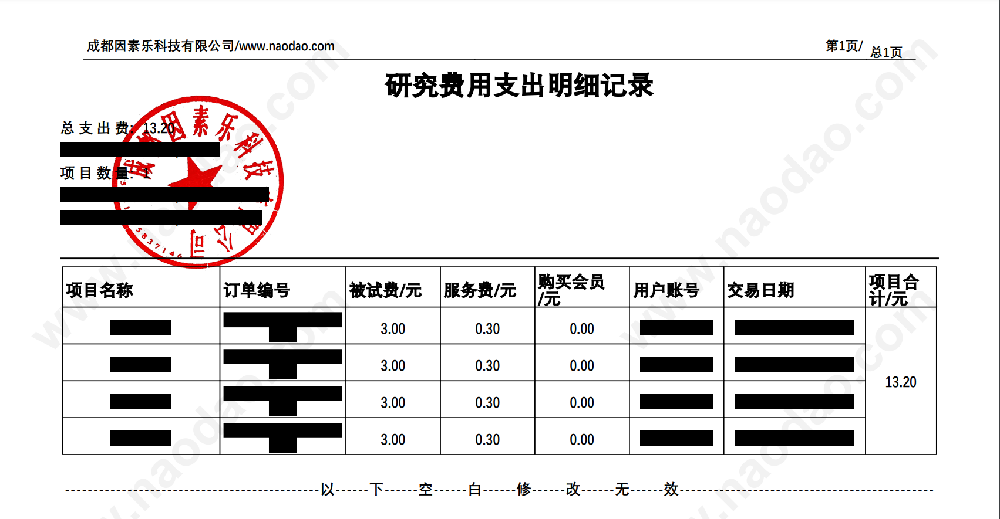

### Recharge and Refund <!-- {docsify-ignore-all} -->

For issues with recharge, invoicing, etc., please consult the researcher financial customer service.

## Recharge and Refund
Researchers can check their current account balance and perform recharge operations in their personal center - [Account Balance](https://research.naodao.com/user/acount). The balance is currently only used for participant compensation. Account balance is divided into personal accounts and corporate accounts, and the balances of these 2 accounts cannot be mixed.

### Personal Account Recharge

### Corporate Account Recharge
Corporate recharge is suitable for large-amount recharges by organizations like research groups, specifically for transfers from **corporate bank accounts** that require paper documentation for reimbursement. Corporate account recharge **does not support direct refund operations**. For refunds, please contact recharge customer service via email at [mkt@naodao.com](mailto:mkt@naodao.com).

Corporate account recharge does not support transfers from personal bank accounts. Recharge applications using personal accounts will be rejected.

Corporate recharge involves the following 5 steps:

1. **recharging party** submits a recharge application with account and contact information, awaiting platform review
2. **platform** contacts you to verify recharge information and approves the application after successful communication
3. **recharging party** transfers money to the designated platform account and confirms online (upload bank transfer receipt)
4. **platform** verifies receipt of payment, approves after financial confirmation
5. recharged amount enters the researcher's "Personal Center - Account Information - Corporate Account"

## Reimbursement Matters
### Invoice Issuance for Recharged Balance
1. **Personal Account**

In the researcher's personal center - [Issue Invoice](https://research.naodao.com/user/invoice), researchers can choose to issue electronic invoices (regular invoices) for successful recharge orders. If refunding after invoice issuance, corresponding tax amounts will be deducted.

> Invoice amounts are based on recharge orders, regardless of balance usage. The system calculates available invoice balance based on recharge records, previous invoice records, and refund records.
>

2. **Corporate Account**

For corporate accounts, invoice choice is made during recharge. After completing the recharge process, financial customer service handles invoice issuance.

### Invoice Issuance for Membership Purchase
Invoice issuance for membership purchases varies by payment method:

1. **Membership paid with corporate account balance**  
If the corporate account recharge was already invoiced, membership fees are included and cannot be invoiced again.
2. **Membership paid via third-party payment (WeChat Pay, Alipay, etc.)**  
Membership amount is added to "Available Invoice Balance". Invoice amount can be any value not exceeding "Available Invoice Balance". **For membership-specific reimbursement, issue an invoice equal to the membership fee.**

### Data Collection Agreement (Contract)
Researchers needing participant fee certification agreements (or contracts) for reimbursement can [download](https://www.naodao.com/public/%E8%84%91%E5%B2%9B%E5%B9%B3%E5%8F%B0%E6%95%B0%E6%8D%AE%E9%87%87%E9%9B%86%E6%9C%8D%E5%8A%A1%E5%8D%8F%E8%AE%AE.docx) the "Naodao Platform Data Collection Service Agreement", complete it, and contact recharge customer service at [mkt@naodao.com](mailto:mkt@naodao.com) for next steps.

> Data collection agreements only support researchers using the **corporate recharge** process
>

### Participant Fee Details
For researchers needing **each** participant fee order detail, follow these steps:

1. Go to Personal Center - Account Information - Personal Account / Corporate Account - Account Details

2. Scroll to the bottom of orders, select historical transaction data export, and filter orders by time or project 

Exported details example:

## Other Tutorials
[Naodao Recharge Reimbursement and Refund: Complete Materials, Dedicated Customer Service, Worry-free Reimbursement](https://mp.weixin.qq.com/s/Q40Mj1WkOc5muzTI0v2lbg)

