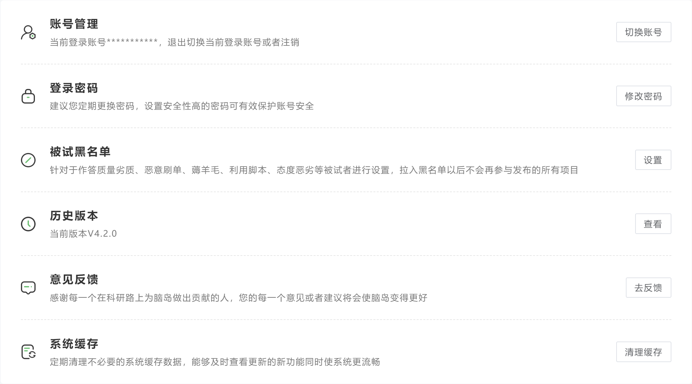

# 个人中心 <!-- {docsify-ignore-all} -->

当用户注册后，在进入研究者平台时脑岛会要求用户[认证成为研究者](/2-researcher-manual/0-must-read.md)。如果用户没有完善（认证）个人资料，则不能使用研究者平台所有功能。每一次进入研究者平台，脑岛都会提示用户完善个人资料。

完善的资料将显示在个人中心的个人资料中，研究者可以在此处更新研究者资料。如果更改邮箱，则需要重新认证研究者信息。

## 账户余额

此页面可以查看不同脑岛账户的余额，进行充值、退款等操作。

「账户明细」中可以查看余额、冻结金额的明细和导出。导出明细具体步骤参见[充值与报销 - 被试费明细](/2-researcher-manual/4-1-recharge.md#被试费明细)。

## 账户安全

用户可在**账户安全**中进行绑定 / 修改 / 解绑手机号、邮箱以及微信账号和支付宝账号等操作。

除邮箱外，账户安全中的其他项目都和官网保持同步。详见[官网个人中心说明](/2-researcher-manual/4-personal.md)。

## 订单管理

用户可在**订单管理**版块中查询所有的订单详情。

全部的订单类型可以通过筛选查看。常见的订单类型有

+ 充值与退款订单
+ 项目支付被试、申诉支付被试、结余退款

导出支付订单参见[充值与报销 - 被试费明细](/2-researcher-manual/4-1-recharge.md#被试费明细)。

## 开具发票
主条目：[充值与报销](/2-researcher-manual/4-1-recharge.md#报销事宜)

在开具发票的**开票记录**栏目中，可以查看过往的开票记录，点击「开具发票」可以为余额新开发票。

在**发票设置**栏目中，可以查看和新建保存的开票信息（抬头、统一社会信用代码等）。

****

## 文件管理

用户可在**文件管理**版块中上传图片、音频和视频等材料。需要注意的是，上传材料的质量不应该超过相应的限制。文件管理中的材料可以在简单云和 RSA 实验中使用。

> 【脑岛Tips】上传材料的文件名请不要包含特殊字符
>

## 消息中心

此处包含来自脑岛的各类通知和消息，包括充值、退款、项目动态、发票动态等。

## 申诉反馈

对于**脑岛平台发布渠道**的项目，当研究者拒绝了被试，也即被试未通过审核时；又或者被试最终没能完成项目，但被试认为自己花费了时间、或者研究者的项目存在问题时，被试都有机会进行申诉。

申诉是被试针对自己未正常完成的记录申请报酬的手段，当被试发起申诉后，研究者的个人中心会收到一条申诉记录，同时被试和研究者间会建立一个临时的对话，双方可以通过对话表明自己的主张。同样地，研究者也能够在该界面看到被试的完成信息。

> 到账状态：能够进行申诉的记录在通过前均为未到账
>
> 答题状态：可能存在「已完成」和「已放弃」，已完成的申诉记录通常是未通过研究者或系统自动审核
>
> 申诉状态：研究者通过或拒绝了该条申诉
>

研究者收到申诉记录后，消息中心会发送一条通知提醒研究者处理申诉（通过或拒绝申诉）。若研究者收到申诉后 48 小使内未处理，研究者所有项目的**下载数据功能会被临时禁用**，直到处理完成所有申诉，在此期间研究者的其他功能不受影响。

若研究者通过一条申诉，则需要支付被试一定费用。费用金额可以自定义，请与被试沟通后再填写。支付申诉的金额需要**额外从账户中扣除**，最大不能支持超过项目报酬的金额。因此即便申诉通过，被试的这条作答也**不会占用已发布项目的费用和有效名额**，同时被试的作答状态也不会改变。

若研究者驳回一条申诉，被试无法再进行第二次申诉。但被试仍有可能寻求平台方的介入。**请确定您和被试进行了充分的沟通，然后处理申诉。**

### 常见申诉问题
> Q: 被试声称完成了实验，但记录中显示放弃
>
> A: 这种情况很可能是被试没有进行最终的提交。
>

> 脑岛的一个项目可以承载多个不同类型的节点，因此每完成一个节点（问卷或实验）需要手动点击下一步以进入下一个节点或结束项目。有些被试可能看到实验结束的界面就直接关闭浏览器，没有进行最后的提交，因此数据不会被记录。研究者应该在项目（尤其是只有单个实验节点的项目）的指导语中提醒被试。
>

## 团队管理

开通专业版后，研究者在脑岛可以创建自己的团队，并为团队添加成员账号。该功能尤其适合课题组 PI 用于共享组内资金和资源，而不必因为课题组的工作让相关成员全部注册账号。

成员账号（或**子账号**）并非独立的脑岛账号，子账号创建、发布项目都依赖于创建团队的脑岛账号（以下称为**主账号**）的资金，且子账号的项目归属与主账号。详细操作请阅读[团队账户说明](https://mp.weixin.qq.com/s/iFmvvV8XkzSLMi-xdRozzA)

主账号在团队管理为分配的额度，意义是子账号**允许使用**的主账号最大余额，**并不代表主账号将余额转移到了子账号**，因此额度是只增不减的。如果主账号余额不足，子账号持有的额度也无法使用。

例如主账号为子账号 1 分配了￥500 个人账户额度，但主账号的个人账户仅剩￥100，子账号 1 发布一个￥200 的项目时将提示余额不足。

## 系统设置

在系统设置中可以进行切换账号、管理黑名单、查看更新记录、清除缓存等操作。

## 其他教程
[脑岛高级功能｜团队账户，助力每一位PI自动化管理团队](https://mp.weixin.qq.com/s/iFmvvV8XkzSLMi-xdRozzA)

[脑岛使用小妙招00丨教您轻松在脑岛平台进行注册和登录](https://mp.weixin.qq.com/s/T7LJTd0KACTTLsAzL-RgVA)

[脑岛使用小妙招01丨研究者注册和身份认证](https://mp.weixin.qq.com/s/x6sXPDgMt4ieZH5OfScFhQ)

[注册与登陆_哔哩哔哩_bilibili](https://www.bilibili.com/video/BV1g14y147ZT?p=1)

[认证研究者_哔哩哔哩_bilibili](https://www.bilibili.com/video/BV1g14y147ZT?p=2)

[脑岛使用小妙招18丨如何处理被试的申诉反馈](https://mp.weixin.qq.com/s/Tws0kAd9YOtEPj3SDzPCpQ)

[处理被试的申述与反馈_哔哩哔哩_bilibili](https://www.bilibili.com/video/BV1g14y147ZT?p=18)

