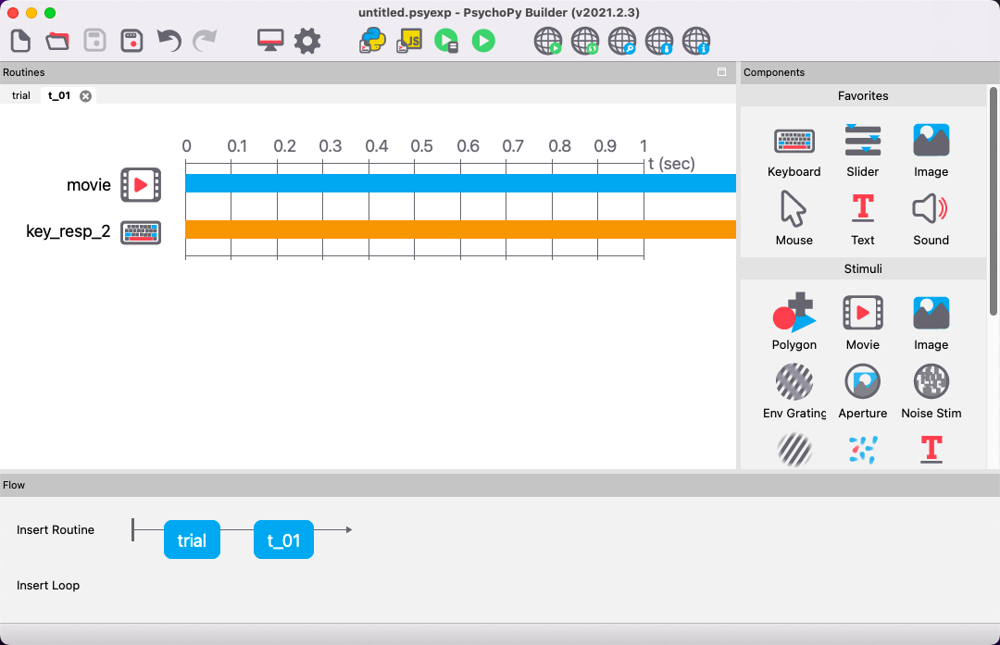
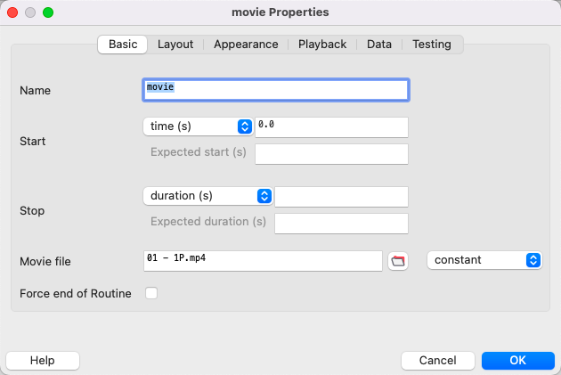
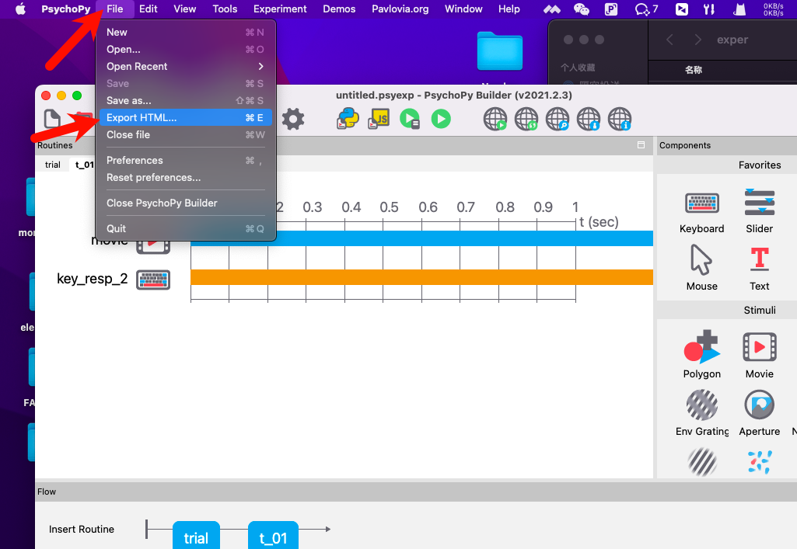
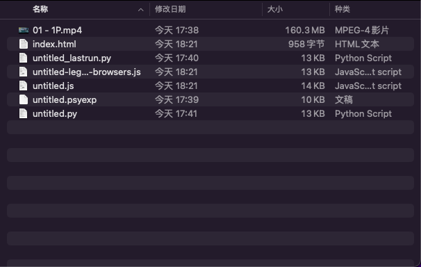
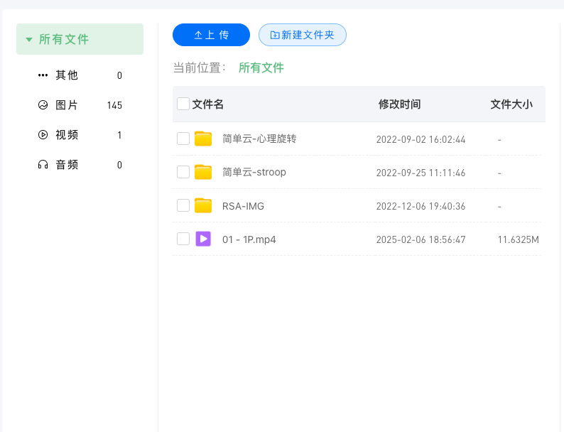
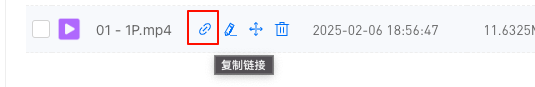
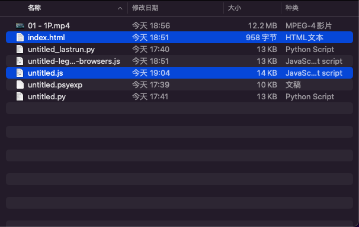

# PsychoPy打包压缩

因为网络限制原因，脑岛平台上传的实验压缩包上线在`100MB`，所以一旦刺激涵盖了视频、图片，那么打包后的压缩包会很有可能会超过这个限制。

所以，为了更好的利用网络资源，同时帮助大家减小压缩包体积。推出此教程以展示大家如何充分利用脑岛平台。

## 原始方案

我们需要用psychopy展示一个视频。所以该Routine我们这样子设置。


里面涵盖了一个视频组件，一个按键键盘。视频组件里面只有一个视频，文件比较大。


为了能上传到脑岛上，我们需要先点击`File > Export HTML`。


最后我们得到的文件列表如下：


我们需要将这些内容打包成`zip`，并参考[上传实验包](./1-1-2-5-psychopy.md#上传实验包)将实验程序上传至脑岛平台即可正常使用。

不过这样子压缩包就涵盖了全部的视频资源，会导致压缩包超过100兆的限制。

## 进阶技巧

为了进一步缩减压缩包体积，我们需要将视频文件从压缩包中删除。

### 预先检查
首先，打开`<实验文件名称>.js`文件，这里的实验文件名称叫untitled，所以打开`untitled.js`。

接着找到下面的内容:
```js
psychoJS.start({
  expName: expName,
  expInfo: expInfo,
  resources: [
    {'name': '01 - 1P.mp4', 'path': '01 - 1P.mp4'}
  ]
});
```

:::tip 提示
需要关注`resources`内`path`后面的内容。
:::

### 视频图片等先上传脑岛
> 找到里面需要压缩的文件。这里选择`01 - 1P.mp4`。

将文件手动上传到脑岛研究者平台中文件管理。如果不知道如何进入的话，直接进入该网址即可：`https://research.naodao.com/user/file`。


这里上传完毕后，点击复制按钮。


这里会复制这些文本：`/591665676708478976/939957816112975873.mp4`。

### 修改JS文件
这里将原来的js文件内容修改为以下内容：
```js
psychoJS.start({
  expName: expName,
  expInfo: expInfo,
  resources: [
    {'name': '01 - 1P.mp4', 'path': 'https://document.naodao.cc/591665676708478976/939957816112975873.mp4'}
  ]
});
```

:::tip
记住，这里一定要加`https://document.naodao.cc`
:::

### 压缩文件
注意，最后我们需要`选择性压缩`，而非全部压缩。

只需要选择`index.html`和目标js文件即可！！！


压缩完毕后，看看文件大小。
> 该方法得到的压缩包小于一兆。

最后将该压缩包上传即可！

