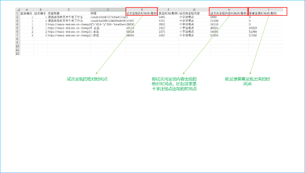
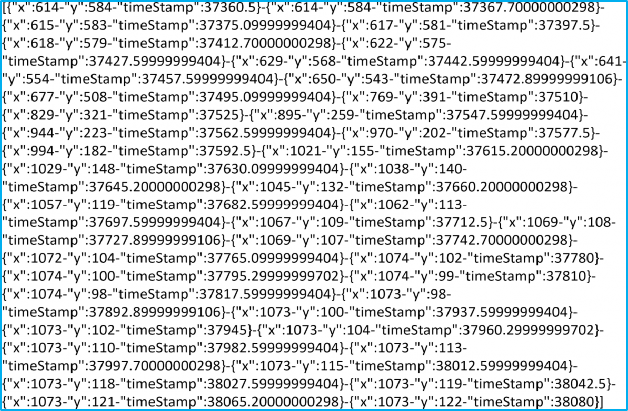

# 简单云实验导出数据说明

在简单云平台，导出的数据包括区块编号（block 编号）、试次编号、实验刺激、被试的回答、反应时，以及实验刺激出现的绝对时间点、十字注视点（或者空白屏）出现的绝对时间点、反馈呈现出现的绝对时间点。绝对时间点的算法为：从时间的零点（即被试点击完

【全屏还是不全屏】的那个瞬间）开始，到某个节点的所遍历的时间。

举个例子，比如试次 2 出现的时间点为 14497,意思是，当被试点击了【全屏还是不全屏】的那个瞬间开始到第二个试次出现，遍历了 14497 毫秒。

关于被试的回答，有两种比较特殊的形式，说明如下。

## 语音数据

## 鼠标轨迹数据

X 代表的是鼠标在屏幕的横向坐标位置，Y 代表的是鼠标在屏幕的纵向坐标位置； timeStamp 代表的是当鼠标出于某个位置的时候，该时刻的时间点。

