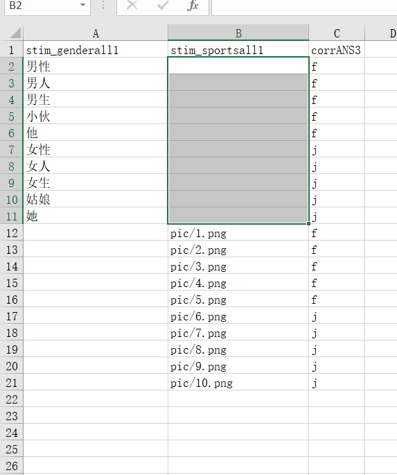

# PsychoPy <!-- {docsify-ignore-all} -->

> For more information, please check [Github Issues](https://github.com/psychopy/psychopy/issues)

> Updated as of 2022/10/01

## Variable Not Accessible

Don't arbitrarily use `var a` to name variables - PsychoPy will add them automatically. No need to worry about initialization.

## Setting Specific Number of Trials for Participants

Simply enter `0:n` in the selected rows input box in the loop settings window to have participants complete n trials in one loop. Multiple positions can be separated by commas `,`.

## Allowing Participants to Adjust Slider After Selection

Step 1: Add a button or other response element. Change the appearance condition to "condition" and enter `$show_button`

Step 2: Add a code component, and in begin routine add `show_button = False`

Step 3: In the code's each frame, add the following code:
```python
# Manually convert None to undefined (not null)
show_button = slider.getRating() is not None
# print(slider.getRating())
if show_button:
    text.text = slider.getRating() # Display the rating
```

## Textbox Centering Issue

For offline experiments, this hasn't been fully investigated yet - likely needs to be addressed through pygame.

For online experiments, add a code component, set code type to both. Then add the following code:
```javascript
$("textarea").css({
display: "block",
textAlign: "center",
padding: (
$("textarea").height() / 4
).toString() + "px 0"
});

$("textarea").focus();
```

`$("textarea").height() / 4` is used for horizontal centering. You can use / 2 instead, as / 4 may not give ideal results.

## Unable to Input Content After Textbox Component

In version 2021.2.3, there's a bug with the textbox. You need to manually add JavaScript code to make the text box visible.

Add a code component, set code type to both, and add the following code:
```javascript
$("textarea").css("display", "block");

$("textarea").focus();
```

## How to Detect Key Press Without Release

First, add a code component and keyboard component in the build page.

Add the following code to the code component:
```python
pressed_keys = show_stimuli_keyboard.getKeys(waitRelease=False, clear=False)

if len(pressed_keys) > 0:
    this_key = pressed_keys[len(pressed_keys)-1] # Get the last pressed key
    if not this_key.duration:
        # If a key is pressed
    else:
        # After key release
```

`show_stimuli_keyboard` is the name of the keyboard component

## Video Playback Error

Please ensure the video file can be opened and played in a browser.

:::tip
AbortError: The play() request was interrupted by a call to pause().
:::

[See this post for detailed reference](https://forum.naodao.com/postingInfo?id=1555137945563041793)

## Works Offline but Not Following Experiment Logic Online

- Case 1:

In a loop, using a code component to redefine timeline variables in begin experiment. Remove the redefinition to fix. For example, if xlsx has a `cc` column, and you add `cc=0` to the component in the loop, the program will always get the value `0` regardless of what's in the xlsx.

## Polygon Component Circle Display Error in PsychoPy 2021.2.3

When using the builder, switch to regular shape and set it to 999 (i.e., a 999-sided polygon, effectively a circle)

## Uploading Data for Incomplete Experiments

If you want to save partial data, but only after participants complete a minimum amount of the experiment (e.g., 100 trials), add `PsychoJS._config.experiment.saveIncompleteResults = true;` to a JS component in the appropriate Routine [needs testing].

## Syntax Issues

Python and JavaScript syntax differ. Here are syntax issues reported in the forum **Note: the following code won't run online, manual modification required**:

1. [0, 1] == [0, 1]
2. [1, 2, 3, 3, 3, 3, 3] * 15
3. import os \n os.listdir()
4. divmod()
5. time.clock()
6. str(423)
7. 1 & 1 == 1

Solutions:

1. [0, 1][0] == [0,1][0] & [0, 1][1] == [0,1][1]
2. [1, 2, 3, 3, 3, 3, 3, 1, 2, 3, 3, 3, 3, 3, 1, 2, 3, 3, 3, 3, 3, 1, 2, 3, 3, 3, 3, 3, ...]
3. No solution, cannot use
4. Integer division: Math.floor(7 / 5)  Remainder: 7 % 5
5. new Date().getTime()
6. (423).toString()
7. 1 and 1 == 1

## Rating Marker Initial Position Not Showing Online

Testing shows that online experiments don't support default *slider* positions. This needs to be implemented through code.

Add a code component and add `slider1.setMarkerPos(50)` in `begin routine`

## Can Online Experiments Add Marks? (e.g., EEG, skin conductance)
This depends on whether your device supplier provides corresponding methods and specific operation instructions.

## What is PsychoPy Node?
PsychoPy is a well-established psychological experiment development software that supports online experiments. Naodao enables online data collection by being compatible with PsychoPy export files.

## Is There a Size Limit for Uploaded Experiment Packages?
Yes, please don't upload experiment packages larger than 100M. You can reduce package size by compressing images, videos, etc.

## Which PsychoPy Versions are Currently Supported?
See [PsychoPy Experiments](/2-researcher-manual/1-1-2-5-psychopy.md)

Currently only versions 2020.1.3 and 2021.2.3 are supported. Please use these versions for development. We chose these versions because they have fewer issues with the experiment editor and correspond to more stable online experiments. We will support more versions as optimizations continue.

## How to Make Stimuli Appear Similar for Different Participants?
PsychoPy can use Height units (where screen height = unit 1), ensuring all stimuli maintain the same proportions on all participant computers without distortion. For screen ratio handling (whether stimuli appear completely on screen), e.g., some participants use 16:9 (e.g., 1920*1080) while others use 16:10 (e.g., 2880*1800, common on Mac), usually setting stimulus presentation boundaries to ±0.8 (i.e., 16:10) meets most needs. For optimal compatibility, ±0.5 also works. Additionally, for more precise control:

(1) Naodao provides participant screen pixel size filtering to automatically exclude participants with very low screen resolutions;
(2) Card calibration (e.g., bank cards) can be used to estimate physical screen size; blind spot tests with approximately 13° offset can estimate visual angle.

## Modifying Audio Hz

Online Hz modification is not feasible, recommend using files instead.

## PsychoPy Code Involving import and Other Syntax

Online doesn't have libraries like numpy and doesn't support import syntax (need alternative functions)

Find alternative functions through online search

## Resource Library BART Experiment Only Has One Trial Offline

PsychoPy resources are online/offline compatible, with some exceptions, this being one: it uses sound components. In online experiments, PsychoJS determines Routine timing based on sound file duration, so Audio component time is set to infinite; offline follows its time settings.

See [this article](https://forum.naodao.com/postingInfo?id=1499255336811630593) for details

## Complex Key Press Detection

See [article](https://forum.naodao.com/postingInfo?id=1501126060505567233)

## Cannot Open After Upload, Shows "unknown resource"

* Solution 1

> For version 2021.2.3, delete html from export path. Go to `Edit experiment settings` > `Online`, find `Output Path`, clear the textbox content

* Solution 2

> Check if file naming and paths are correct in `js` files, use `/` for path separation, not `\`, i.e., change backslashes to forward slashes

* Solution 3

> Ensure only one file ends with `.html`, if multiple exist, keep only one usable file.

## Font Support

* Arial (sans-serif)
* Verdana (sans-serif)
* Helvetica (sans-serif)
* Tahoma (sans-serif)
* Trebuchet MS (sans-serif)
* Times New Roman (serif)
* Georgia (serif)
* Garamond (serif)
* Courier New (monospace)
* Brush Script MT(cursive)
* STSong

## Some Image Materials Not Reading Correctly

Please manually add resource files as follows:

Go to `Edit experiment settings` > `Online`, find `Additional Resources`, make additions/removals there.

## Data Encoding Issues

Online experiments use UTF-8, while offline usually uses GBK. For encoding issues, use Excel's import feature to import CSV files as UTF-8 for proper display.

## Defined Variables Not Executing as Expected

Ensure variable names don't match any Routine names, loop names, or loop condition names, otherwise JavaScript redefinition issues will occur.

[Case 1](https://forum.naodao.com/postingInfo?id=1522061951159767041)
[Case 2](https://forum.naodao.com/postingInfo?id=1574235865155375105)

## Condition Variable Empty, Causing undefined



For example, in the above table, `stim_sportsall1` is empty in some timeline loops, needs to be filled.

See detailed reference in [forum](https://forum.naodao.com/postingInfo?id=1523567902115237890)

## Loop Issues with thisN Function

`.thisN` attribute doesn't work online, use alternative methods

## Online Recording Issues

Currently doesn't support microphone data storage, will consider adding in future

## new core.Clock() Error

Please change to new util.Clock() for JavaScript

## Version Syntax Issues


Main case shown in above image, change *\$\'right\'* to *right*

## Changing Background Color

If using version 2021.2.3, refer to this [post](https://forum.naodao.com/postingInfo?id=1541755998795206657)

## Data Not Uploaded to Naodao

* Solution 1

Check if folder has `lib` folder, which is automatically generated for local debugging. Delete before uploading.


<!-- ## 线上自动运行

不做解释，内部人员使用

```javascript
function sleep (time) {
    return new Promise((resolve) => setTimeout(resolve, time));
  }

setInterval(() => {
    window.dispatchEvent(new KeyboardEvent("keydown", { key: "3", code: 'Digit3'}));
    window.dispatchEvent(new KeyboardEvent("keyup", { key: "3", code: 'Digit3' }));
    window.dispatchEvent(new KeyboardEvent("keydown", { key: "3", code: 'Digit3'}));
    window.dispatchEvent(new KeyboardEvent("keyup", { key: "3", code: 'Digit3' }));
    sleep(100).then(() => {
        window.dispatchEvent(new KeyboardEvent("keydown", { key: "Enter", code: 'Enter'}));
        window.dispatchEvent(new KeyboardEvent("keyup", { key: "Enter", code: 'Enter' }));
        window.dispatchEvent(new KeyboardEvent("keydown", { key: "s", code: 'KeyS'}));
        window.dispatchEvent(new KeyboardEvent("keyup", { key: "s", code: 'KeyS' }));
    });
}, 1000);
``` -->