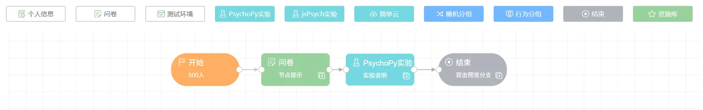
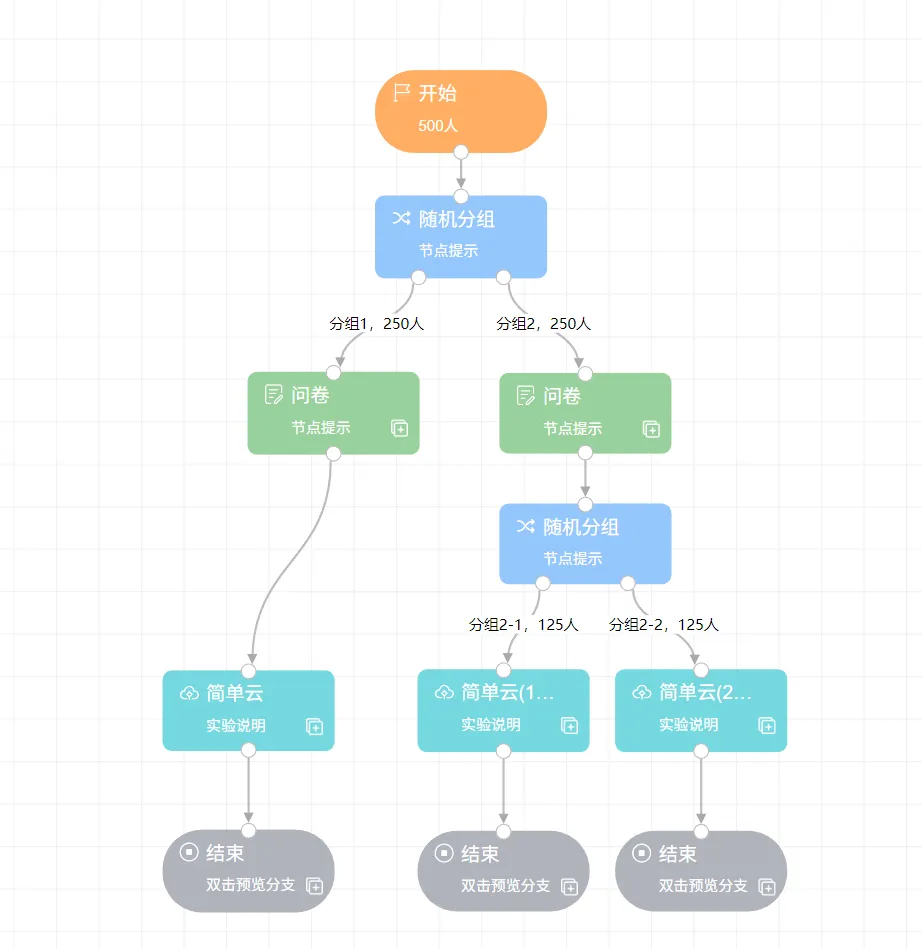
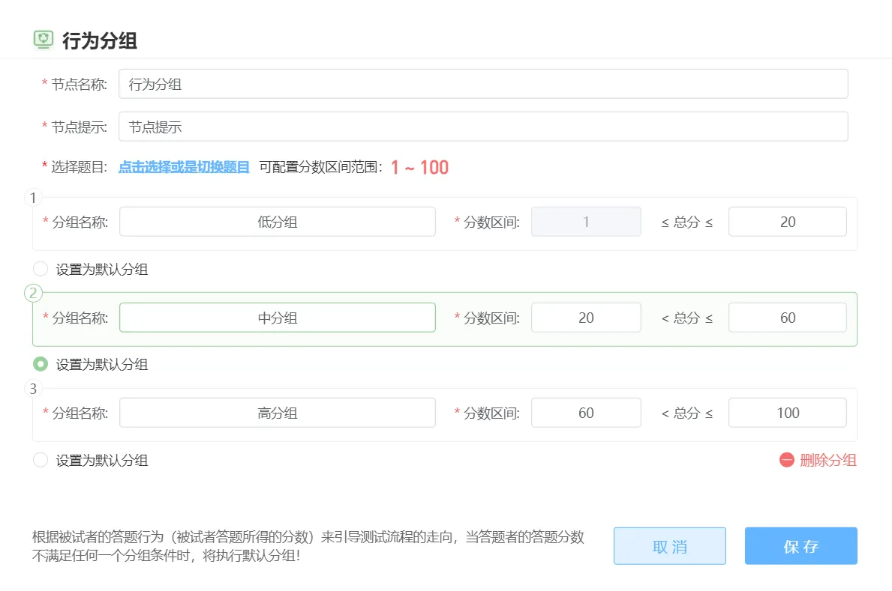

# Projects, Canvas, and Nodes

## Q: What is the canvas, and what does it contain?
A: The canvas is the core functionality of a project. Initially, you need to drag in a start node, and then, like completing a flowchart, you can intuitively complete your experimental design by creating nodes and connections. Double-clicking a node on the canvas takes you to the corresponding content editing or function page. You can refer to the user manual's [Canvas and Nodes](/2-researcher-manual/1-1-2-Canvas-and-nodes.md) section.

## Q: How do I implement between-subjects design on the canvas?
A: You can use the canvas's "Grouping Node" to set different paths for participant responses, which appears as different groups (branches) on the canvas. Grouping nodes include "Random Grouping" and "Behavioral Grouping."

## Q: How can I merge multiple branches created by grouping nodes?
A: The canvas currently only supports tree-structured node arrangement and cannot merge branches. You can use the node copy feature to quickly create multiple identical end nodes and arrange them under different groups. The advantage of this is that double-clicking an end node will always preview the corresponding branch, unaffected by preview responses.

## Q: How do I use behavioral grouping?
A: Behavioral grouping obtains the **score** from the node preceding the grouper and assigns participants to branches based on preset intervals. When a participant's score doesn't fall within any interval, they are assigned to the default branch. Questionnaire node scores need to be set in the questions, with only certain question types allowing score settings; experiment nodes require Python scripts to parse experimental data and return score values. See [Behavioral Grouping](/2-researcher-manual/1-1-2-8-behavior-grouping.md) for details.

## Q: Does Naodao currently support using both "Behavioral Grouping" and "Random Grouping" simultaneously?
A: They can be used simultaneously, but branches after behavioral grouping cannot use random grouping. This is because behavioral grouping groups participants based on their scores from the previous node, making the number of people in each group uncertain; random grouping's upstream needs a fixed number of people to allocate to each group.

## Q: How can I implement random experiment arrangement after "Behavioral Grouping"?
A: In this case, if the randomization requirement doesn't have strict proportional (or numerical) requirements for each group, complete randomization can meet the need. Therefore, you can try implementing random presentation of experimental blocks within the experiment to meet the corresponding requirements.

## Q: PsychoPy / jsPsych node experiment package upload fails or gets stuck at 95%.
A: Please ensure your compressed package:
- Is less than 100 MB in size;
- Doesn't contain a very large number of subdirectories or files;
- Contains exactly one html file (`index.html`)

