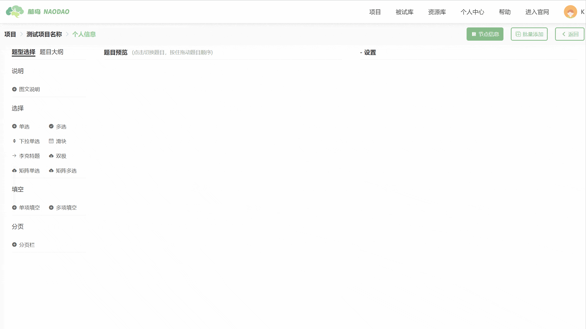
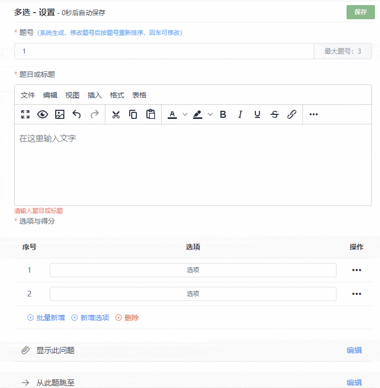
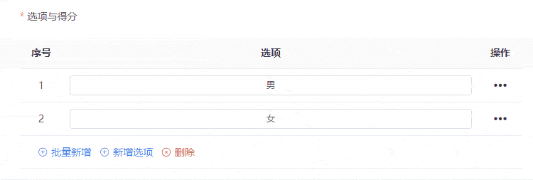

# Questionnaire Node <!-- {docsify-ignore-all} -->
[Quick Guide to Creating Questionnaires](https://mp.weixin.qq.com/s/oDAG0d8gqY6vE-_FRvO17w)

[How to Use Questionnaires_bilibili](https://www.bilibili.com/video/BV1g14y147ZT?p=5)

## Previous Content
> Most of the following content is outdated
>

You can modify the basic information of the current node (node name, node prompt) through the [Node Information] button.

You can select common question types from the [Question Type Selection] panel on the left side of the page. You can add question types from the [Question Type Selection] panel to the **question preview area** in the middle of the page by **clicking and dragging with your mouse**.

After adding questions to the **question preview area**, you can edit **individual questions** in the [Settings] panel on the right.

##### Required Question Settings
_**Required Question**_: You can use [*Required Question] to set whether a question must be answered.

##### Edit Question Number
_**Question Number**_: You can modify the question number for each question in [*Question Number]. Under normal circumstances, the platform will generate a default question number for each question in the question preview area. When you manually modify a question's number, the platform will **automatically update** the sorting position of all questions based on the new number.

Additionally, when you directly drag to modify the sorting position of questions in the **question preview area**, the platform will automatically update the question numbers.

 ##### Edit Question Text
_**Question or Title**_: You can modify the **question text** of each question in [*Question or Title]. Question text editing supports rich text format.

##### Edit Options
_**Options and Scores**_: You can add question options in [*Options and Scores].

You can use the [Batch Add] function to add multiple options at once.

Click [Add Option] to add new options.

You can also edit the specific content of options through the [Operations] function. The [Operations] function provides a **rich text editor** for formatting option content.

##### Wrong Answer Verification
You can set up [Wrong Answer Verification] for questions: Click [Wrong Answer Verification] in the **operations** column of the question **options** to set the current option as a _**wrong answer verification option**_.

It's important to note that the [Wrong Answer Verification] function operates on question **options**, which means you can only set wrong answer verification for (_**one or more options**_) of the question. For example, if we set wrong answer verification for option A, it means that if the test taker selects option A when answering this question, it indicates they answered incorrectly, and their wrong answer count will +1.

> 【Tips】NaoDao currently only supports wrong answer verification for **<u>single-choice questions</u>**, **<u>dropdown single-choice</u>** and **<u>matrix single-choice questions</u>**.
>

##### Display Logic
_**Show this Question**_: You can set the question's **display logic** through [*Show this Question].

**Show this Question** means displaying this question when certain conditions are met. Therefore, to set **display logic** for a question, there must be **at least one question** before it.

As shown below, if you want to set display logic for Question 3, you can choose to make judgments based on Questions 1 and 2. Specifically, you can choose to make judgments based on a particular option of a specific question.

> 【Tips】Text and image explanation questions currently do not support display logic settings. This feature is under development, stay tuned!
>

***Selected*** means Question 3 will only be displayed when the test taker selects specific options of specific questions *(in this example, Option 1)*. 

***Not Selected*** means Question 3 will only be displayed when the test taker has not selected specific options *(in this example, selecting Option 1 won't display Question 3, but selecting Option 2 will display Question 3)*.

In addition to the above single judgment conditions, Naodao also allows you to set **multiple condition joint judgments**. You can click the "+" button in the [Display Logic] popup to add judgment conditions.

##### Skip Logic
_**Skip to**_: You can set the question's **skip logic** through [*Skip to].

**Skip to** means jumping to specific questions when certain conditions are met. Currently, Naodao only supports **forward skipping**, meaning you can only skip from previous questions to later questions, not from later questions to previous ones. Therefore, to set **skip logic** for a question, there must be other questions after it.

Additionally, note that **skip logic only works when the target question and the skip source question are on different pages**. This means if you want test takers to skip directly to Question 3 after selecting Option 1 of Question 1, Question 1 and Question 3 must not be on the same page.

As shown below, Question 1 can skip to Questions 2 and 3, Question 2 can skip to Question 3, while Question 3 cannot set **skip logic** because it's the last question. When you set Question 1's **skip logic** to skip to Question 3, Question 2 will be automatically skipped.

For example, when setting **skip logic** for Question 1, we can choose to make judgments based on one of its options.

**Selected** means it will only skip to the target question when the test taker selects specific options of specific questions *(in this example, Option 1 leads to Question 3)*.

**Not Selected** means it will only skip to the target question when the test taker has not selected specific options *(in this example, selecting Option 1 won't skip to Question 3, but selecting Option 2 will skip to Question 3)*.

**Naodao currently only supports single condition skip logic and does not support multiple condition joint skip logic.**

##### Insert New Question
In addition to dragging questions from the [Question Type Selection] panel on the left into the **question preview area**, you can also add new questions through the [Insert New Question] button at the bottom right of each question in the **question preview area**. By default, the canvas will insert the new question after the current question.

##### Change Question Type
You can change the type of the current question using the [Change Question Type] button at the bottom right of the question.

##### Batch Add
If you want to add multiple questions at once, you can batch import questions using the [Batch Add] button in the upper right corner of the page.

Naodao currently only supports batch importing questions from txt text files. You can click the **?** button to view the text formatting requirements for different types of questions.

You can copy and paste the formatted txt file into the **text content input box**, or import the txt file using the [Upload from File] button.

