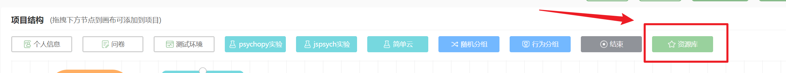

# Resource Library <!-- {docsify-ignore-all} -->

Naodao provides a content-rich project library where you can reference questionnaires or experiment nodes shared by others from the "Resource Library".

You can click the "Preview" button to preview nodes in the "Resource Library".

To import a node to your canvas, click the **circle** in the lower left corner of each shared node and then click "Confirm Selection".

