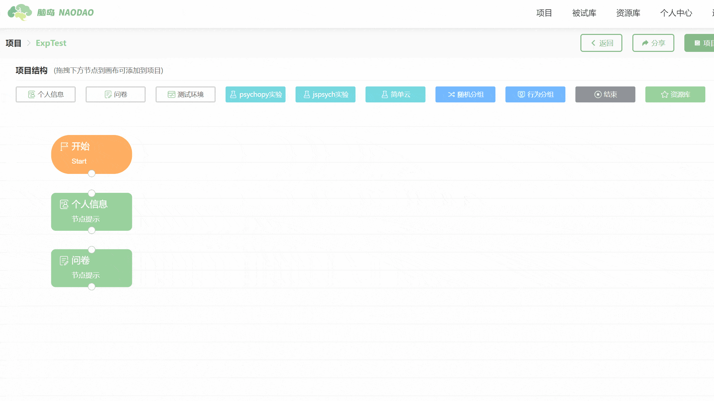

# Testing Environment <!-- {docsify-ignore-all} -->
**【Testing Environment】**
The node is used to record the **environmental characteristics** during the subject's testing process.

For example, the laboratory's lighting conditions or noise levels. This node functions in the same way as the [Questionnaire] node.

