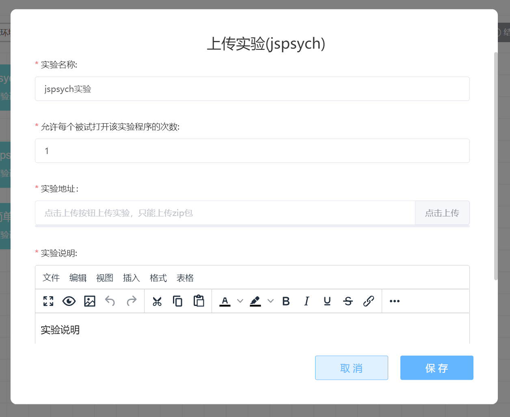

# jsPsych Experiment <!-- {docsify-ignore-all} -->
jsPsych is a toolkit specifically designed for online experiments. Using jsPsych requires at least a basic understanding of JavaScript syntax. Naodao provides support for jsPsych 7.1.

To save data on Naodao, you need to use the jsPsych extension provided by Naodao. For those who are using jsPsych experiments on Naodao for the first time, are unsure which version they're using, or don't know how to migrate to jsPsych 7, please refer to [this guide](https://forum.naodao.com/postingInfo?id=1507622372663103489).

New to jsPsych? We've prepared some learning resources for you:

+ [jsPsych Official Documentation](https://www.jspsych.org/7.1/tutorials/hello-world/)（English）
+ [Chinese Translation of jsPsych Official Documentation](https://shaobin-jiang.github.io/jsPsych-Chinese-Documentation/7.1/tutorials/hello-world/)
+ [jsPsych Tutorial Series](https://forum.naodao.com/postingInfo?id=1495710882959986690)

If researchers want to use traditional psychophysics paradigms on Naodao, we recommend using the [jspsych-psychophysics](https://jspsychophysics.hes.kyushu-u.ac.jp/) plugin. Naodao provides an [instruction video](https://www.naodao.com/public/stim_calibrate.mp4) for this plugin (thanks to Professor Zhang Ruyuan from Shanghai Jiao Tong University and You Yuqi from East China Normal University for contributing the video materials), which demonstrates how subjects can calibrate stimulus viewing angle and distance. If you wish to use it, you can embed this link in your experiment: `https://www.naodao.com/public/stim_calibrate.mp4`

Double-click the jsPsych node to enter editing mode.

## Number of Times Each Subject Can Open the Experiment Program

You can set the current experiment's name and specify the **number of times each subject is allowed to open the experiment program**. This limit refers to how many times a subject can open the experiment within a single project attempt. **It only functions as a frequency limit within one project response** and is different from the project-level control ["Allow users to repeat responses"](/2-researcher-manual/1-1-6-publish-project.md#作答设置).

For example, if we want subjects to only open the experiment once during one response session, set the number to `1`. However, if you have enabled subjects to repeatedly participate in the current research project in your project publication settings, subjects can still open this experiment after abandoning their response and re-entering the project.

## Upload Files

You need to package your `index.html`, js files, experiment materials, and other additional files into a zip archive and upload it in the jsPsych node.

> Tips
>
> 1. The HTML file must be named `index.html`
> 2. Pay attention to the jsPsych version and whether necessary extensions are added. In most cases, after adding extensions, you no longer need to use `localSave()` to save data
> 3. Unless Naodao doesn't provide support, it's not recommended to upload jsPsych script files along with your experiment. If you must upload them, please only upload necessary files, and especially avoid uploading all the examples from the official package's `examples` folder
> 4. Files (folders) in the uploaded package with names containing Chinese or other non-ASCII characters may cause execution errors
> 5. Please ensure the uploaded package is less than 100 MB and doesn't contain a very large number of subdirectories or files. Try to avoid including multiple HTML files
>

### Preview Experiment

After the experiment is uploaded, a [Preview] button will appear on the right side of the **Experiment URL**. You can click this button to preview the uploaded experiment. When the preview ends, the browser will download the data file generated from this preview for inspection.

## Experiment Scoring
Main entry: [Behavior Grouping](/2-researcher-manual/1-1-2-8-behavior-grouping.md)

After uploading the experiment package, users can **optionally** upload code to parse the CSV data files generated by the experiment to obtain a numerical result. This result can be used in subsequent behavior grouping nodes.

## Other Tutorials
[Guide to Easily Using jsPsych Experiments on Naodao!](https://mp.weixin.qq.com/s/vik0H8ewEIwXeJ4bpyUHOw)

[jsPsych Node_Bilibili_bilibili](https://www.bilibili.com/video/BV1g14y147ZT?p=8)

