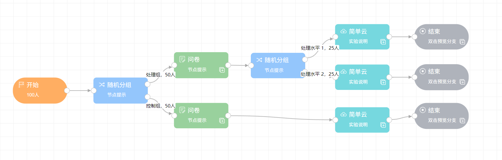
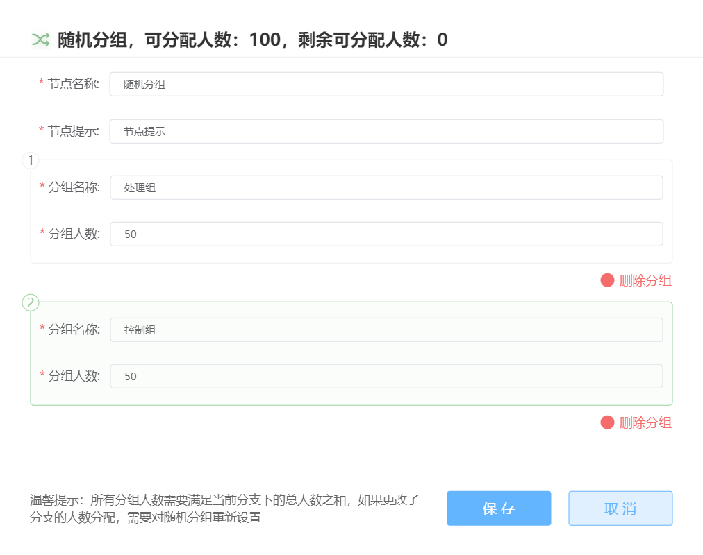
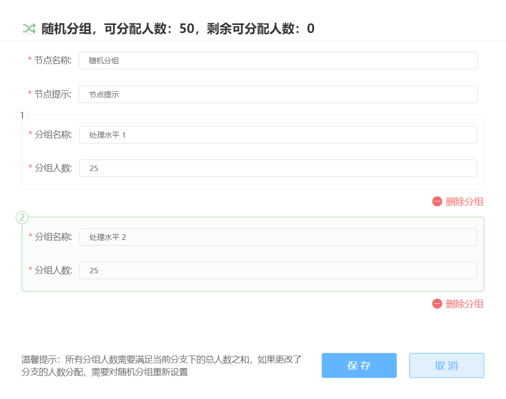

# Random Grouping <!-- {docsify-ignore-all} -->
Random grouping nodes can determine the number of project participants and establish multiple branches in the project workflow based on this number. Random grouping randomly assigns participants to different branches, which is suitable for situations such as random assignment of between-subjects factors.

As shown in the example below, the initial random grouping node obtains the number of participants set for the project and uses it as the basis for grouping. Subsequent random nodes on each branch will obtain the number of participants for that specific branch.

> Note: Branches created after grouping cannot be merged, meaning the entire project must maintain a tree structure
>

The configuration interfaces for two consecutive random grouping nodes are shown below (double-click to enter):

Random grouping is based on the set number of participants, which leads to certain limitations:

+ Random grouping nodes must have upstream nodes with determined participant numbers, therefore **random grouping cannot appear downstream of behavioral grouping**
+ If the number of participants is changed, all random grouping settings on the canvas become invalid and require regrouping and reconnecting
+ When random grouping exists on the canvas, the number of participants cannot be changed on the **publishing page**. To modify the number, you must return to canvas editing

The **Random Grouping** node implements **dynamic random grouping** rather than traditional fixed-probability random assignment.

Different from traditional random grouping:

+ Each group can collect the specified number of participants, avoiding situations where one group has 30 people while another has 60
+ During actual data collection, participants are distributed more evenly
+ Compared to traditional random grouping methods, dynamic random grouping is less likely to result in consecutive assignments to the same group followed by consecutive assignments to another group

**Random Grouping Example**:

## Other Tutorials
[Easy Random Grouping Implementation](https://mp.weixin.qq.com/s/fO6pV3J8PagHAA2hxa92HA)

[Random Grouping_Bilibili_bilibili](https://www.bilibili.com/video/BV1g14y147ZT?p=9)

