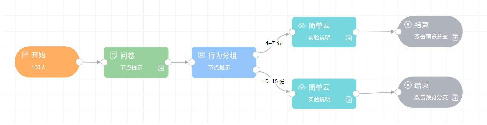
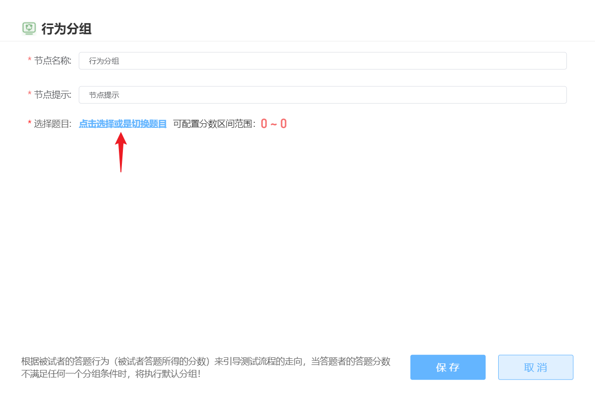
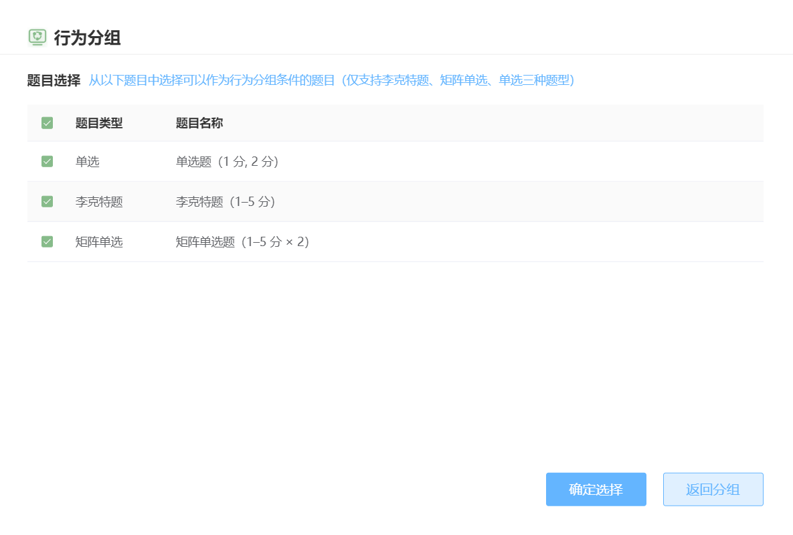
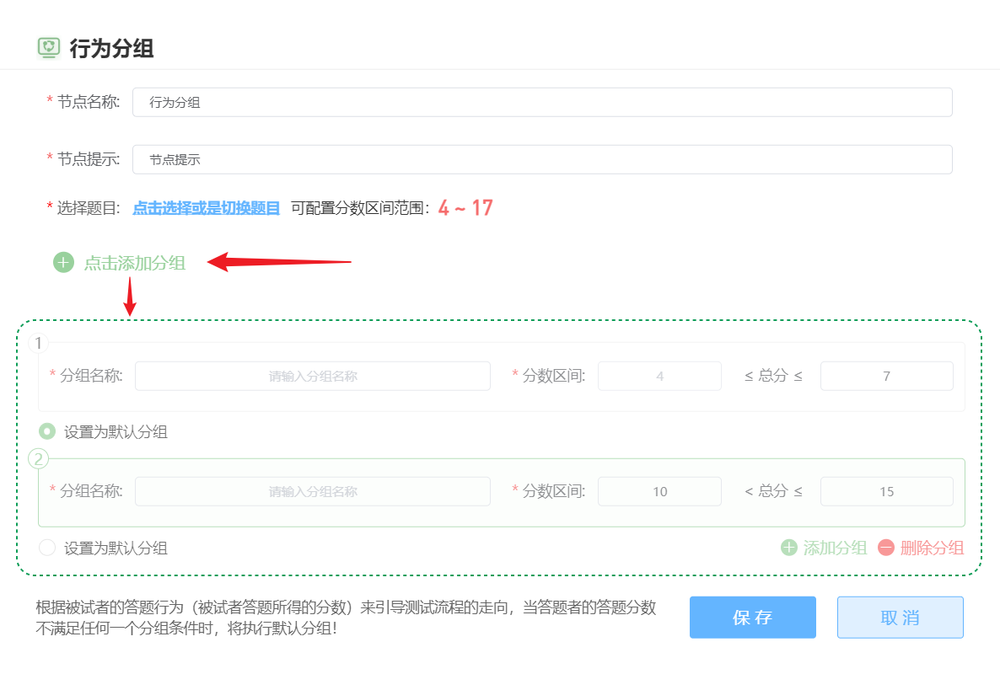

# Behavioral Grouping <!-- {docsify-ignore-all} -->
The behavioral grouping node can establish multiple project branches based on scores from the **previous node**. 

As shown in the example below, the node preceding behavioral grouping must be a node type that generates scores (supports questionnaires and experiments). Behavioral grouping can determine which branch a participant follows based on their questionnaire scores.

> Note: Branches created after grouping cannot be merged, meaning the entire project must maintain a tree structure
>

## Questionnaire Scoring

In questionnaire nodes, three types of questions can be scored: single-choice, Likert-scale, and matrix single-choice questions.

When placing a behavioral grouping node directly after a questionnaire node, double-click the behavioral grouping node to open the grouping settings interface. Here you can select scoring questions from the questionnaire node and obtain their score ranges.

## Experiment Scoring

Experiment type nodes (currently supporting PsychoPy and jsPsych) can analyze each participant's data file online during response and generate a numerical result as the experiment node's score.

After **uploading the experiment package**, you can upload a Python script file (**analysis code**). This script should contain a function called `handler` that takes the data file (CSV) generated after experiment completion as a parameter. After code analysis, it should return an `int` or `float` value, which serves as the experiment node's score.

The Python code runs in Python 3.6 environment, with access to `numpy`, `scipy`, `pandas`, `sklearn`, and their dependencies. Detailed information about the `handler` function's parameters and return values can be found in the node template.

Experiment nodes without analysis code have a score of `0`. After uploading analysis code, researchers still need to **define possible score ranges** and **verify the analysis code's validity**. Verification requires uploading a sample CSV data file for the experiment (obtainable through preview; note that PsychoPy online and offline data files differ, **please write analysis code based on online data files**). After uploading the sample data file, the system will attempt to run the analysis code with that CSV as input parameter; verification passes if a valid return value is obtained.

> Upload verification may fail if filenames contain spaces or non-ASCII characters (including Chinese characters)
>

## Setting Groups Based on Scores
Once the previous node has valid scores, behavioral grouping can assign participants to different groups based on these scores. 

Here's an example using questionnaire-based behavioral grouping:

> Score ranges for groups can be discontinuous. Participants with scores not falling within specified ranges will be assigned to the **default group**
>

If the content of the previous node is modified, subsequent behavioral grouping becomes invalid and requires regrouping and reconnecting.

## 其他教程
[Master Behavioral Grouping Nodes Easily](https://mp.weixin.qq.com/s/mClgFJ2WhynXXnwXhQytUw)

[Behavioral Grouping_Bilibili_bilibili](https://www.bilibili.com/video/BV1g14y147ZT?p=10)

