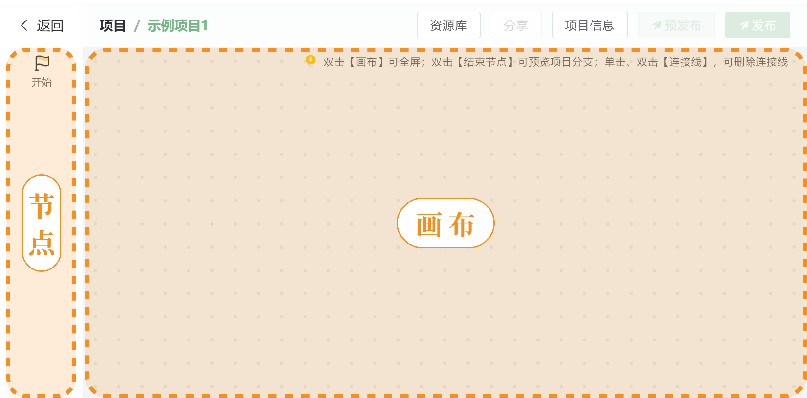
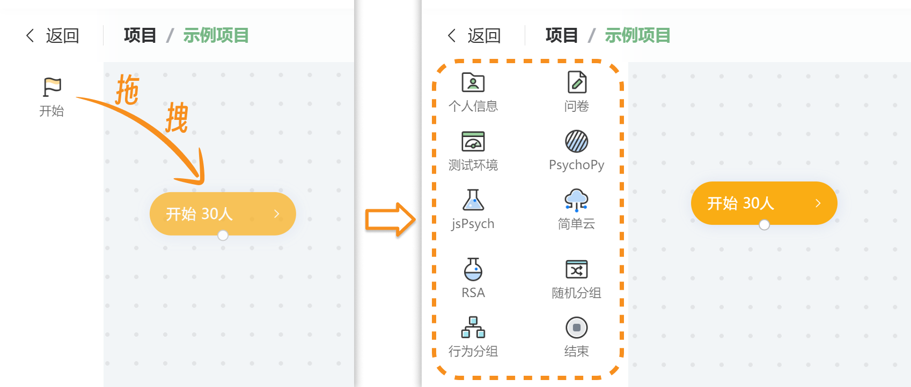
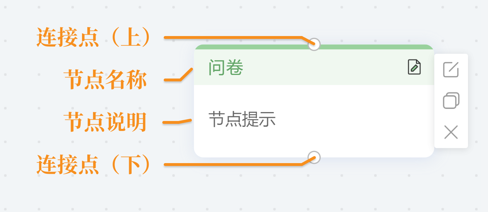

# Canvas and Nodes <!-- {docsify-ignore-all} -->

Naodao Research Platform aims to present everything you do through a clear and intuitive interface. It provides a simple yet powerful **Canvas Tool** where you can easily edit your projects and experiments, and design complex project workflows with simple mouse dragging.

In the initial **inactive state**, the canvas menu bar only contains a "Start" node. You need to drag the "Start" node onto the canvas to activate the canvas's **editing state**.

In editing state, the canvas menu bar displays several functional nodes. You can create complex project structures by dragging these **functional nodes** onto the canvas. All functional nodes on the canvas are added through **clicking and dragging with the mouse**.

The node structure on the canvas typically appears as shown below. You can create connections by dragging from connection points, and nodes are linked together through **connecting arrows**.

**Double-clicking** most nodes triggers their respective functions. Hovering over a node reveals additional menu options:

+  icon allows modification of node metadata (title, description)
+  icon enables quick node duplication
+  icon deletes the node

## Response Flow

The **direction of arrows** on the canvas indicates the **response flow**. During testing, participants **start from the start node, can only proceed to the next node after completing the current one, and finish at the end node**. Therefore, all nodes on the canvas must be contained within the **Start -> [Various Nodes] -> End** structure.

## Currently Available Nodes

+ Function Control Nodes
    - Start Node
    - [End Node](/2-researcher-manual/1-1-2-9-end.md)

+ Questionnaire Type Nodes
    - [Questionnaire Node](/2-researcher-manual/1-1-2-1-questionnaire.md)
    - [Personal Information](/2-researcher-manual/1-1-2-2-personal-info.md) (preset questionnaire for collecting personal information)
    - [Test Environment](/2-researcher-manual/1-1-2-3-env.md) (preset questionnaire for collecting participant's testing environment information)

+ Experiment Type Nodes
    - [Simple Cloud Node](/2-researcher-manual/1-1-2-4-simple-cloud.md)
    - [PsychoPy Node](/2-researcher-manual/1-1-2-5-psychopy.md)
    - [jsPsych Node](/2-researcher-manual/1-1-2-6-jspsych.md)

+ Grouping Nodes
    - [Random Grouping Node](/2-researcher-manual/1-1-2-7-Random-grouping.md)
    - [Behavioral Grouping Node](/2-researcher-manual/1-1-2-8-behavior-grouping.md)

+ [Import Nodes from Resource Library](/2-researcher-manual/1-1-2-10-resource.md)

## Other Tutorials

[How to Use the Canvas System to Implement Various "Advanced" Experimental Procedures?](https://mp.weixin.qq.com/s/a5wEEZ9g_sUXIecfxzs0iQ)

[Canvas System_Bilibili_bilibili](https://www.bilibili.com/video/BV1g14y147ZT?p=4)

