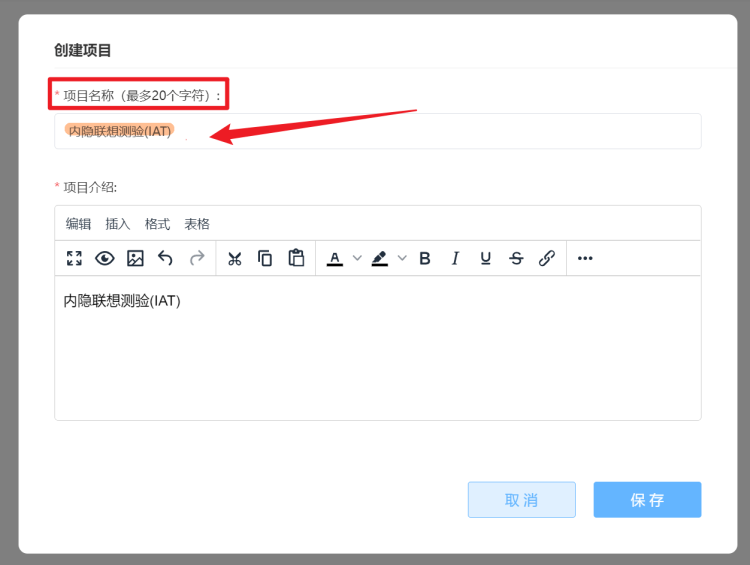
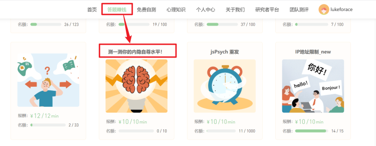
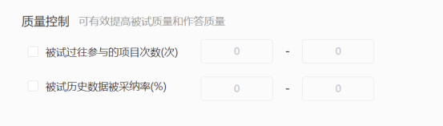
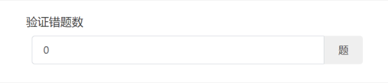

# Project Publication <!-- {docsify-ignore-all} -->

When project editing is complete, click the [Publish] button in the upper right corner of the [Canvas] to publish the project.

> Publishing a project means completing the editing phase and entering the distribution phase. After publication, the project undergoes the following changes:
>
> * Published projects cannot be edited further, only publishing management operations are available
> * Based on different publishing channels, published projects can be distributed to participants in various ways
> * Unlike preview mode, after publication, data files generated by participants' responses will be uploaded to Naodao rather than downloaded to participants' devices

Project publication requires multiple settings, generally divided into 5 parts: **project publication information, response system settings, project quality control, participants and costs, and ethics-related matters**.

## Project Publication Information

### Publishing Channels

Naodao Platform currently offers two publishing channels: [Naodao Platform] and [Anonymous Response]. Each publication can only choose one channel. Different publishing channels require different publication settings.

* If you publish a project to [Naodao Platform], it will appear in the [Earn Money by Answering] section on Naodao's homepage, and only registered Naodao users can participate. All projects published to [Naodao Platform] must provide test compensation (participant payment). Participants will receive payment directly after completing the test (and passing review). Research projects without test compensation cannot be published to [Naodao Platform].
* If you publish a project to [Anonymous Response], it bypasses Naodao's user and payment systems. Anonymous means the project won't appear on Naodao's website, and Naodao won't record participant identity information. After successful publication, a response link is generated, and anyone with the link can participate without registering on Naodao. Projects published to [Anonymous Response] cannot set test compensation.

> 【Tips】
>
> * For projects published through [Anonymous Response], test compensation distribution doesn't rely on the Naodao platform, so compensation settings aren't needed during publication. However, this doesn't mean the project doesn't require participant payment - researchers and participants should arrange payment methods separately
> * [Anonymous Response] cannot utilize Naodao's participant identity-based screening and tracking functions (as shown below)

### Publication Title

!> This option is only available when publishing to "Naodao Platform"

The first step in publishing your research project is setting a publication title.

The publication title is different from the project name you set when creating the project. The former is displayed on Naodao's website for all users to see, while the latter is shown in the project section of the researcher platform for your reference.

For example, in this project, the project name was set as `Implicit Association Test (IAT)` during creation,

while the publication title was set as `Test Your Implicit Self-Esteem Level!` during publication.

After publication, the project appears as `Implicit Association Test (IAT)` in the researcher platform's project section,

but shows as `Test Your Implicit Self-Esteem Level!` in the "Earn Money by Answering" section on Naodao's website.

> [Naodao Tips] Some important notes about project names and publication titles:
> * Publication titles can be duplicated, meaning there can be multiple "Test Your Implicit Self-Esteem Level!" in the answering section
> * Project names cannot be duplicated, meaning you cannot have multiple "Implicit Association Test (IAT)" in the researcher platform's project section, mainly to help researchers distinguish their published projects

### Select Project Cover

!> This option is only available when publishing to "Naodao Platform"

Currently, Naodao provides 15 cover images for different research fields. `Custom cover upload is not supported yet`.

### Participant Response Time Limit

The response time limit helps avoid situations where participants remain "in progress" indefinitely due to unexpected issues. You need to set an upper limit for project completion time. If a participant exceeds this limit, Naodao automatically invalidates their response and the data cannot be submitted.

> [Naodao Tips] Please set the response time limit carefully. Avoid setting it too short; it's better to be somewhat generous to prevent complaints due to timeout issues.

### Estimated Completion Time

!> This option is only available when publishing to "Naodao Platform"

For projects published to [Naodao Platform], you need to set an estimated completion time. This isn't the actual time required to complete the project or the maximum response time limit, but rather your (the researcher's) estimate of how long it typically takes a participant to complete the project under normal conditions. The estimated time will be displayed in the [Earn Money by Answering] section of Naodao's website, primarily serving to attract participants.

## Response System Settings

### Operating System Selection

You can specify which computer operating systems are allowed to participate in your project. All options are selected by default.

### Browser Selection

You can specify which browsers are allowed to participate in your project. Naodao does not support using IE browser for responses. All options are selected by default.

### Resolution Control

You can use the [Resolution Control] feature to restrict participants' computer screen resolution, meaning only participants whose screen resolution falls within the specified range can participate in the project.

By default, Naodao does not restrict participants' screen resolution.

> **Important Notes About Resolution Control**
>
> Currently, Naodao's [Resolution Control] feature can only restrict computer screen resolution width, and it only controls the actual display width.
>
> Taking the most common 1920×1080 resolution as an example, 1080 is the screen width. However, in most cases, this is not the actual display width because computer operating systems typically have a scaling layout setting. For the aforementioned 1920×1080 resolution, if the system is set to 150% scaling, the actual screen resolution will be divided by 1.5 from the physical resolution, becoming 1280×720, making the actual display width 720. For mobile devices, the actual width is often particularly small, usually around 480.

## Project Quality Control

### Quality Control

!> This option is only available when publishing to "Naodao Platform"

You can effectively improve participant and response quality through the [Quality Control] feature.

The number of previous project participations refers to the total number of projects a participant has completed in the [Earn Money by Answering] section of Naodao's website before participating in the current project.

The historical data acceptance rate (%) indicates the percentage of accepted test data from all projects a participant has completed before the current project (only counting projects in Naodao's [Earn Money by Answering] section). A higher acceptance rate indicates better historical response quality.

### Verification Error Limit

!> This option is only available when publishing to "Naodao Platform"

The [Verification Error Limit] refers to the number of questions researchers allow participants to answer incorrectly in the current project. If a participant's errors equal or exceed this number, they are considered to have not answered seriously.

For example, if we set the [Verification Error Limit] to 1, it means participants are not allowed to make even one mistake. Experimental records deemed not seriously answered will be automatically rejected by the system 72 hours after completion.

### Response Settings

**Allow repeated participation in this release**: When checked, participants can participate in the current project multiple times.

**IP address restriction**: When checked, each IP address can only participate in the project once.

> [Tips]
>
> When publishing anonymously, there is no [Allow repeated user participation in this release] option
>
> The two options in response settings can be checked simultaneously, meaning "allow a participant to repeatedly answer a project" and "each IP address can only participate once". This means Naodao currently allows a participant to participate in a project from different IP addresses

## Participants and Costs

### Select Test Participants

Main entry: [Participant Pool](2-participants.md)

!> This option is only available when publishing to "Naodao Platform"

You can choose to publish to all registered users on Naodao platform or limit to a specific participant pool. Users not selected won't see the project on their homepage and cannot participate (even with a link).

### Project Participant Count

Whether publishing to [Naodao Platform] or [Anonymous Response], you need to set the project participant count - the maximum number of valid responses the project can receive.

The count is closely related to many project settings, so set it carefully. See Participant Count and Random Grouping, Participant Count and Participant Pool

> [Tips] Once published, the participant count cannot be modified, so please set it carefully.

### Test Compensation

!> This option is only available when publishing to "Naodao Platform"

Test compensation is the payment given to participants for completing the project once. Test compensation cannot be 0 (minimum allowed is 0.01 yuan), otherwise the project cannot be published.

> **Currently Naodao Platform does not charge platform service fees**, so all your payments go directly to participants as test compensation.

### Project Encryption

!> This option is only available when publishing to "Naodao Platform"

Researchers can set passwords for projects published to [Naodao Platform] and distribute the passwords to specific participant groups.

> Using participant pools is recommended for more effective and traceable participant control

## Ethics-Related Matters

### Ethics Approval Document

Whether publishing to [Naodao Platform] or [Anonymous Response], you need to upload your institution's ethics approval document for the current research project.

> [Naodao Tips] Naodao platform does not actively check if your uploaded ethics approval document meets standards - you are responsible for your uploaded files! After uploading ethics approval documents, `you bear all responsibility for any adverse consequences that violate research ethics`.

#### Ethics Disclaimer

Considering some institutions may not issue ethics approval documents, Naodao platform provides an ethics disclaimer document. Those unable to upload ethics documents can publish projects by signing this disclaimer.

### Informed Consent Form

Whether publishing to [Naodao Platform] or [Anonymous Response], you need to upload an informed consent form. Participants can see this consent form when participating in the project.

> If you're unsure how to write an informed consent form, you can refer to this [Informed Consent Template](/assets/%E7%9F%A5%E6%83%85%E5%90%8C%E6%84%8F%E4%B9%A6_%E6%A8%A1%E6%9D%BF1.docx){target="_self"}

