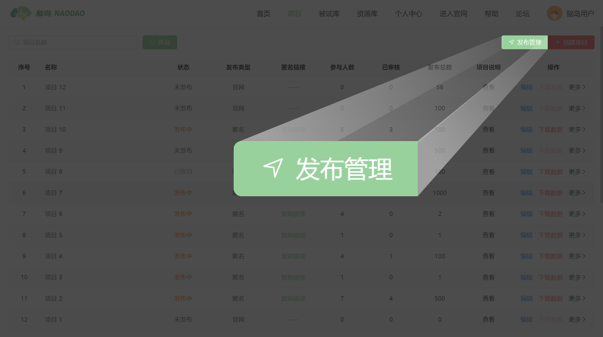
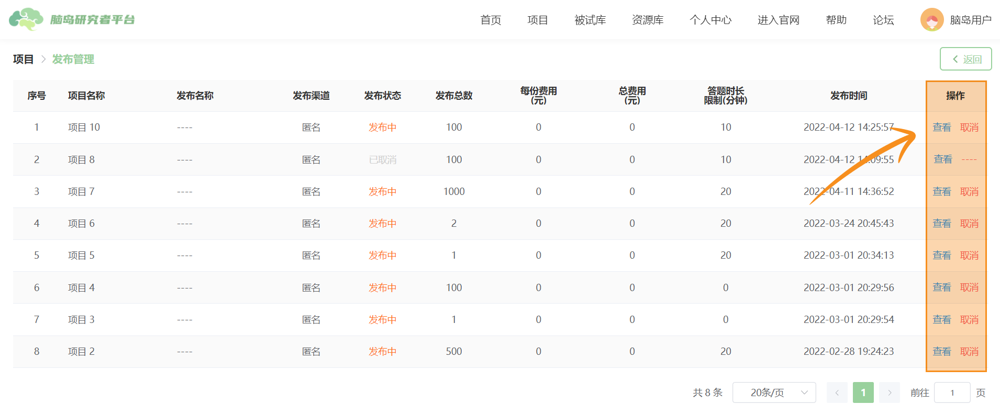

## Project Publication Management <!-- {docsify-ignore-all} -->

You can access the project's publication management page by clicking the [Publication Management] button next to Create Project.

Projects in the publication management page may have the following publication statuses: [Unpublished] [Publishing] [Cancelled]

> Unpublished projects typically don't appear in publication management, but projects created through **project copying** will appear in publication management even if unpublished, and will retain most of the original project's publication information.
>

The [Operations] column on the right side of the [Publication Management] page allows 2 operations for published projects: [View Publication Information] and [Cancel Publication]

## 查看发布信息
Main entry: [Publish Project](/2-researcher-manual/1-1-6-publish-project.md)

Published projects can no longer access the [Project Publication] interface from the canvas. You can click "View" here to review the publication information of already published projects.

## Cancel Publication

You can actively cancel published projects using the [Cancel Publication] button. Once a project's publication is cancelled, participants can no longer access it for responses.

> When the effective number of participants reaches the "project participant count", the project status changes to "**Completed**". Projects manually cancelled before this point will have their status changed to "**Cancelled**". **Once cancelled, a project cannot be published again**.
>

## Other Tutorials
[Master Project Publication Management and Data Management Easily](https://mp.weixin.qq.com/s/RVgvSqqBYg0JVzjPYyc7BA)

