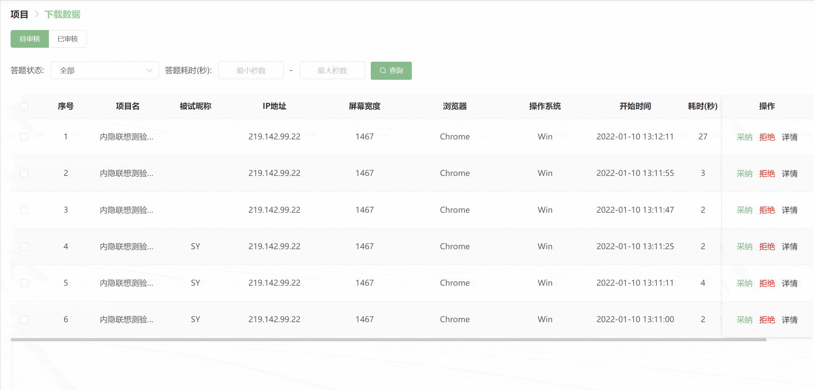
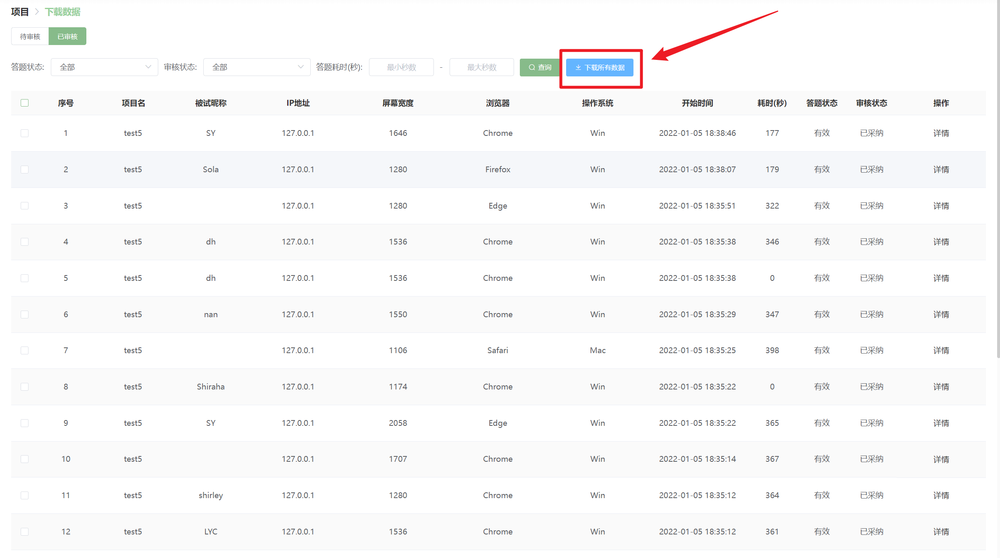
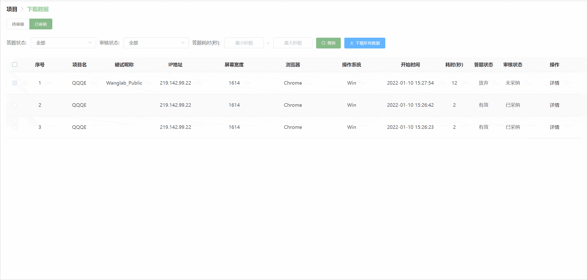

## Project Data Management <!-- {docsify-ignore-all} -->
Click the "**Download Data**" button in the project list to enter the project data download page.

If you cannot directly see buttons like "**Canvas**", "**Download Data**", etc., it may be because your device's screen is too narrow. Simply scroll right to find them.

## Official Platform (Paid Survey) Publication Type
### Pending Review Section
#### Answer Status
Each data record has three possible **answer statuses**: Valid, In Progress, and Abandoned.

+ **Valid** status means the participant has completed the project normally and submitted data.
+ **In Progress** status means the participant is currently doing the project.
+ **Abandoned** status means the participant actively quit the project during participation.

> 【Tips】
>
> A **Valid** answer status does not indicate the quality of the data.
>
> 
>
> Note that once a participant abandons the test during the process, Naodao will automatically **reject** that participant's data record. This means Naodao automatically reviews these abandoned data records, so they won't appear in the **Pending Review** section but will automatically appear in the **Reviewed** section.
>

#### Data Acceptance
When a participant completes a project, their test record appears in the **Pending Review** section of the [Download Data] page. All test data in the **Pending Review** section has not yet been reviewed by the project publisher.

You can **accept** participant data based on their performance on **check questions** (using metrics like accuracy or response time). Note that data with an **In Progress** status cannot be accepted or rejected!

Accepted data appears in the **Reviewed** section with a _Accepted_ **review status**. You can download accepted data or click the **Details** button in the [Operations] column to view the participant's responses.

> 【Tips】Clicking the **Details** button in the **Reviewed** section only shows responses to questionnaire-type items (personal information, questionnaires, test environment), not experimental response information (which must be downloaded manually).
>

Note that you cannot view **unaccepted** participant data. Once you accept participant data in the **Pending Review** section, the system assumes you have obtained the participant's data, meaning you cannot change the review status from **Accepted** to **Unaccepted**.

#### Data Rejection
If you believe a participant did not complete the test seriously or submitted malicious responses, you can use the [Reject] button to not accept their data.

> 【Tips】Please don't arbitrarily reject participant data! Doing so may lead to complaints about your published project. Generally, for project complaints, Naodao first lets participants communicate with you privately via **internal messages**. If communication fails, Naodao platform will intervene and judge the reasonableness of the complaint based on evidence from both parties. Note that if your published project receives a certain number of complaints, Naodao platform will temporarily remove your project.
>

Rejected data also appears in the **Reviewed** section with an _Unaccepted_ **review status**. Unaccepted data cannot be selected for download.

Rejected data can be **accepted again**, but this usually occurs after effective private communication with the participant. In other words, the system allows you to re-accept previously rejected participant data. Note that after second acceptance, you cannot reject that participant's data again.

#### System Automatic Review
&> ⚠️ To avoid accepting unnecessary data, please review promptly.

The acceptance and rejection described above usually require manual operation by researchers. However, to protect participant rights, the deadline for manual review is within **72 hours** of completion.

If no manual review occurs within this period, **system automatic review** will be triggered. The system will determine whether to pass based on the [check question threshold](/2-researcher-manual/1-1-6-publish-project.md#验证错题数) set during questionnaire publication: when check question errors are **less than** the threshold, the system will approve; conversely, if **greater than or equal to** the threshold, the system will reject. If no check questions are set, the system will **default to pass**.

#### Batch Accept/Reject
When there is more than one response record in the **Download Data** section, you can accept and reject data in **batch**.

You can click the **Select All** button to select all response records, or use **individual checkboxes** to select desired records. Both methods will activate the [Batch Accept] and [Batch Reject] buttons.

### Reviewed Section

All reviewed data records appear in the **Reviewed** section.

#### Review Status
Each data record has two possible **review statuses**: _**Accepted**_ and _**Unaccepted**_. Self-explanatorily, **Accepted** means data accepted by the project publisher, **Unaccepted** means data rejected by the project publisher.

#### Download All/Selected Data
You can download all data with **Accepted** review status in the **Reviewed** page.

> Unaccepted data cannot be downloaded.
>

You have two ways to download data:

+ Download all data

You can directly click the [Download All Data] button to automatically download all accepted data records.

**Data Format**: You can choose to download `csv file` or `excel file`

> Currently only supports downloading `csv files`
>

+ Download selected data

You can use **individual checkboxes** to select desired data records. This method will activate the [Download Selected Data] button.

## Anonymous Publication

Naodao automatically accepts all anonymous data, so you don't need to accept it manually. Therefore, the [Download Data] page for anonymous data has no **Pending Review** and **Reviewed** sections.

For an anonymous project, Naodao defaults to downloading all anonymous data each time, and currently doesn't support downloading **selected data**.

## Other Tutorials
[Master Project Publication Management and Data Management Easily](https://mp.weixin.qq.com/s/RVgvSqqBYg0JVzjPYyc7BA)

