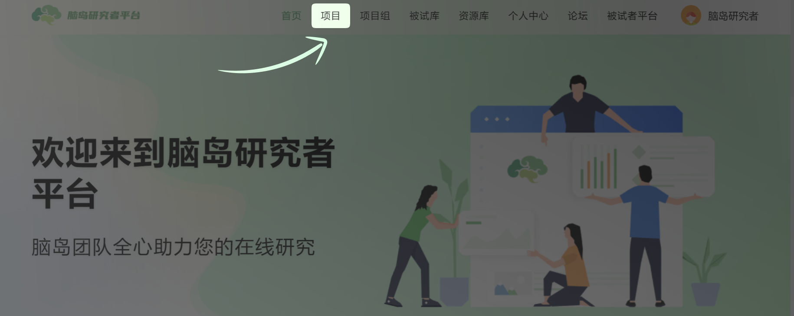
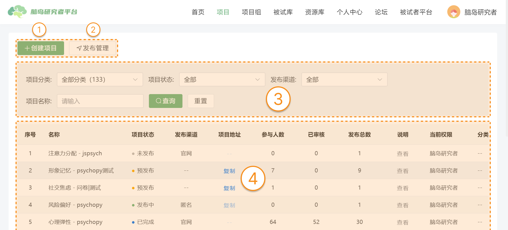

# Projects <!-- {docsify-ignore-all} -->

On the Naodao platform, researchers' studies are carried through "projects". The specific research content, such as questionnaires and experiments, are all contained within projects. Projects are **edited** and **published** by researchers, while participants **answer** them and **receive compensation**.

Users can click the [Projects] button in the navigation bar to enter the projects section.

In the initial page of the projects section, **users can perform the following operations on the [Projects] page**:

1. [Create Project]: Users can create new research projects and edit them for publication through this function.
2. [Publication Management]: Users can manage the publication status of projects through this function, such as canceling publication and viewing published information.
3. [Filter Projects]: Users can search for specific projects by project category, status, and name.
4. [Project Board]: Users can overview all their projects in the central board area of the project page.

