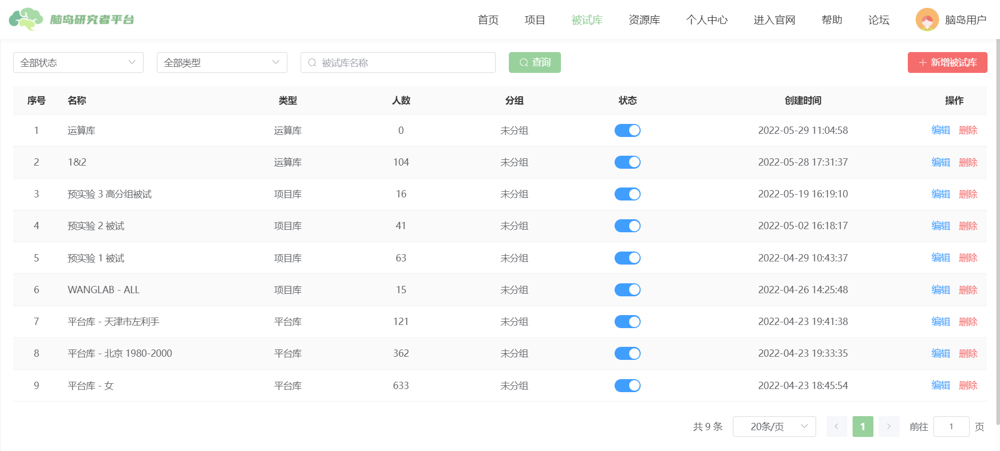
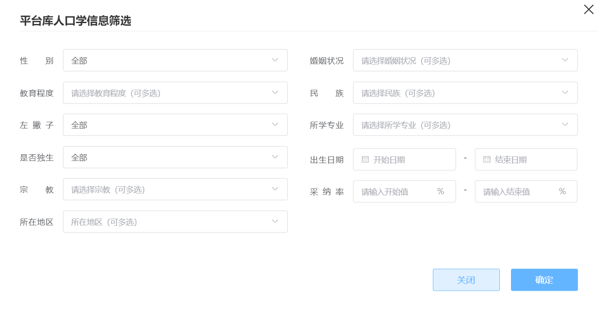
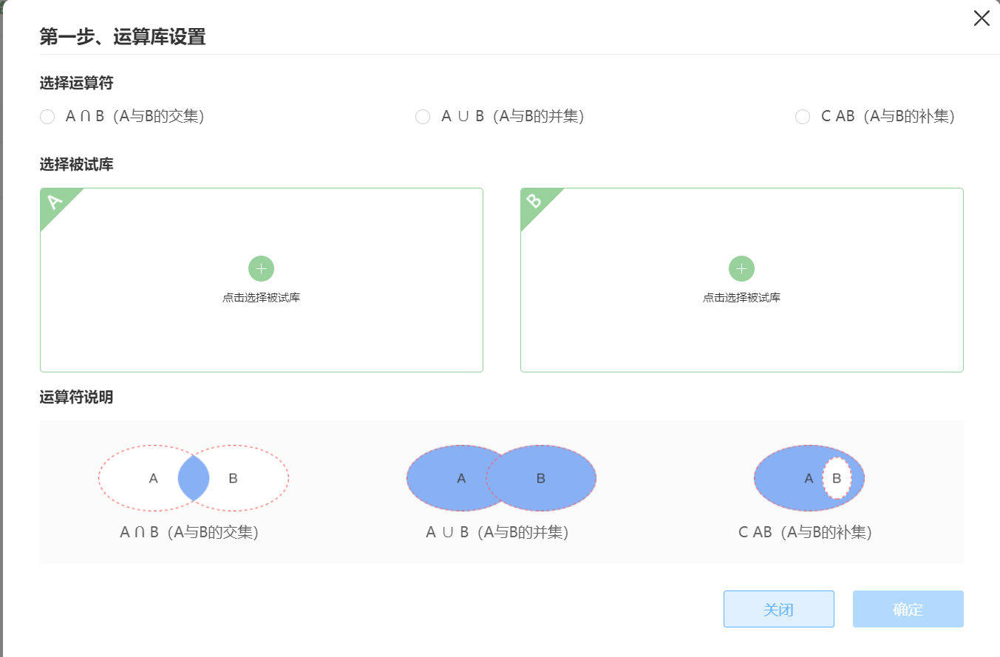
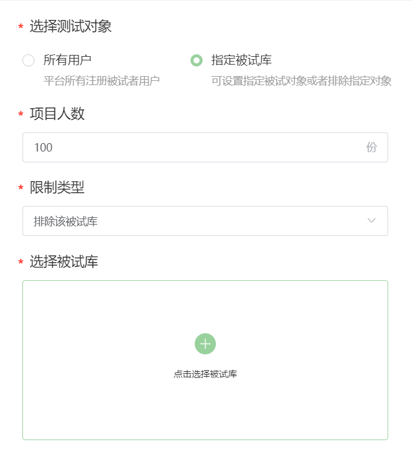
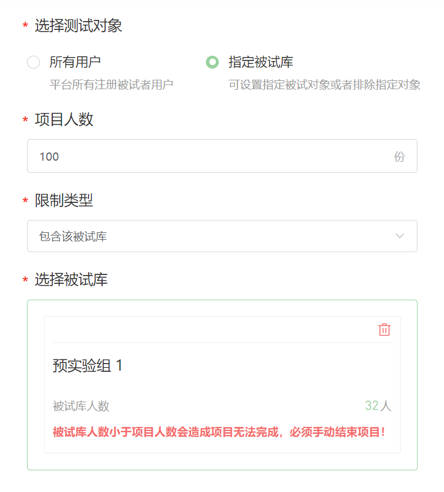

# Participant Pool <!-- {docsify-ignore-all} -->

:::tip
Participant pools can only be used in projects published on the Naodao platform
:::

A participant pool is a means to control who can access published [projects]. Using participant pools, researchers can selectively publish projects to specific participants.

Simply put, a participant pool is a subset of registered participants on Naodao. When publishing a project, researchers can select created participant pools to publish projects to specific participant groups. Participants cannot see/answer projects they are not designated for.

Participant pools can contain fixed groups (static pools) or all participants meeting certain criteria (dynamic pools). Flexible use of participant pools enables features like participant tracking within the Naodao platform.

## Adding New Participant Pools
Researchers can add participant pools in 3 ways:

+ Platform Pool

A participant pool obtained by setting filtering conditions (demographic information). The data used for filtering participants comes from participants' personal center - basic information.

This type of pool is a **dynamic pool** - all platform participants meeting the filtering criteria are included. Newly registered participants meeting the criteria will be added, while participants who modify their personal information and no longer meet criteria will be removed.

+ Project Pool 

Static participant pools containing fixed participants can be created by importing participants from:
    1. Past completed projects' participants 
    2. Participant ID lists

Importing via participant IDs requires an Excel file (xlsx) with "USERID" as the header (see example below, note case sensitivity). Participant IDs can be obtained by:
- Exporting from project (participant) pools
- Downloading data from past projects  
- Having participants copy and report their IDs to researchers from their personal centers

| **USERID** |
| --- |
| xxxxxxxxxxxxxxxxxx |
| xxxxxxxxxxxxxxxxxx |

+ Computation Pool

Generate a new participant pool by performing set operations (intersection, union, complement) on 2 **static pools**.

## Selecting Participant Pools When Publishing
When the project's publication channel is "Naodao Platform", participant pools can be used to **specify publication targets** in the target settings. After selecting a participant pool, you can **include** or **exclude** that pool (from all platform participants). This allows defining specific participant ranges.

Users not selected cannot see the project on their homepage and cannot answer it (even with the link).

> About the relationship between publication numbers and participant pools
>
> There are no strict requirements between publication numbers and participant pool size, but typically **the participant pool size should ≥ publication numbers**. If the pool size is insufficient, the project cannot be filled and can only be manually cancelled by the researcher. Project publication fees are calculated as ![equation].
>

## Managing Participant Pools
Participant pools can be modified and deleted in the participant pool list. However, pools associated with currently published projects cannot be modified or deleted.

## Other Tutorials
[Naodao Participant Pools—A Magic Tool for Ensuring Participant Quality and Quantity!](https://mp.weixin.qq.com/s/m5qv1BBj4wmgN8kBGxi_bg)

[Participant Pools_Bilibili](https://www.bilibili.com/video/BV1g14y147ZT?p=14)

