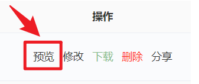
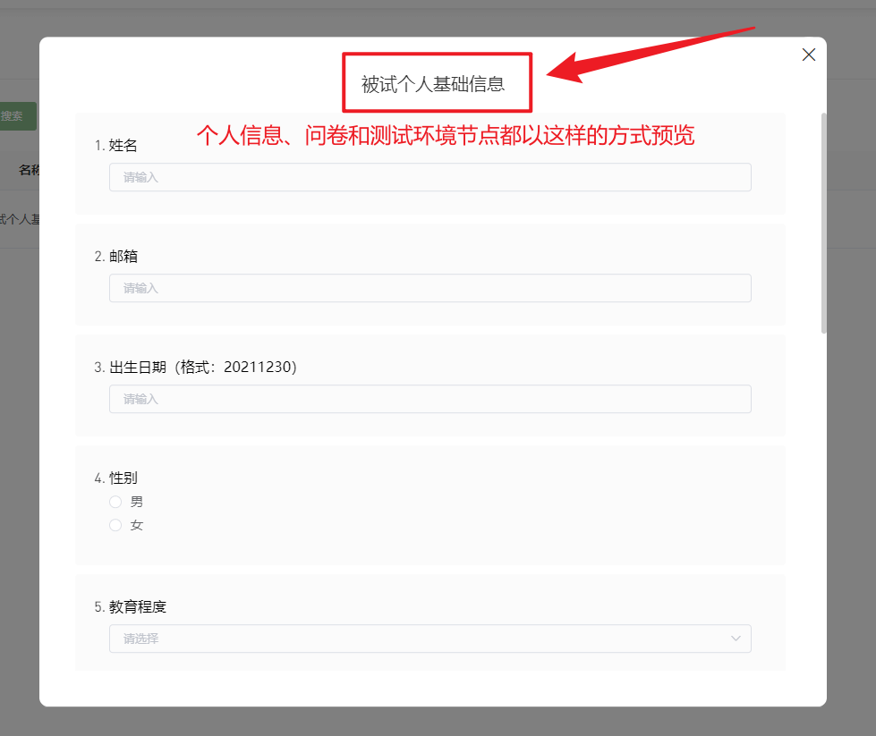

# 资源库 <!-- {docsify-ignore-all} -->

Users can click the **Resource Library** button to access the Naodao resource library page.

The Naodao **Resource Library** is divided into _[My Resource Library]_ and _[Platform Resource Library]_. Each library contains two sections: _Personal Resources_ and _Shared Resources_.

Nodes shared to [Personal Resource Library] from the canvas will be saved in the `[My Resource Library]-[Shared Resources]` section. Nodes shared with [Specific Researchers] will be saved in the specified researcher's `[My Resource Library]-[Shared Resources]` section.

Resources directly added by clicking [Add New Resource] button in [My Resource Library] will be saved in `[My Resource Library]-[Personal Resources]`.

Nodes shared to [Platform Resource Library] from the canvas will be saved in the `[Platform Resource Library]-[Personal Resources]` section. Similarly, resources directly added by clicking [Add New Resource] button in [Platform Resource Library] will also be saved in `[Platform Resource Library]-[Personal Resources]`. The `[Platform Resource Library]-[Shared Resources]` section stores resources shared by other researchers to the [Platform Resource Library].

## Resource Preview

Users can preview nodes shared in the **Resource Library** by clicking the **Preview** button in the operation bar.

### Preview **Personal Information**, **Questionnaire**, and **Test Environment** nodes

### Preview **PsychoPy Experiment Nodes** and **jsPsych Experiment Nodes**

## Resource Modification

Users can modify nodes they have **uploaded or shared** by clicking the [Modify] button.

## Resource Download

All nodes shared in the **Resource Library** support downloading. Users can download them by clicking the **Download** button in the operation bar.

It should be noted that **Personal Information**, **Questionnaire**, and **Test Environment** nodes currently only support downloading in txt format. For **PsychoPy** experiment nodes and **jsPsych** experiment nodes, the corresponding experiment package will be downloaded (ZIP format). **Simple Cloud** experiment nodes currently do not support downloading.

## Resource Deletion
Users can delete nodes they have **uploaded or shared** by clicking the [Delete] button.

## Resource Sharing
Users can share resources from [My Resource Library] to [Platform Resource Library] or specific users by clicking the [Share] button.

## Other Tutorials
[Naodao Resource Library (Part 1) - Design Concept and Personal Resource Library Usage](https://mp.weixin.qq.com/s/c4tZQcEcTfOmCYbsWpapLg)

[Naodao Resource Library (Part 2) - Platform Resource Library Usage and Introduction to Existing Public Resources](https://mp.weixin.qq.com/s/ngTk8lEU-toWX4kG3m1G_w)

[How to Quickly Use Resources in Naodao Resource Library](https://mp.weixin.qq.com/s/gnHvffTGZbbh-OUKM0e52g)

[Resource Library - Part 1_bilibili](https://www.bilibili.com/video/BV1g14y147ZT?p=11)

[Resource Library - Part 2_bilibili](https://www.bilibili.com/video/BV1g14y147ZT?p=12)

[Resource Library Nodes_bilibili](https://www.bilibili.com/video/BV1g14y147ZT?p=13)

