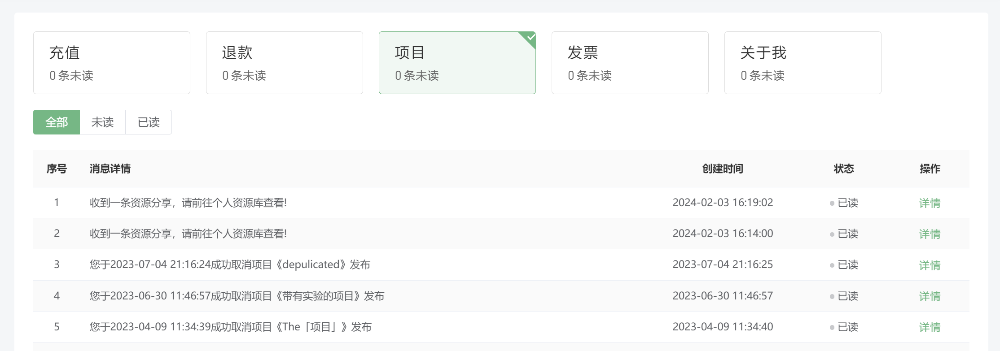
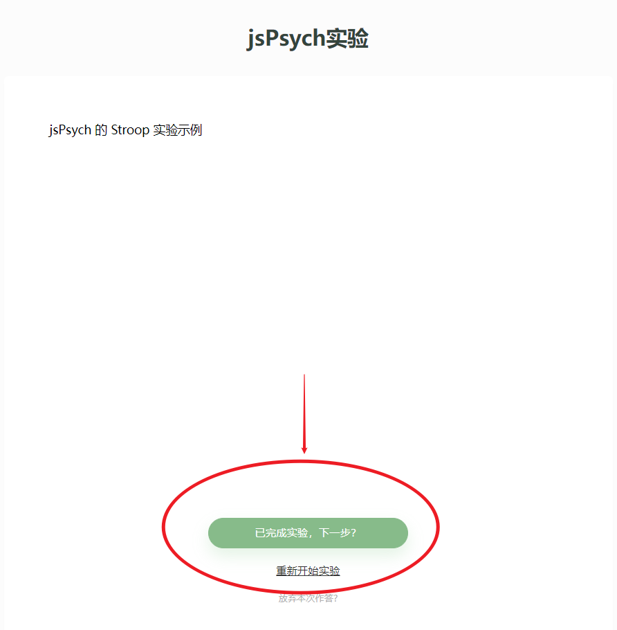
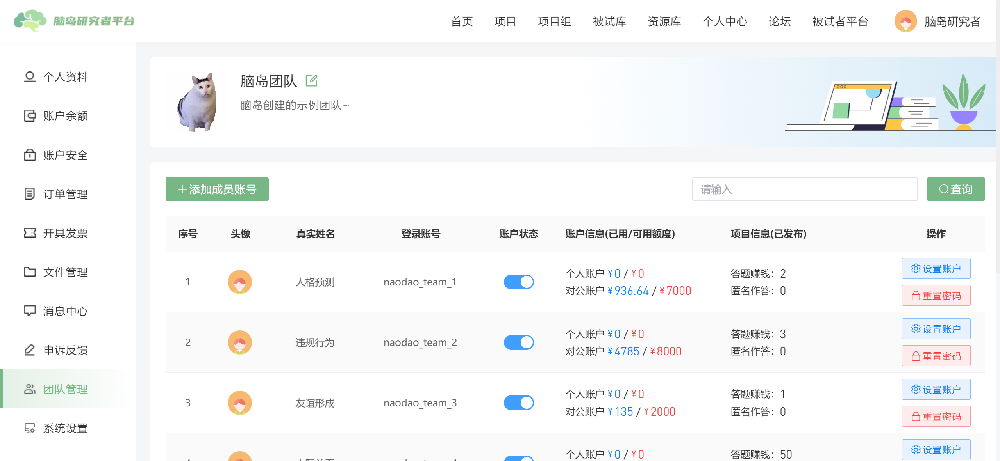

# Personal Center <!-- {docsify-ignore-all} -->

After registration and entering the researcher platform, Naodao requires users to [become certified researchers](/2-researcher-manual/0-must-read.md). Users cannot access any researcher platform functions without completing (certifying) their personal information. Naodao will prompt users to complete their personal information each time they enter the researcher platform.

Completed information will be displayed in the personal profile section of the personal center, where researchers can update their information. Email changes require re-certification of researcher information.

## Account Balance
This page shows balances of different Naodao accounts and allows recharge and refund operations.

"Account Details" shows balance details, frozen amounts, and exports. For specific steps to export details, see [Recharge and Reimbursement - Participant Fee Details](/2-researcher-manual/4-1-recharge.md#participant-fee-details).

## Account Security

Users can bind/modify/unbind phone numbers, emails, WeChat accounts, and Alipay accounts in **Account Security**.

Except for email, all other account security items sync with the official website. See [Official Website Personal Center Instructions](/2-researcher-manual/4-personal.md).

## Order Management

Users can check all order details in the **Order Management** section.

All order types can be viewed through filters. Common order types include:

+ Recharge and refund orders
+ Project participant payments, appeal payments, balance refunds

For exporting payment orders, see [Recharge and Reimbursement - Participant Fee Details](/2-researcher-manual/4-1-recharge.md).

## Invoice Issuance
Main entry: [Recharge and Reimbursement](/2-researcher-manual/4-1-recharge.md#reimbursement-matters)

In the **Invoice Records** section, you can view past invoice records and click "Issue Invoice" to create new invoices for your balance.

In the **Invoice Settings** section, you can view and create saved invoice information (title, unified social credit code, etc.).

****

## File Management

Users can upload images, audio, and video materials in the **File Management** section. Note that uploaded materials should not exceed respective limits. Materials in file management can be used in Simple Cloud and RSA experiments.

> 【Tips】Upload material filenames should not contain special characters
>

## Message Center

This section contains various notifications and messages from Naodao, including recharge, refund, project updates, and invoice updates.

## Appeal Feedback

For projects on **Naodao Platform channels**, participants can appeal when researchers reject them (fail review) or when participants cannot complete projects but believe they spent time or there were project issues.

Appeals are how participants request compensation for incomplete records. When a participant appeals, researchers receive an appeal record in their personal center and a temporary dialogue is established between both parties to state their claims. Researchers can also see participant completion information here.

> Account Status: Records eligible for appeal show as unpaid before approval
>
> Answer Status: May show "Completed" or "Abandoned". Completed appeal records typically failed researcher or automatic review
>
> Appeal Status: Shows whether researcher approved or rejected the appeal
>

When researchers receive appeal records, the message center sends a notification to handle the appeal (approve or reject). If researchers don't handle appeals within 48 hours, the **data download function for all projects is temporarily disabled** until all appeals are processed. Other functions remain unaffected.

If researchers approve an appeal, they must pay the participant a certain fee. The amount can be customized after communication with the participant. Appeal payment amounts are **additionally deducted from the account** and cannot exceed the project compensation amount. Even if approved, the participant's answer **won't count toward published project fees or valid quota**, and their answer status won't change.

If researchers reject an appeal, participants cannot appeal again but may seek platform intervention. **Please ensure thorough communication with participants before handling appeals.**

### Common Appeal Issues
> Q: Participant claims to have completed the experiment, but record shows abandoned
>
> A: This likely means the participant didn't make the final submission.
>

> Naodao projects can contain multiple different node types, so completing each node (questionnaire or experiment) requires manually clicking next to enter the next node or end the project. Some participants might close their browser after seeing the experiment end screen without final submission, so data isn't recorded. Researchers should remind participants of this in project instructions (especially for single-experiment-node projects).
>

## Team Management

After activating the professional version, researchers can create their teams on Naodao and add member accounts. This feature is especially suitable for research group PIs to share group funds and resources without requiring all related members to register accounts.

Member accounts (or **sub-accounts**) aren't independent Naodao accounts. Sub-accounts rely on the creating Naodao account's (called **main account**) funds for creating and publishing projects, and sub-account projects belong to the main account. For detailed operations, read [Team Account Instructions](https://mp.weixin.qq.com/s/iFmvvV8XkzSLMi-xdRozzA).

The quota allocated by main accounts in team management means the maximum main account balance sub-accounts are **allowed to use**, **not that the main account transferred balance to sub-accounts**. Therefore, quotas only increase. If the main account has insufficient balance, sub-accounts cannot use their quotas.

For example, if a main account allocates ¥500 personal account quota to sub-account 1, but the main account's personal account only has ¥100 left, sub-account 1 will receive insufficient balance notice when publishing a ¥200 project.

## System Settings

System settings allow account switching, blacklist management, update history viewing, cache clearing, and other operations.

## Other Tutorials
[Team Accounts, Helping Every PI Automate Team Management](https://mp.weixin.qq.com/s/iFmvvV8XkzSLMi-xdRozzA)

[Easy Registration and Login on Naodao Platform](https://mp.weixin.qq.com/s/T7LJTd0KACTTLsAzL-RgVA)

[Researcher Registration and Identity Certification](https://mp.weixin.qq.com/s/x6sXPDgMt4ieZH5OfScFhQ)

[Registration and Login_bilibili](https://www.bilibili.com/video/BV1g14y147ZT?p=1)

[Certify as Researcher_bilibili](https://www.bilibili.com/video/BV1g14y147ZT?p=2)

[How to Handle Participant Appeals and Feedback](https://mp.weixin.qq.com/s/Tws0kAd9YOtEPj3SDzPCpQ)

[Handling Participant Appeals and Feedback_bilibili](https://www.bilibili.com/video/BV1g14y147ZT?p=18)

