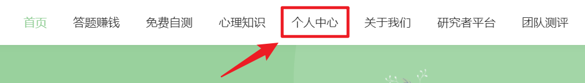
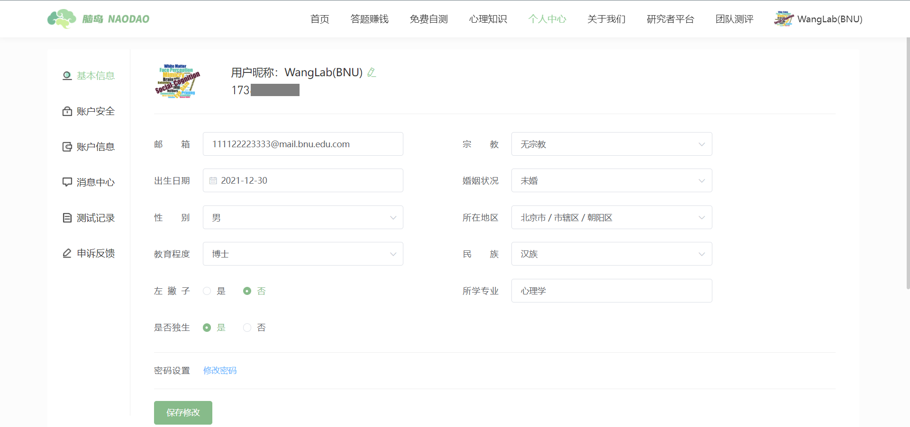
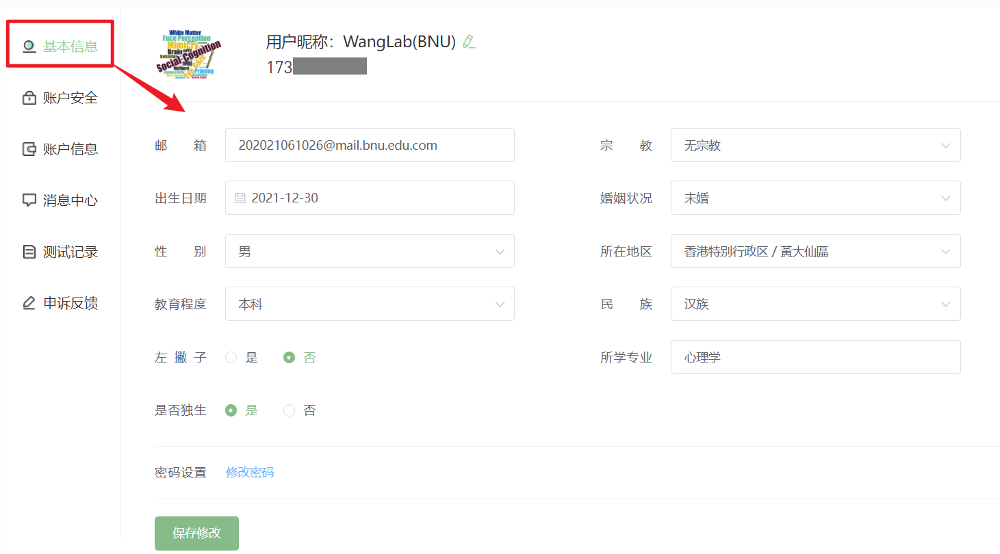
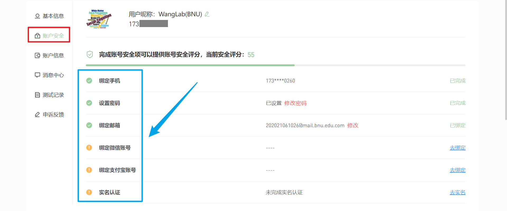
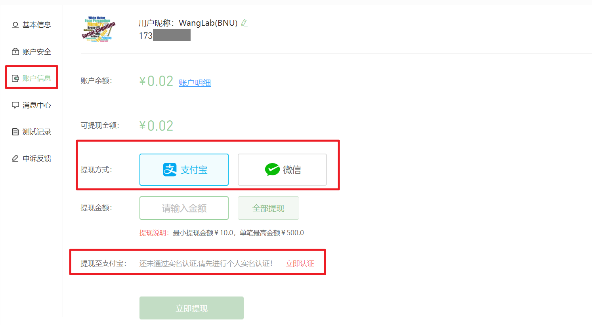
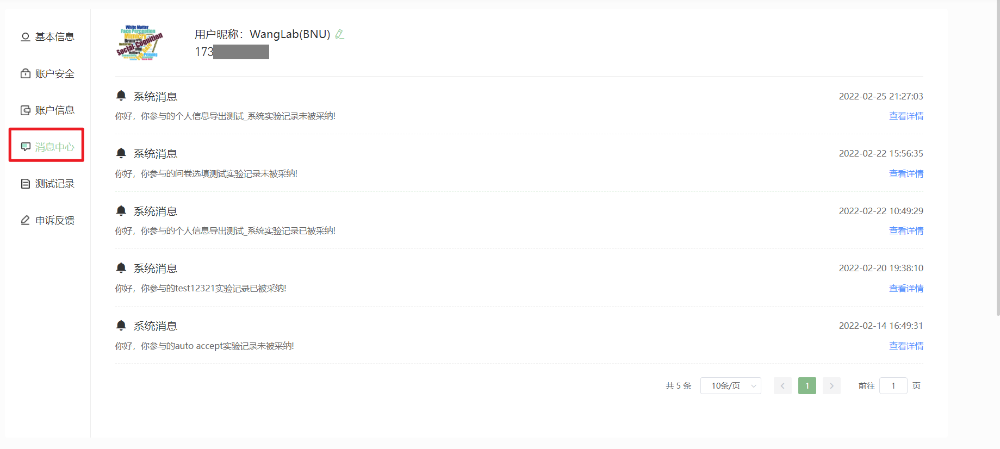
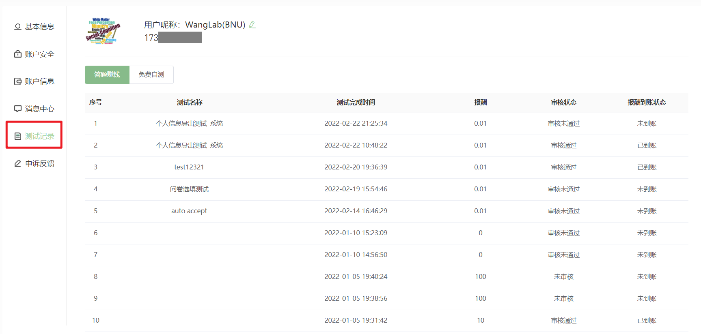
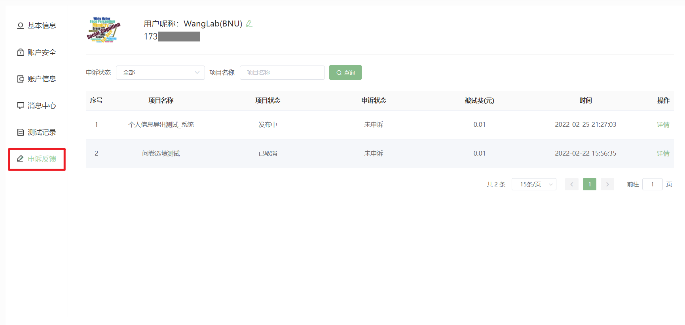

# Personal Center <!-- {docsify-ignore-all} -->

## Basic Information
You can fill in your personal information such as email, date of birth, and gender in the "Basic Information" section. NaoDao will keep your personal information strictly confidential.

## Account Security

To enhance your account security, NaoDao recommends completing your account information in the "Account Security" section, including binding your WeChat and Alipay accounts, and real-name verification. NaoDao will keep your private information strictly confidential.

> [NaoDao Tip] NaoDao strongly recommends completing real-name verification. Your identity information will be kept strictly confidential. Without real-name verification, users cannot access certain features like the NaoDao forum.

:::tip NaoDao Tip
Is there any risk in binding Alipay and WeChat?
:::

>
> Short answer: No risk.
>
> Explanation: WeChat and Alipay do not provide open APIs to access users' sensitive information, including Alipay account numbers, real names, bank card information, etc. Therefore, NaoDao not only doesn't collect this user information but is unable to collect it. NaoDao only collects users' WeChat and Alipay nicknames and profile pictures.

## Account Information
You can view your account balance and withdrawal methods in the "Account Information" section. The minimum withdrawal amount on NaoDao is 10 yuan, with a maximum single withdrawal of 500 yuan. Note that you must complete real-name verification before making withdrawals.

> [NaoDao Tip] NaoDao currently only supports withdrawals to Alipay, not WeChat.

## Message Center
In the "Message Center", you can check whether your experimental records as a participant have been accepted by the project publishers.

## Test Records
You can view your past test records in the "Test Records" section.
* The "Paid Tasks" column shows whether your compensation has been credited
* The "Free Self-Test" column shows your free self-test records and corresponding brain reports

## Appeals and Feedback
You can view your appeal records in the "Appeals and Feedback" section.

