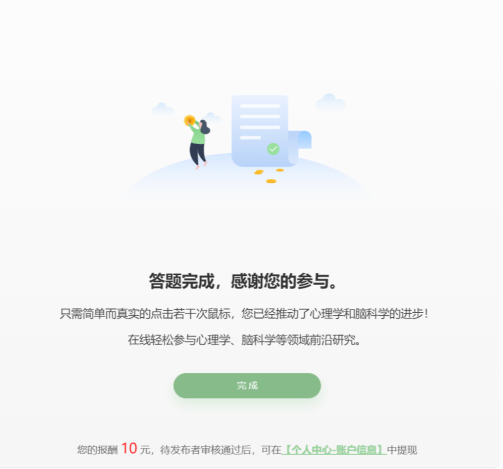

## Essential Reading for Test-Taking <!-- {docsify-ignore-all} -->

When taking tests, you may encounter experiments that consist of multiple parts (multiple experiments + questionnaires).

When you complete a single experiment (not a questionnaire, usually tasks requiring responses) and see the experiment's ending message, please don't close the browser directly. Instead, only close the experiment tab, return to the previous page, and click "Experiment Completed." If there are unfinished parts, you will proceed to the next section; if all parts are completed, the data will be submitted.

If the data is not submitted, researchers will not be able to receive your responses normally, and you may not receive compensation as a result.

