# Introduction to Simple Cloud Basic Functions

## Global Experiment Settings

## Experiment Content (Blocks)

The experiment content (blocks) section is the core part of experiment setup. Click [Add Experiment Block] to add a block. If your experiment has two blocks, click [Add Experiment Block] twice.

After adding experiment blocks, please set the basic information for each block.

## Setting Trial Information for Each Experiment Block

### Stimulus Type Settings

Stimulus types include text, images, videos, and audio.

#### Text

For text stimuli, enter text in the red box.

#### Images

For images, add the image and set its arrangement style, width, and height.

#### Video

For videos, upload the video and set its width and height. Please note! Videos must be in MP4 format!

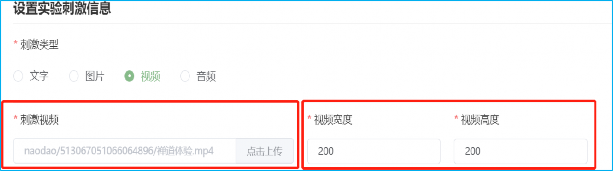

#### Audio

For audio, upload the audio file in MP3 format.

### Content and Time Between Trials, Response Duration

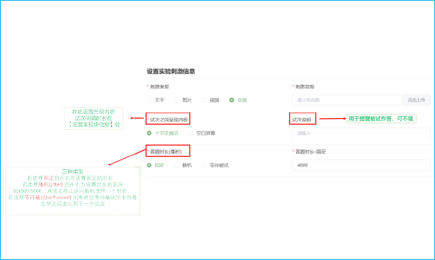

### Response Types

#### Buttons

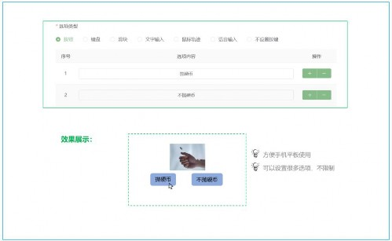

#### Keyboard

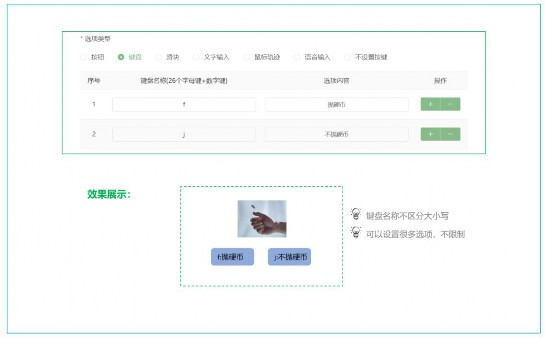

#### Slider

#### Text Input

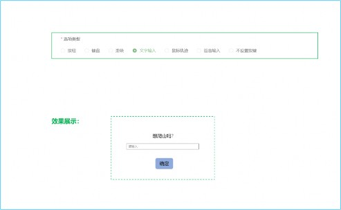

#### Mouse Tracking

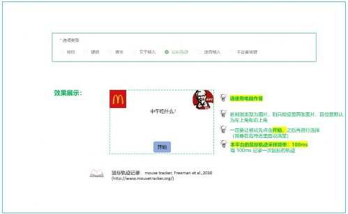

#### Voice Input

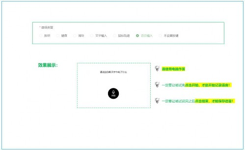

#### No Response Setting

### Response Time Feedback Options

#### Logic Settings for Experiments with Feedback

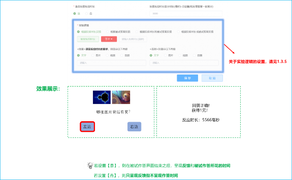

#### Logic Settings for Experiments without Feedback

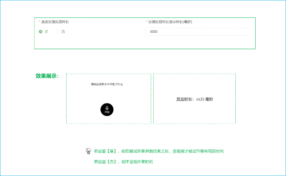

### Setting Experiment Logic (Only for Experiments with Feedback)

#### Feedback Based on Response Time

#### Feedback Based on Participant's Answer

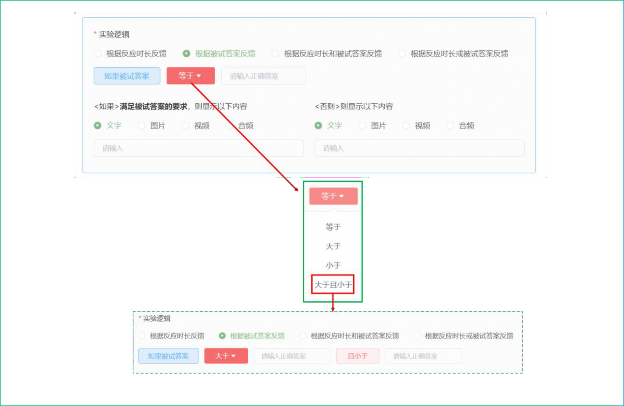

#### Feedback Based on Both Response Time and Participant's Answer

#### Feedback Based on Either Response Time or Participant's Answer

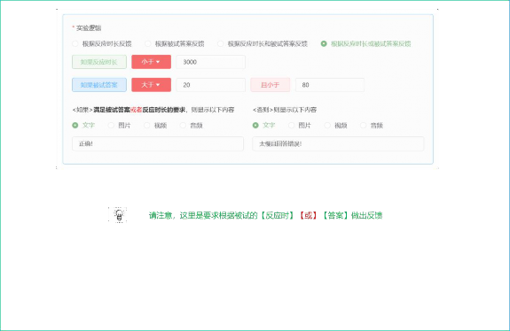

### Edit, Add, Delete Trials

## Batch Experiment Setup — Importing Experiment Templates

When there are many trials, setting each one manually can be time-consuming. Simple Cloud provides a quick way to set up multiple trials:
(1) First click [Download Template]
(2) After setting parameters in the template, click [Batch Import] to generate the experiment.

The downloaded template is named: `exp_template.xls`

Each column in the spreadsheet has detailed explanatory notes.

The only point that needs explanation here is regarding the URL addresses for images, videos, and audio.

As shown in column C above, there will be a unique code for each image (or video, audio). How to obtain this unique code? The method is simple, as shown below:

