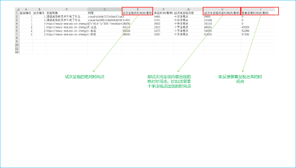

# Data Export Guide for Simple Cloud Experiments

On the Simple Cloud platform, exported data includes block number, trial number, experimental stimuli, participant responses, reaction time, as well as absolute timestamps for: stimulus presentation, fixation cross (or blank screen) appearance, and feedback presentation. The absolute timestamp is calculated as the time elapsed from the zero point (the moment when the participant clicks [Fullscreen or Not Fullscreen]) to a specific event node.

For example, if trial 2 has a timestamp of 14497, this means 14497 milliseconds have elapsed from the moment the participant clicked [Fullscreen or Not Fullscreen] until the second trial appeared.

Regarding participant responses, there are two special formats explained below.

## Voice Data

## Mouse Trajectory Data

X represents the horizontal coordinate position of the mouse on the screen, Y represents the vertical coordinate position of the mouse on the screen; timeStamp represents the moment in time when the mouse was at a particular position.
