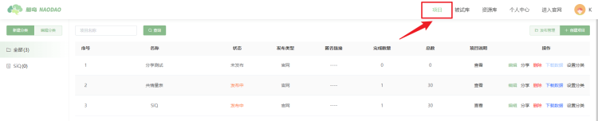
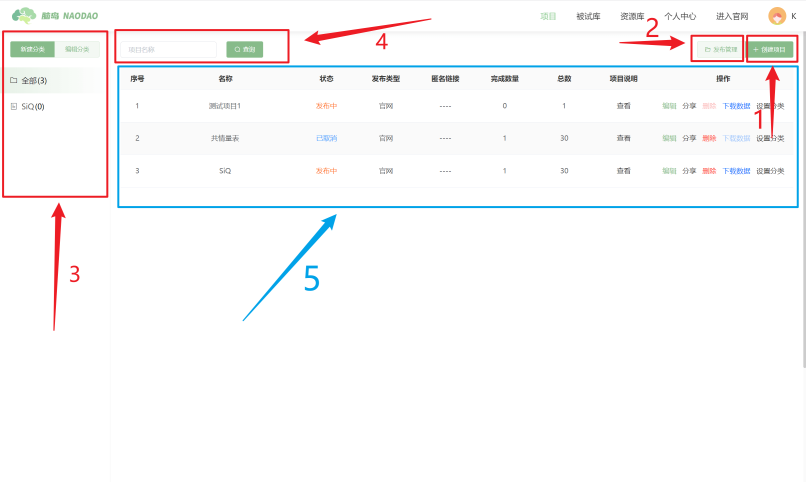

# 项目

在脑岛平台，研究者的研究都是通过项目承载的。研究的具体内容，例如问卷、实验等，都包含在项目中。项目是由研究者编辑、发布；由被试者作答、获得报酬等。

用户可点击导航栏上的【项目】按钮进入项目版块。项目版块的初始页面如下：

用户可以在【项目】页面进行以下操作：

1. 【创建项目】：用户可以通过此功能新建研究项目并进行编辑发布。
2. 【项目发布管理】：用户可以通过此功能对已发布或未发布的研究项目进行二次编辑和重新发布。
3. 【新建/编辑项目分类】：用户可以通过此功能将研究项目分类存放，以便于之后更好地管理。
4. 【查询项目】：用户可通过输入项目的名称来检索特定的项目。
5. 【项目看板】：用户可以在项目页面的中心看板区域总览自己所有的项目。

