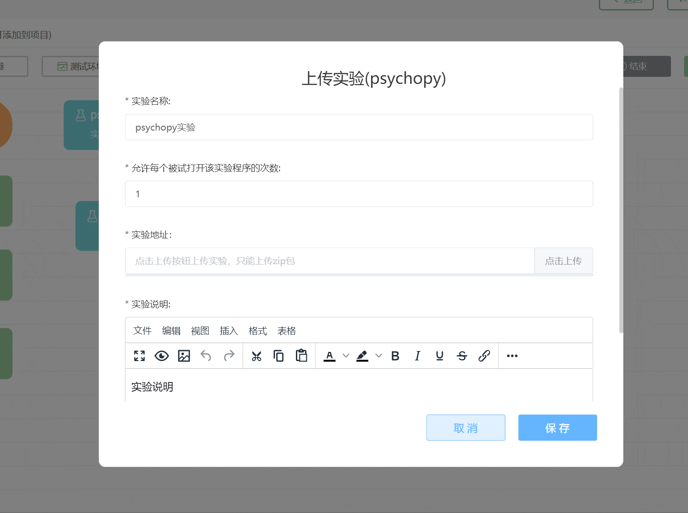

# PsychoPy实验

PsychoPy 是流行的创建心理学行为实验的工具。脑岛提供了对于 PsychoPy [2021.2.3](https://github.com/psychopy/psychopy/releases/tag/2021.2.3) 和 [2020.1.3](https://github.com/psychopy/psychopy/releases/tag/2020.1.3) 生成的在线实验的支持。需要注意，PsychoPy 使用 Builder 编写的实验才能自动转换成在线实验，使用 coder 编写的Python（本地）实验无法转换为在线实验。

> PsychoPy 新手？我们也为你整理了一些学习资源
> [PsychoPy 官网](https://www.psychopy.org/)（英文）
> [PsychoPy 支持中心](https://psychopyhelp.notion.site/PsychoPy-Help-Center-d517aee9e57749c6b766a005fd34646e) by 闲事与尘游
>
> 如果你希望求助或与人交流 PsychoPy 心得，欢迎关注[脑岛论坛 PsychoPy 版块](https://forum.naodao.com/postingInfo?id=1500138031221575682)

双击 PsychoPy 节点可以打开编辑界面。

## 允许每个被试打开该实验程序的次数

您可以设置当前实验的名称以及规定允许每个被试打开该实验程序的次数。此处的次数限制是指在一个项目中允许被试打开实验的次数，只能在一次项目项目作答中起到次数限制的作用，与项目级别的控制「[允许用户重复作答](project1-3.md#作答设置)」不同。

例如我们希望被试在一次作答中只能打开一次实验，那么将次数设为1；但如果您项目发布设置中允许了被试重复参与当前的研究项目，那么被试放弃作答后重新进入这个项目，仍然可以打开这个实验。

## 上传实验包

您可以点击【点击上传】按钮上传通过PsychoPy软件编写的心理学实验。

> 脑岛Tips
> 1. 请注意务必在PsychoPy Builder中将所有Python实验转换为合适的在线实验，即选择 `File` - `Export to HTML` 导出HTML文件后才能进行上传压缩包
> 2. 上传的压缩包中的文件（夹）命名中带有中文或其他非 ASCII 字符可能导致执行出错
> 3. 请确保上传的压缩包体积小于 100 MB，并且没有数量非常多的子目录或和文件

## 实验预览 <!-- {docsify-ignore} -->

当实验上传完成后，在实验地址右侧会出现一个【预览】的功能按钮，您可点击此按钮预览刚才上传的实验。

预览结束后，浏览器会下载本次预览的数据文件以供检查。

## 实验计分

主条目：[行为分组](project1-2-8.md)

在上传实验包之后，用户可选上传代码解析实验生成的 CSV 数据文件，从而得到一个数值结果。这个结果能在后续的行为分组节点中使用。

① ② ③ 需要依次上传，上传前一个会出现后一个的选框

