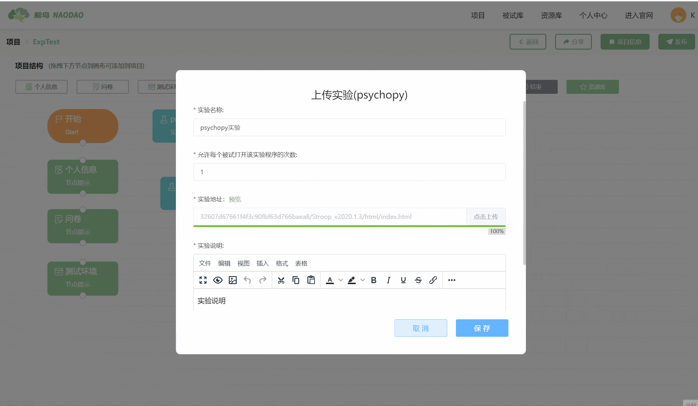

# PsychoPy实验

双击 PsychoPy 节点可以打开编辑界面。

您可以设置当前实验的名称以及规定允许每个被试打开该实验程序的次数。此处的次数限制是指在一个项目中允许被试打开实验的次数，只能在一个项目中起到次数限制的作用。通常我们会希望被试在一个项目中只能打开一次实验，那么次数设为1。如果您允许被试重复参与当前的研究项目，那么被试每一次进入这个项目都可以打开这个实验。

> 您可以点击【点击上传】按钮上传通过PsychoPy软件编写的心理学实验(`以ZIP压缩包的形式上传`)。目前脑岛只支持PsychoPy 2021.2.3和2020.1.3这两个版本编写的实验，后续会提供对其他版本的支持。

> 【脑岛Tips】请注意务必在PsychoPy Builder中将所有Python代码转换为合适的JavaScript代码，  并且导出 HTML 文件后才能进行上传压缩包。

## 实验预览 <!-- {docsify-ignore} -->

当实验上传完成后，在实验地址右侧会出现一个【预览】的功能按钮，您可点击此按钮预览刚才上传的实验。

预览结束后，浏览器会下载本次预览的数据文件以供检查。