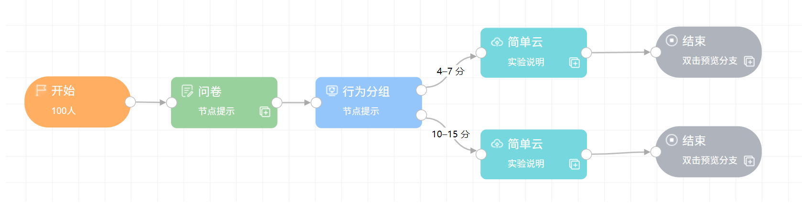
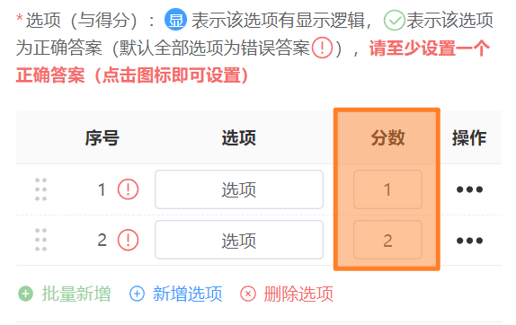
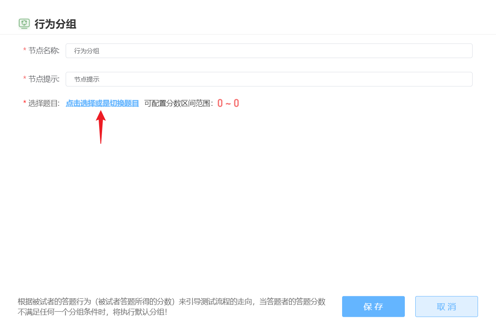
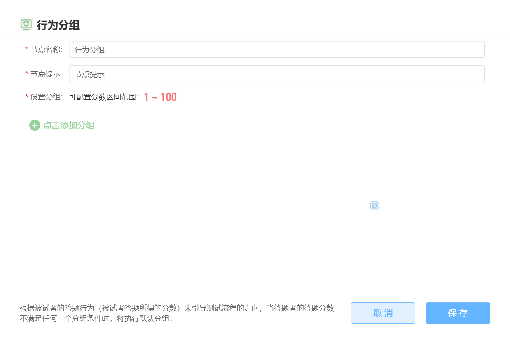
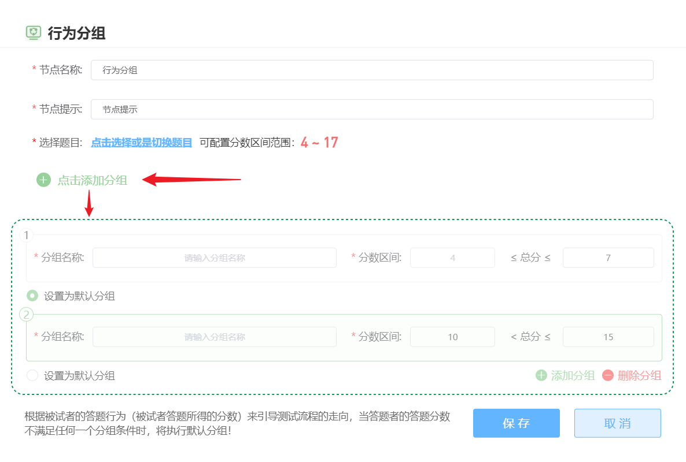

# 行为分组 <!-- {docsify-ignore-all} -->

随机分组节点可以依据前一个节点的得分设置分组，为项目的流程建立多个分支。

如下图的示例，行为分组节点的前一个节点必须是具有得分的节点类型（支持问卷、实验类型）。行为分组能够根据被试在问卷的得分决定被试将要走向哪个分支。

> 分组后产生的分支无法再合并，即整个项目必须是树状结构

## 问卷得分

在问卷节点中，单选题、李克特题、矩阵单选题三种类型的题目可以设置分数。

将行为分组节点直接接在问卷节点后时，双击行为分组节点打开分组设置界面，就可以勾选问卷节点的计分题目，并得到选择的题目之分数范围。

## 实验计分

实验类型节点（目前支持 PsychoPy 和 jsPsych）支持作答中在线分析每个被试产生的数据文件，并得到一个数值结果作为实验节点的得分。

在上传了实验包后，可以继续上传一个 Python 脚本文件（分析代码），该脚本应该包含一个名为 handler的函数，函数接收完成实验后产生的数据文件 (CSV) 作为参数，在经过代码分析后，应该返回一个 int或 float类型的数值，该数值即作为实验节点的分数。

> 运行 Python 代码的环境为 Python 3.6，可导入`numpy``scipy``pandas``sklearn`及其依赖包。`handler`函数的参数和返回值详细情况可以在节点中的模板内查看。

没有上传分析代码的实验节点分数为0．上传分析代码后，研究者仍然需要自行定义可能的分数区间以及验证分析代码的有效性，验证有效性需要上传一个实验对应的示例 CSV 数据文件（可以通过预览获得，特别注意 PsychoPy 线上、线下的数据文件有所差距，请以线上数据文件为对象编写分析代码），上传示例数据文件后，系统会以该 CSV 为输入参数尝试运行一遍分析代码，得到合法的返回值则验证通过。

> 上传文件的文件名如果包含空格或中文（等其他非 ASCII 字符）可能导致验证出错

## 根据分数设置分组

在前一个节点有了合法的分数后，行为分组可以根据该得分将被试分配至不同分组。以问卷设置行为分组为例

> 分组的分数区间可以不连续，得分没有落在指定区间的被试都会被分配至`默认分组`

如果更改了前一个节点的内容，则后方的行为分组会失效，需要重新分组、连线。

