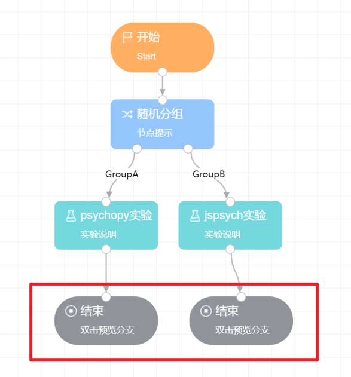

# 结束

结束节点本身无需进行任何设置，但它是一个完整实验分支结束的标志。

对于画布上的任何一个分支而言，都必须拥有开始和结束两个节点。如果一个项目分支没有结束节点，那么画布会判定项目中存在不完整的分支，从而无法发布。

对于存在多分支的项目结构来说（所谓多分支是指在项目结构中使用了随机分组或行为分组节点，使得一个项目存在多个可能的分支走向），每一个分支都需要设置一个结束节点。如下图所示，项目中存在两个分支，因此需要设置两个结束节点。

